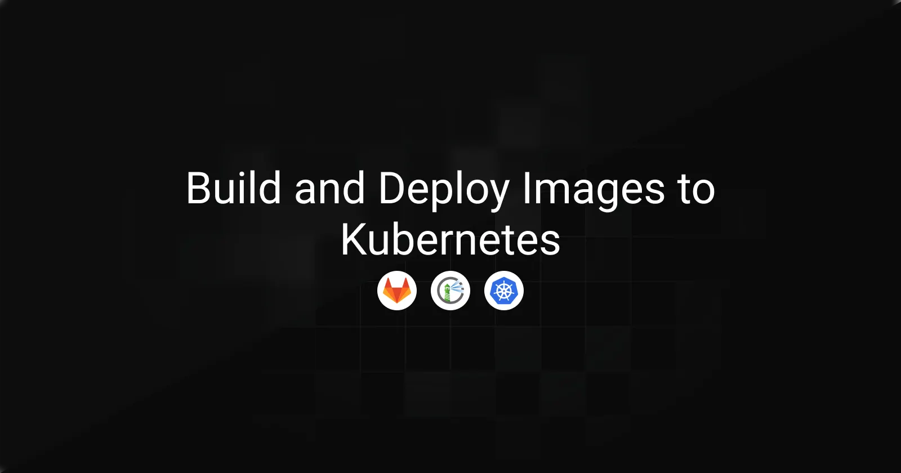

> **Archived project:** This article is preserved as a record of my original work. The accompanying [GitLab repository](https://gitlab.com/rayanoss-group/my-react-app) remains available.

Having a well-controlled end-to-end container workflow is critical in Kubernetes environments. When image build, registry, and runtime concerns are poorly defined or loosely connected, teams quickly run into security gaps, fragile pipelines, and operational blind spots. All of this directly impacts delivery speed and operational reliability.

This article focuses on designing a clean workflow in Kubernetes environments. The emphasis is on clearly separating responsibilities between build, storage, and runtime in order to achieve a predictable image lifecycle that is easier to operate and reason about.

### Table of Contents

---

- [Architecture Overview](#architecture-overview)
- [Harbor as the Central Container Registry](#harbor-as-the-central-container-registry)
- [GitLab Project](#gitlab-project)
- [GitLab Runner](#gitlab-runner)
- [Kubernetes Runtime — Pulling and Running the Image](#kubernetes-runtime--pulling-and-running-the-image)
- [Conclusion](#conclusion)


## Architecture Overview

---

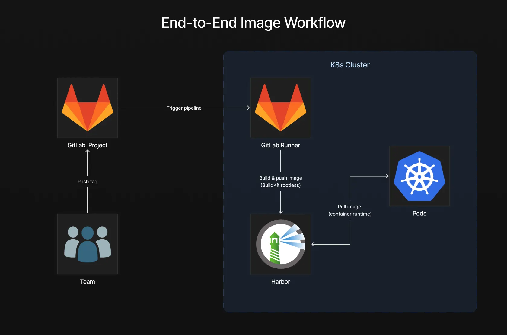

At the center of the setup is a self-hosted GitLab Runner running inside the Kubernetes cluster. This runner is responsible for executing the CI pipeline. During the build stage, it uses BuildKit in rootless mode to build the application image without relying on a Docker daemon. Once the image is built, it is pushed to Harbor, which acts as the private container registry.

Harbor sits between CI and Kubernetes as the single source of truth for container images. It stores the images produced by the pipeline and exposes them through explicit and scoped access. Kubernetes workloads never interact with the CI system directly. They simply pull images from Harbor and run them as application workloads.

## Harbor as the Central Container Registry

Harbor is installed using the official Helm chart. The registry is deployed into a dedicated `harbor` namespace and configured using a custom `harbor-values.yaml` file.

### Add the Harbor Helm repository

```bash
helm repo add harbor https://helm.goharbor.io
helm repo update
```

### Harbor configuration

Add the following values to the `harbor-values.yaml` file to configure Harbor exposure and external access for this setup.

```yaml
expose:
  tls:
    enabled: false
  ingress:
    annotations:
      nginx.ingress.kubernetes.io/ssl-redirect: "false"
externalURL: http://core.harbor.domain
```

By default, Harbor is exposed through a Kubernetes Ingress. For the purpose of this tutorial, HTTPS is intentionally disabled and Harbor is exposed over HTTP.

Certificate management, TLS termination, and trust configuration are outside the scope of this guide. Disabling TLS keeps the focus on the image build and delivery workflow rather than certificate provisioning and PKI setup.

If you need to adapt this release to specific environment requirements, refer to the official [Harbor Helm chart documentation](https://github.com/goharbor/harbor-helm) for available configuration options.

### Install Harbor

```bash
helm install harbor harbor/harbor \
  --namespace harbor \
  --create-namespace \
  -f harbor-values.yaml
```

### Accessing the Harbor UI

Open the Harbor web interface and log in using the default administrator credentials:

*   **Username:** `admin`
*   **Password:** `Harbor12345`

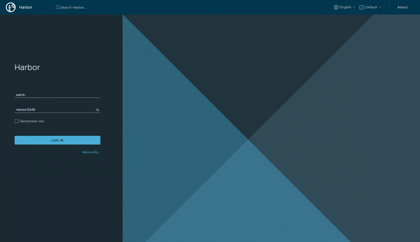

### Configuring the Default Project

By default, Harbor comes with a project named `library`. This project will be reused for the workflow.

1.  Open the `library` project in the Harbor UI.
2.  Navigate to **Configuration**.
3.  Disable **Public** access for the project registry.

This ensures that images stored in the project are not accessible anonymously and require explicit authentication.

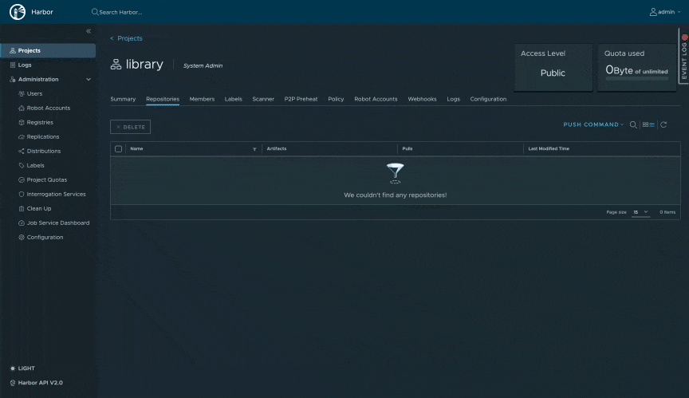

### Creating a Robot Account for GitLab CI

A dedicated robot account is created for the CI pipeline. This account is responsible for pushing and pulling images during the build process.

1.  Inside the `library` project, navigate to **Robot Accounts**.
2.  Click **New Robot Account**.
3.  Configure the robot account with the following values:

*   **Name:** `gitlab-runner`
*   **Expiration:** Never
*   **Permissions:** Repository: **Pull & Push**

After creating the robot account, Harbor displays both the full robot account name and the generated password, which should be stored securely as they will be required later in the GitLab CI pipeline.

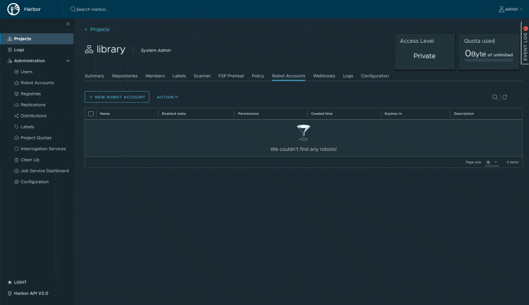

### Creating a Robot Account for Kubernetes

A second robot account is created for Kubernetes. This account is only used at runtime to pull images.

Repeat the same process as above with the following differences:

*   **Name:** `k8s`
*   **Permissions:** Repository: **Pull** only

Store these credentials as well, as they will be used by Kubernetes at runtime to authenticate to Harbor and pull the required application image.

Harbor is configured with a private project and two robot accounts with clearly separated responsibilities. The registry is now ready to be integrated with GitLab CI and Kubernetes in the next sections.

## GitLab Project

---

Before installing the self-hosted GitLab Runner, a GitLab project must be initialized. The project acts as the entry point for the CI pipeline and provides the registration token required for the runner to connect.

For this guide, an existing repository is used. [You can clone it directly from GitLab](https://gitlab.com/rayanoss-group/my-react-app).

This repository already contains:

*   a GitLab CI pipeline definition
*   a Dockerfile used to build the application image
*   a frontend application built with Vite, served as static files by Nginx

The following steps focus on preparing the project so it can work with a self-hosted GitLab Runner and a private Harbor registry.

### Configuring CI/CD Variables

Start by navigating to the project CI/CD settings:

**Settings → CI/CD**

Open the **Variables** section and add the credentials of the Harbor robot account created earlier for the GitLab Runner.

Click **Add variable** in the **Project variables** section and create the following variables:

*   **Key:** `HARBOR_USERNAME`
*   **Value:** the full name of the Harbor robot account
*   **Key:** `HARBOR_PASSWORD`
*   **Value:** the password generated by Harbor for the robot account

These variables will be used by the CI pipeline to authenticate against Harbor when building and pushing images.

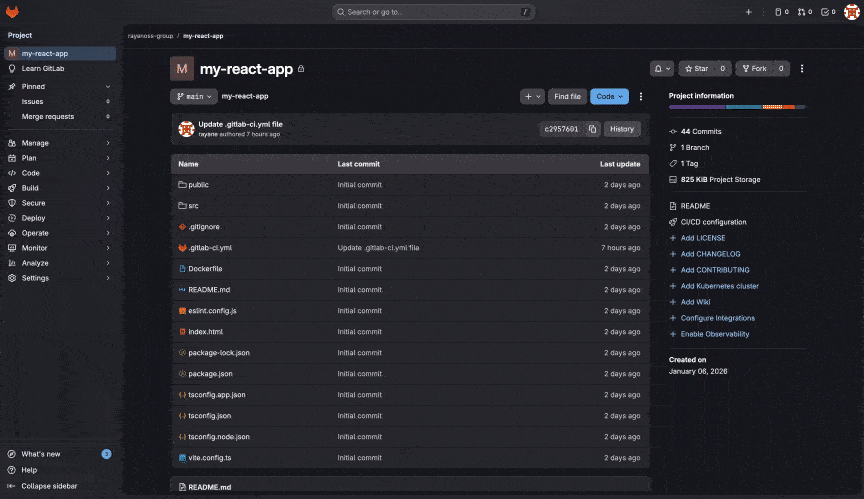

### Disabling Instance Runners

In the same **CI/CD** settings page, locate the **Runners** section. Disable GitLab shared runners by turning **Turn on instance runners for this project** to **Off**. This ensures that jobs for this project will only be executed by the self-hosted runner installed later in the Kubernetes cluster.

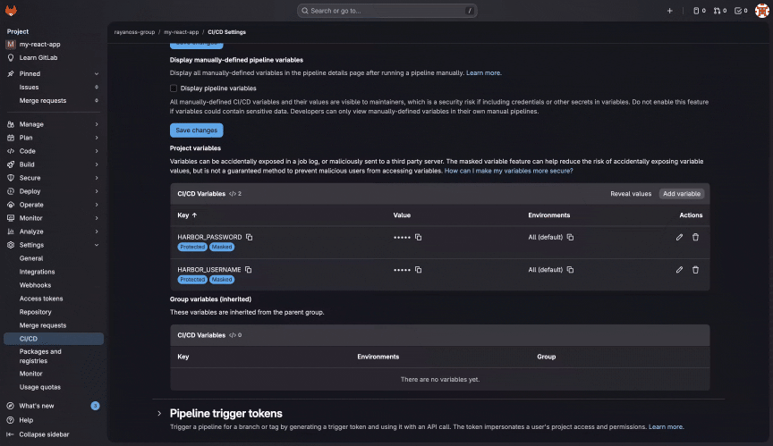

### Creating a Project Runner

Still in the **Runners** section, click **Create project runner**.

Configure the runner with the following values:

*   **Tags:** `self-hosted`

The tag will later be used in the CI pipeline to explicitly target the self-hosted runner.

Create the runner. After redirection, GitLab displays a **runner registration token**. Store this token securely. It will be required in the next section when installing and configuring the GitLab Runner Helm chart.

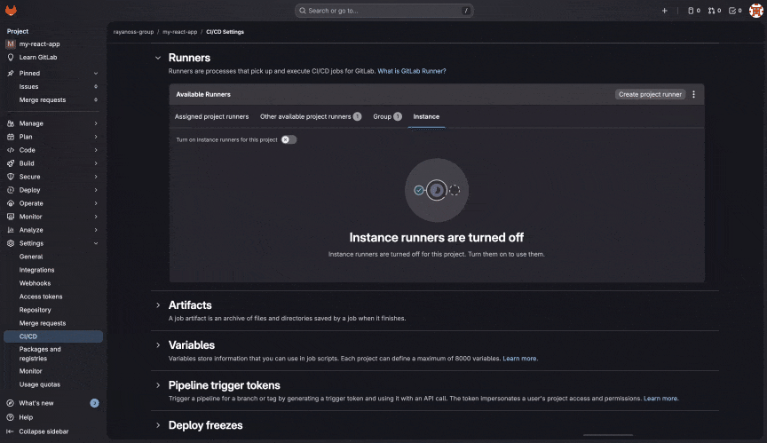

### Defining the GitLab CI Pipeline

The job runs on the self-hosted GitLab Runner and uses BuildKit in rootless mode, avoiding the need for a Docker daemon. Because the runner executes inside the Kubernetes cluster, it connects to Harbor through the internal Kubernetes service DNS. Since Harbor is exposed over HTTP in this setup, the image push is explicitly marked as insecure using `registry.insecure=true`.

Images are built only when a Git tag matching a semantic version is pushed, ensuring that only versioned releases are published. During the build, the pipeline authenticates to Harbor using the robot account credentials configured as CI variables and pushes both a versioned image and a `latest` tag.

```yaml
stages:
  - build
build-image:
  stage: build
  image:
    name: moby/buildkit:rootless
    entrypoint: [""]
  tags:
    - self-hosted
  rules:
    - if: $CI_COMMIT_TAG =~ /^\d+\.\d+\.\d+$/
  variables:
    REGISTRY: "harbor-core.harbor.svc.cluster.local"
    IMAGE_NAME: "library/my-react-app"
    BUILDKITD_FLAGS: "--oci-worker-no-process-sandbox"
  before_script:
    - mkdir -p ~/.docker
    - |
      echo "{
        \"auths\": {
          \"${REGISTRY}\": {
            \"auth\": \"$(printf \"%s:%s\" \"${HARBOR_USERNAME}\" \"${HARBOR_PASSWORD}\" | base64 | tr -d '\\n')\"
          }
        }
      }" > ~/.docker/config.json
  script:
    - export TAG="${CI_COMMIT_TAG}"
    - |
      buildctl-daemonless.sh build \
        --frontend dockerfile.v0 \
        --local context=. \
        --local dockerfile=. \
        --opt platform=linux/amd64,linux/arm64 \
        --output type=image,name=${REGISTRY}/${IMAGE_NAME}:${TAG},push=true,registry.insecure=true \
        --output type=image,name=${REGISTRY}/${IMAGE_NAME}:latest,push=true,registry.insecure=true
```

The GitLab project is ready. CI variables are configured, shared runners are disabled, and a project-level runner token is available for registering the self-hosted GitLab Runner.

## GitLab Runner

---

This section covers the installation of a self-hosted GitLab Runner inside the Kubernetes cluster. The runner is registered using the project-level runner token created earlier and will be responsible for executing CI pipeline jobs.

### GitLab Runner configuration

Before installing the runner, define its configuration in a `runner-values.yaml` file. This file contains the minimal settings required to register the runner with GitLab and use the Kubernetes executor.

```yaml
gitlabUrl: https://gitlab.com
runnerToken: YOUR_RUNNER_TOKEN
rbac:
  create: true
serviceAccount:
  create: true
  name: gitlab-runner
runners:
  config: |
    [[runners]]
      executor = "kubernetes"
```

Replace `YOUR_RUNNER_TOKEN` with the runner registration token obtained when creating the project runner in GitLab.

If you want to customize the runner behavior further, such as resource limits, node selectors, or advanced Kubernetes executor settings, [refer to the full list of available chart values](https://gitlab.com/gitlab-org/charts/gitlab-runner/blob/main/values.yaml)

### Installing the GitLab Runner with Helm

Start by adding the official GitLab Helm repository:

```bash
helm repo add gitlab https://charts.gitlab.io
helm repo update
```

Install the GitLab Runner using the Helm chart. The runner is deployed into a dedicated `gitlab-runner` namespace and configured using the `runner-values.yaml` file.

```bash
helm install gitlab-runner gitlab/gitlab-runner \
  --namespace gitlab-runner \
  --create-namespace \
  -f runner-values.yaml
```

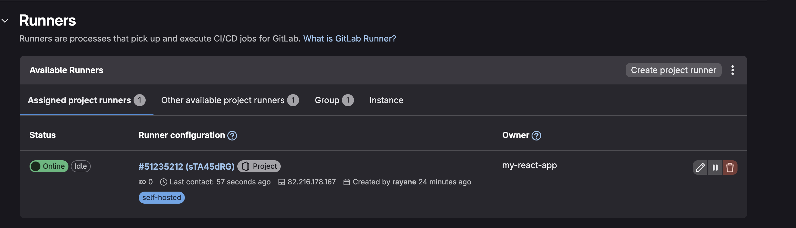

<figcaption>Once the Helm release is deployed, the runner should appear as online in the GitLab project settings. The CI environment is ready to execute pipelines inside the Kubernetes cluster.</figcaption>


### Triggering the CI Pipeline

With the GitLab project, runner, and pipeline in place, the next step is to trigger the CI pipeline by creating and pushing a Git tag. The pipeline is configured to run only on semantic version tags, ensuring that images are built and published only for explicit releases.

### Creating and Pushing a Git Tag

From the project repository, create a new Git tag following the semantic versioning format:

```bash
git tag 1.0.0
git push origin 1.0.0
```

Pushing the tag triggers the GitLab CI pipeline automatically.

### Verifying the Pipeline Execution

Once the tag is pushed, navigate to the **CI/CD → Pipelines** section of the GitLab project.

The pipeline should start automatically and complete successfully using the self-hosted runner. At this stage, the build job executes BuildKit in rootless mode and pushes the application image to Harbor.

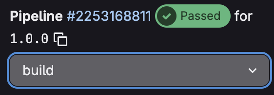

### Verifying the Image in Harbor

After the pipeline completes, open the Harbor web interface and navigate to the `library` project.

The repository for the application should now be visible, containing:

*   the versioned image tag corresponding to the Git tag
*   the `latest` tag

This confirms that the CI pipeline successfully built and pushed the image to the private registry.

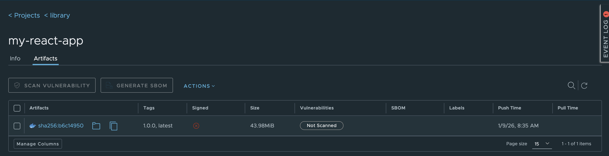

At this point, the image lifecycle from Git tag to registry is complete. The image is now ready to be pulled and executed by Kubernetes in the next section.

## Kubernetes Runtime — Pulling and Running the Image

---

With the image successfully built and pushed to Harbor, the final step is to configure Kubernetes so it can pull the image from the private registry and run the application.

In this setup, Harbor is exposed over HTTP and accessed through an Ingress. Because the Kubernetes runtime relies on containerd, the control-plane node must be explicitly configured to trust the registry endpoint and resolve its hostname.

### Configuring the Control Plane for Harbor Access

Connect to the Kubernetes control-plane node and add the Harbor hostname to the local hosts file so the node can resolve the Ingress endpoint:

```bash
echo "127.0.0.1 core.harbor.domain" >> /etc/hosts
```

Configure containerd to allow pulling images from Harbor over HTTP:

```bash
mkdir -p /etc/containerd/certs.d/core.harbor.domain
cat > /etc/containerd/certs.d/core.harbor.domain/hosts.toml << 'EOF'
server = "http://core.harbor.domain"
[host."http://core.harbor.domain"]
  capabilities = ["pull", "resolve"]
  skip_verify = true
EOF
systemctl restart containerd
exit
```

This configuration allows containerd to resolve the Harbor hostname and pull images from the registry without TLS.

### Creating the Application Namespace

Create a dedicated namespace for the application:

```bash
kubectl create namespace my-react-app
```

### Creating the Image Pull Secret

Create a `docker-registry` secret using the Harbor robot account credentials created earlier for Kubernetes:

```bash
kubectl create secret docker-registry harbor \
  --namespace my-react-app \
  --docker-server=core.harbor.domain \
  --docker-username=<HARBOR_K8S_ROBOT_USERNAME> \
  --docker-password=<HARBOR_K8S_ROBOT_PASSWORD>
```

This secret will be used by Kubernetes to authenticate to Harbor when pulling images.

### Running the Application Pod

Create a pod that pulls the image from Harbor and uses the image pull secret:

```yaml
apiVersion: v1
kind: Pod
metadata:
  name: my-react-app
  namespace: my-react-app
  labels:
    app: my-react-app
spec:
  containers:
  - name: my-react-app
    image: core.harbor.domain/library/my-react-app:1.0.0
  imagePullSecrets:
  - name: harbor
```

Apply the manifest and verify that the pod starts successfully.

### Exposing the Application

Expose the pod using a ClusterIP service on port 80:

```bash
kubectl expose pod my-react-app \
  --namespace my-react-app \
  --port 80 \
  --target-port 80
```

Forward the service port to the local machine:

```bash
kubectl port-forward svc/my-react-app 80:80 -n my-react-app
```

Open a browser and navigate to [http://localhost:80](http://localhost:80)

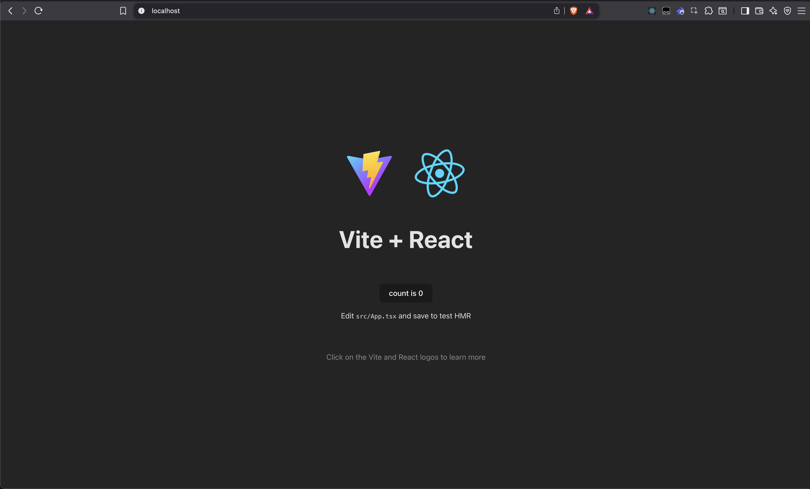

<figcaption>The application should now be accessible from the browser, confirming that Kubernetes successfully pulled the image from Harbor and ran it.</figcaption>

## Conclusion
----------

This article demonstrated how to build a clean end-to-end container workflow, from image build to application execution in Kubernetes.

By combining GitLab CI, a self-hosted GitLab Runner, BuildKit in rootless mode, and Harbor as a private registry, each stage of the image lifecycle is clearly separated. Image builds remain a CI responsibility, the registry acts as a controlled distribution point, and Kubernetes focuses exclusively on pulling and running images.

This structure results in a workflow that is easier to reason about, easier to operate, and less error-prone. More importantly, it establishes a solid foundation that can later be extended with additional concerns such as TLS, security policies, or advanced deployment strategies, without changing the core flow.
