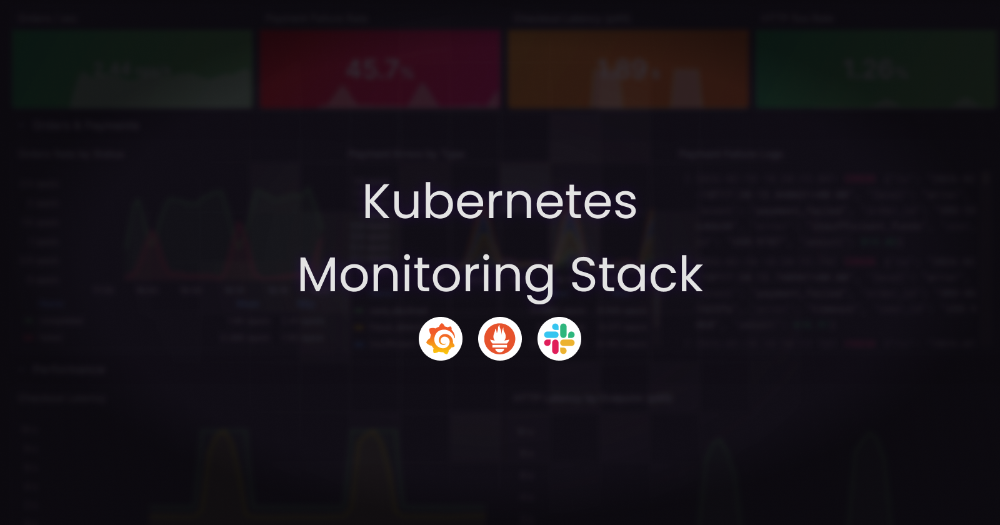
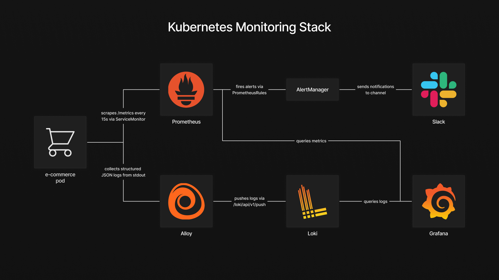
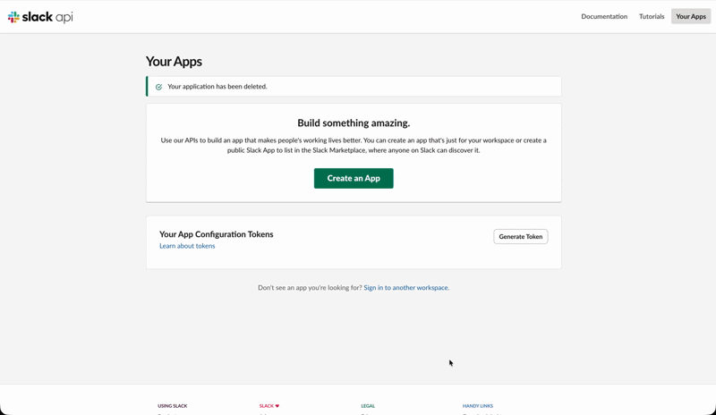
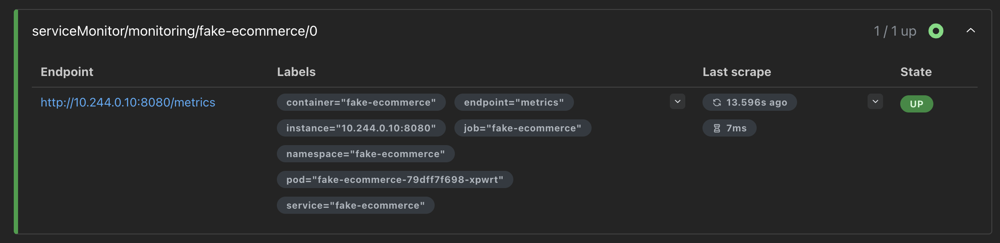
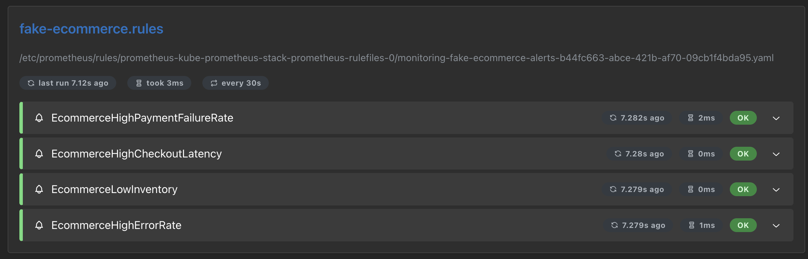
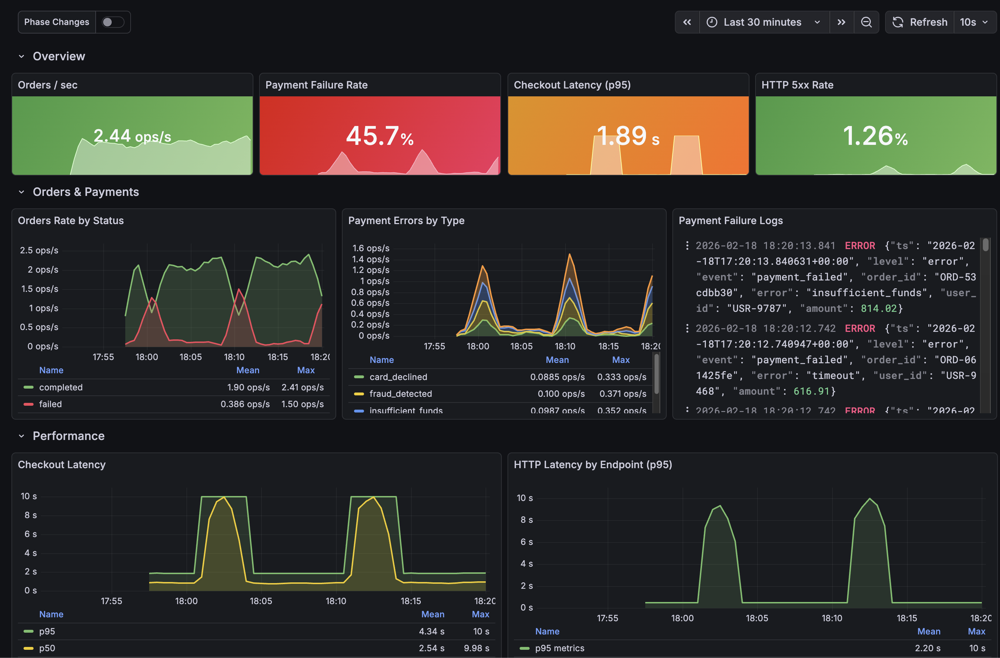
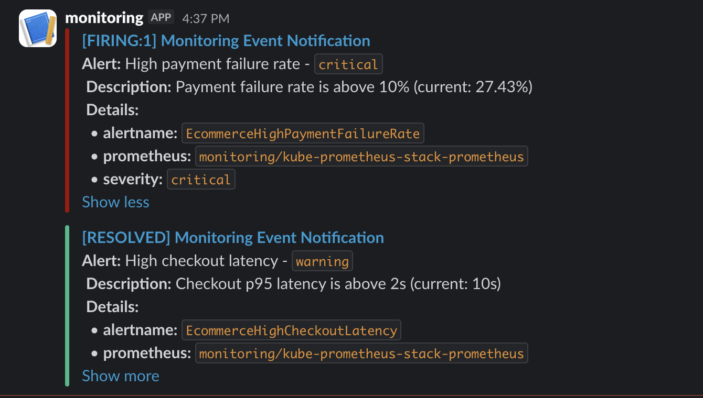

> **Archived project:** The original GitHub repository is no longer available. This article is preserved as a record of the project, including its explanations, code snippets, and illustrations.

Running applications on Kubernetes without observability means operating blind. When something goes wrong, the impact is not just technical. For example, in an e-commerce platform, a failing payment gateway or a latency spike during a traffic peak means lost orders, frustrated customers, and eroded trust. The difference between detecting a problem in seconds versus minutes can be the difference between a brief incident and a wave of abandoned carts.

To address this, we will deploy a complete monitoring stack on Kubernetes that covers the three pillars of observability: Prometheus for metrics collection, Loki for log aggregation, and Grafana for visualization, with Alloy handling log shipping and Alertmanager routing alerts to Slack. A fake e-commerce application is deployed alongside the stack, continuously generating realistic metrics and structured logs such as orders, payments, inventory levels, and HTTP traffic. This gives the monitoring layer something meaningful to work with from the start and makes every configuration immediately verifiable.

## Table of Contents

- [Architecture Overview](#architecture-overview)
- [Deploying the Application](#deploying-the-application)
- [Deploying the Observability Stack](#deploying-the-observability-stack)
- [Connecting Metrics, Logs and Alerts](#connecting-metrics-logs-and-alerts)
- [Validation](#validation)
- [Conclusion](#conclusion)

## Architecture Overview

---



<figcaption>Architecture diagram of the monitoring stack.</figcaption>

The stack is built around two data flows that converge in Grafana. On the metrics side, the fake e-commerce application exposes a `/metrics` endpoint in Prometheus format. A **ServiceMonitor** tells Prometheus where to scrape, and Prometheus collects the data at regular intervals. On the logs side, the application writes structured JSON logs to stdout. These logs are collected by **Grafana Alloy**, which runs as a DaemonSet on every node, discovers pods through the Kubernetes API, and ships their log streams to **Loki**.

**Grafana** sits at the center as the visualization layer. It queries Prometheus for metrics and Loki for logs, allowing both data sources to be combined in a single dashboard. This means a spike in payment errors on a time series panel can be correlated with the actual error logs right next to it, without switching tools.

For alerting, **PrometheusRules** define the conditions that should trigger an alert, such as a high payment failure rate or low inventory levels. When a rule fires, Prometheus forwards the alert to **Alertmanager**, which handles grouping, deduplication, and routing. In this setup, alerts are sent to a Slack channel, giving the team immediate visibility when something requires attention.

## Deploying the Application

---

Before setting up the monitoring stack, we need something to monitor. The fake e-commerce application is a lightweight container that simulates realistic e-commerce activity. It exposes a `/metrics` endpoint with Prometheus-formatted metrics such as order rates, payment errors, checkout latency, and inventory levels. It also emits structured JSON logs to stdout, covering events like successful orders, failed payments, and low stock warnings.

The application runs in its own namespace with a simple Deployment and a Service that exposes the metrics port.
```bash
kubectl create namespace fake-ecommerce
kubectl apply -f fake-ecommerce-app/
```

With the application running and generating data, we can now deploy the monitoring stack that will collect, store, and visualize it.

## Deploying the Observability Stack

---

### Loki

Loki is the log aggregation backend. Unlike traditional logging solutions that index the full content of every log line, Loki only indexes metadata labels such as namespace, pod, and container. The actual log content is stored compressed and queried on demand. This makes it significantly lighter to operate and a natural fit for Kubernetes environments where log volume can grow quickly.

The values file keeps the deployment minimal by disabling all distributed components and caching layers:
```yaml
# loki-values.yaml
deploymentMode: SingleBinary

singleBinary:
  replicas: 1

write:
  replicas: 0
read:
  replicas: 0
backend:
  replicas: 0

chunksCache:
  enabled: false
resultsCache:
  enabled: false

test:
  enabled: false

loki:
  auth_enabled: false
  commonConfig:
    replication_factor: 1
  storage:
    type: filesystem
    filesystem:
      chunks_directory: /var/loki/chunks
      rules_directory: /var/loki/rules
  useTestSchema: true
```

For this setup, Loki runs in **SingleBinary** mode, meaning all components run in a single process with logs stored on the local filesystem. This keeps the deployment simple and self-contained, with no external dependency or authentication required.

```bash
kubectl create namespace monitoring
helm repo add grafana https://grafana.github.io/helm-charts
helm repo update
helm install loki grafana/loki \
  --namespace monitoring \
  --values helm-values/loki-values.yaml
```

Once Loki is running, it exposes a gateway service inside the cluster at `http://loki-gateway`. This is the endpoint that both Alloy and Grafana will use to push and query logs.

### Alloy

Grafana Alloy is the log collection agent. Deployed as a DaemonSet, it runs on every node in the cluster, discovers pods through the Kubernetes API, and forwards their log streams to Loki. It replaces older agents like Promtail and provides a unified pipeline configuration using the Alloy configuration language.

The configuration defines a three-stage pipeline: discover pods, enrich the labels, and ship the logs to Loki.
```yaml
# alloy-values.yaml
alloy:
  configMap:
    content: |
      discovery.kubernetes "pods" {
        role = "pod"
      }

      discovery.relabel "pods" {
        targets = discovery.kubernetes.pods.targets

        rule {
          source_labels = ["__meta_kubernetes_namespace"]
          target_label  = "namespace"
        }
        rule {
          source_labels = ["__meta_kubernetes_pod_name"]
          target_label  = "pod"
        }
        rule {
          source_labels = ["__meta_kubernetes_pod_container_name"]
          target_label  = "container"
        }
      }

      loki.source.kubernetes "pods" {
        targets    = discovery.relabel.pods.output
        forward_to = [loki.write.default.receiver]
      }

      loki.write "default" {
        endpoint {
          url        = "http://loki-gateway/loki/api/v1/push"
          tenant_id  = "1"
        }
      }
```

The `discovery.kubernetes` block discovers all pods in the cluster. The `discovery.relabel` stage extracts useful metadata like namespace, pod name, and container name into labels that will be queryable in Loki. Finally, `loki.source.kubernetes` reads the actual log streams and `loki.write` pushes them to the Loki gateway endpoint we deployed earlier.
```bash
helm install alloy grafana/alloy \
  --namespace monitoring \
  --values helm-values/alloy-values.yaml
```

At this point, logs from every pod in the cluster, including the fake e-commerce application, are being collected and stored in Loki.

### Slack Webhook Setup

Before deploying the Prometheus stack, we need a Slack webhook URL so Alertmanager can send alerts to a channel.

1. Head over to the [Slack app creation page](https://api.slack.com/apps?new_app=1) and click **Create New App**
2. Select **From Scratch**
3. Set the app name to something like "Monitoring", select your workspace, and click **Create App**
4. On the app configuration page, click **Incoming Webhooks**
5. Turn on **Activate Incoming Webhooks**
6. Click **Add New Webhook to Workspace**
7. Select the channel where you want alerts to appear and click **Allow**
8. Copy the webhook URL and keep it aside

We will use this URL in the next section when configuring Alertmanager.



<figcaption>Setting up a Slack app and generating an incoming webhook URL.</figcaption>

### kube-prometheus-stack

The kube-prometheus-stack Helm chart bundles Prometheus, Grafana, and Alertmanager into a single deployment. It also installs the ServiceMonitor and PrometheusRule CRDs that we will use later to connect the application to the monitoring layer.

The values file covers three main configuration areas: Prometheus scraping behavior, Grafana access and datasources, as well as Alertmanager alert routing to Slack.
```yaml
# kube-prometheus-stack-values.yaml
prometheus:
  enabled: true
  prometheusSpec:
    serviceMonitorSelectorNilUsesHelmValues: false
    serviceMonitorSelector: {}
    serviceMonitorNamespaceSelector: {}
    ruleSelector:
      matchExpressions:
        - key: prometheus
          operator: In
          values:
            - example-rules

grafana:
  sidecar:
    image:
      registry: docker.io
  assertNoLeakedSecrets: false
  adminPassword: <GRAFANA_ADMIN_PASSWORD>
  additionalDataSources:
    - name: Loki
      type: loki
      uid: loki
      url: http://loki-gateway.monitoring.svc.cluster.local
      access: proxy
      jsonData:
        httpHeaderName1: "X-Scope-OrgID"
      secureJsonData:
        httpHeaderValue1: "fake"

alertmanager:
  config:
    global:
      resolve_timeout: 5m
      slack_api_url: <SLACK_WEBHOOK_URL>
    route:
      group_by: ['job']
      group_wait: 30s
      group_interval: 5m
      repeat_interval: 12h
      receiver: 'slack'
      routes:
        - match:
            alertname: DeadMansSwitch
          receiver: 'null'
        - match:
          receiver: 'slack'
          continue: true
    receivers:
      - name: 'null'
      - name: 'slack'
        slack_configs:
          - channel: '<SLACK_CHANNEL>'
            send_resolved: true
            title: '[{{ .Status | toUpper }}{{ if eq .Status "firing" }}:{{ .Alerts.Firing | len }}{{ end }}] Monitoring Event Notification'
            text: >-
              {{ range .Alerts }}
                *Alert:* {{ .Annotations.summary }} - `{{ .Labels.severity }}`
                *Description:* {{ .Annotations.description }}
                *Details:*
                {{ range .Labels.SortedPairs }} • *{{ .Name }}:* `{{ .Value }}`
                {{ end }}
              {{ end }}
```

The Prometheus configuration disables the default Helm label filtering for ServiceMonitors, allowing it to pick up any ServiceMonitor across all namespaces. The `ruleSelector` targets PrometheusRules labeled with `prometheus: example-rules`, which is the label we will use when creating alert rules later.

Grafana is configured with Loki as an additional datasource pointing to the gateway service deployed earlier. The `X-Scope-OrgID` header is required because Loki expects a tenant ID, even when multi-tenancy is disabled.

Alertmanager uses the Slack webhook URL obtained in the previous step to route all firing alerts to the configured channel. The `DeadMansSwitch` alert, which fires continuously to confirm Alertmanager is alive, is routed to a null receiver to avoid noise. The Slack message template references fields like `summary`, `description`, and `severity` that we will define later when writing the alert rules.

Replace `<GRAFANA_ADMIN_PASSWORD>` with your chosen password, `<SLACK_WEBHOOK_URL>` with the webhook URL from the Slack app setup, and `<SLACK_CHANNEL>` with your channel name prefixed with `#` (for example `#alerts`).

```bash
helm repo add prometheus-community https://prometheus-community.github.io/helm-charts
helm repo update
helm install kube-prometheus-stack prometheus-community/kube-prometheus-stack \
  --namespace monitoring \
  --values helm-values/kube-prometheus-stack-values.yaml
```

With this deployment, the full monitoring stack is in place. Prometheus is scraping metrics, Loki is storing logs collected by Alloy, Grafana has both datasources configured, and Alertmanager is ready to forward notifications to Slack. The next step is to wire the fake e-commerce application into this stack.

## Connecting Metrics, Logs and Alerts

---

### ServiceMonitor

The monitoring stack is running, but Prometheus does not yet know about the fake e-commerce application. A ServiceMonitor is a custom resource that tells Prometheus which Service to scrape, on which port, and how often.
```yaml
# service-monitor.yaml
apiVersion: monitoring.coreos.com/v1
kind: ServiceMonitor
metadata:
  name: fake-ecommerce
  namespace: monitoring
  labels:
    app.kubernetes.io/part-of: fake-ecommerce
    app.kubernetes.io/component: monitoring
spec:
  namespaceSelector:
    matchNames:
      - fake-ecommerce
  selector:
    matchLabels:
      app: fake-ecommerce
  endpoints:
    - port: metrics
      path: /metrics
      interval: 15s
```

The `namespaceSelector` points to the `fake-ecommerce` namespace where the application is running, and the `selector` matches the Service by its `app: fake-ecommerce` label. The `endpoints` section defines the scrape target: the port named `metrics` on the `/metrics` path, with a 15 second interval.
```bash
kubectl apply -f monitoring/service-monitor.yaml
```

Within a few seconds, Prometheus discovers the new target and starts collecting metrics from the application. To verify, expose the Prometheus UI and check the target health:
```bash
kubectl port-forward -n monitoring svc/kube-prometheus-stack-prometheus 9090:9090
```

Open [http://localhost:9090/targets](http://localhost:9090/targets) in your browser. The `fake-ecommerce` target should appear with a status of `UP`.



<figcaption>Prometheus targets page showing the fake-ecommerce target as UP.</figcaption>

### PrometheusRules

With metrics flowing into Prometheus, we can now define alert rules that will fire when specific conditions are met. A PrometheusRule is a custom resource that contains PromQL expressions evaluated at regular intervals. When an expression returns a result for longer than the defined `for` duration, Prometheus fires the alert and forwards it to Alertmanager.

The following manifest defines four alerts covering the key areas of the e-commerce application:
```yaml
# prometheus-rules.yaml
apiVersion: monitoring.coreos.com/v1
kind: PrometheusRule
metadata:
  labels:
    prometheus: example-rules
    role: alert-rules
  name: fake-ecommerce-alerts
  namespace: monitoring
spec:
  groups:
    - name: "fake-ecommerce.rules"
      rules:
        - alert: EcommerceHighPaymentFailureRate
          expr: sum(rate(ecommerce_payment_errors_total[2m])) / sum(rate(ecommerce_orders_total[2m])) > 0.10
          for: 30s
          labels:
            severity: critical
          annotations:
            summary: High payment failure rate
            description: "Payment failure rate is above 10% (current: {{ $value | humanizePercentage }})"

        - alert: EcommerceHighCheckoutLatency
          expr: histogram_quantile(0.95, sum(rate(ecommerce_checkout_duration_seconds_bucket[2m])) by (le)) > 2
          for: 30s
          labels:
            severity: warning
          annotations:
            summary: High checkout latency
            description: "Checkout p95 latency is above 2s (current: {{ $value | humanizeDuration }})"

        - alert: EcommerceLowInventory
          expr: ecommerce_inventory_level < 5
          for: 30s
          labels:
            severity: warning
          annotations:
            summary: Low inventory
            description: "Product {{ $labels.product }} stock is critically low (current: {{ $value }})"

        - alert: EcommerceHighErrorRate
          expr: sum(rate(ecommerce_http_requests_total{status_code=~"5.."}[2m])) / sum(rate(ecommerce_http_requests_total[2m])) > 0.05
          for: 30s
          labels:
            severity: critical
          annotations:
            summary: High HTTP error rate
            description: "HTTP 5xx error rate is above 5% (current: {{ $value | humanizePercentage }})"
```

The `labels` on the metadata include `prometheus: example-rules`, which matches the `ruleSelector` we configured in the `kube-prometheus-stack-values.yaml`. Without this label, Prometheus would ignore the rules entirely.

Each rule follows the same structure. The `expr` field contains the PromQL expression that defines the condition. The `for` field sets how long the condition must hold before the alert fires, preventing false positives from brief spikes. The `labels` section attaches a `severity` level used by Alertmanager for routing decisions. The `annotations` provide the `summary` and `description` fields that appear in Slack notifications, which are the same fields referenced in the Alertmanager template we configured earlier.

The four alerts cover payment failure rates exceeding 10%, checkout p95 latency above 2 seconds, inventory dropping below 5 units for any product, and HTTP 5xx error rates above 5%. To demonstrate this behavior, the fake e-commerce application runs on a 10-minute cycle alternating between normal operation and anomaly phases. Each phase lasts 2 minutes, generating enough data for the PromQL expressions to detect issues within their rate windows, causing all four alerts to fire over the course of a single cycle.
```bash
kubectl apply -f monitoring/prometheus-rules.yaml
```

To verify that Prometheus has picked up the rules, open [http://localhost:9090/rules](http://localhost:9090/rules) in the Prometheus UI. The `fake-ecommerce.rules` group should appear with all four alert definitions.



<figcaption>Prometheus rules page showing the fake-ecommerce alert rules.</figcaption>

### Grafana Dashboard

The last piece is a Grafana dashboard that brings metrics and logs together in a single view. Rather than building it manually through the Grafana UI, the dashboard is defined as a JSON file and deployed through a ConfigMap. Grafana's sidecar automatically detects ConfigMaps with the label grafana_dashboard: "1" and loads them on the fly.

The dashboard JSON was stored in the original repository under `monitoring/grafana-dashboard-configmap.yaml` and is not included inline. That repository is no longer available; this archived article preserves the explanation and screenshots. It is organized into multiple sections that group related metrics and logs by functional area, providing a structured overview of the application’s behavior. Each row combines Prometheus metric panels with Loki log panels side by side, making it possible to correlate metric changes with the corresponding log entries without leaving the dashboard.

```bash
kubectl apply -f monitoring/grafana-dashboard-configmap.yaml
```

Grafana picks up the dashboard within a few seconds. We can now validate that the entire stack is working end to end.

## Validation

---

To verify the stack is working end to end, expose Grafana and check the dashboard:
```bash
kubectl port-forward -n monitoring svc/kube-prometheus-stack-grafana 3000:80
```

Open [http://localhost:3000](http://localhost:3000) and log in with `admin` as the username and the password you defined in the `kube-prometheus-stack-values.yaml`. In the left sidebar, navigate to **Dashboards**. The **Fake E-commerce** dashboard should appear in the list. Open it to see metrics and logs updating in real time as the application cycles through its different phases.



<figcaption>Grafana dashboard showing real-time e-commerce metrics and logs.</figcaption>

After a few minutes, the application enters its anomaly phases and alerts start firing. Alertmanager groups them and forwards the notifications to Slack. Messages appear in the configured channel under the name of the Slack app created earlier, with the alert summary, description, and severity labels.



<figcaption>Slack notifications showing fired alerts from Alertmanager.</figcaption>

## Conclusion

---

This stack provides the foundations for observability on Kubernetes: metrics with Prometheus, logs with Loki and Alloy, alerting with Alertmanager and Slack, and a unified dashboard in Grafana that correlates both data sources. A production setup would involve switching Loki to object storage, enabling Prometheus high availability, adding TLS, and refining alert thresholds based on real traffic patterns.

But even at this stage, the core value is already there. A payment failure spike, a latency degradation, or a depleting inventory is no longer something that goes unnoticed until customers start complaining. It surfaces in a dashboard, triggers an alert, and reaches the team in seconds.
