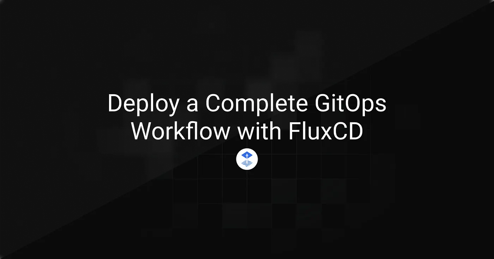
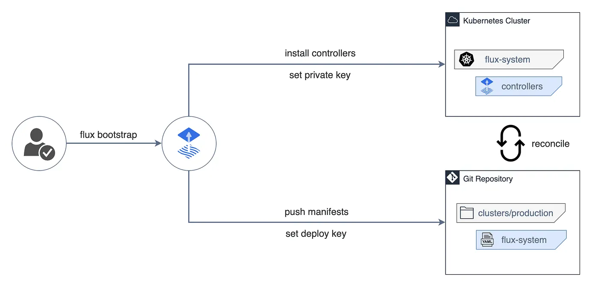
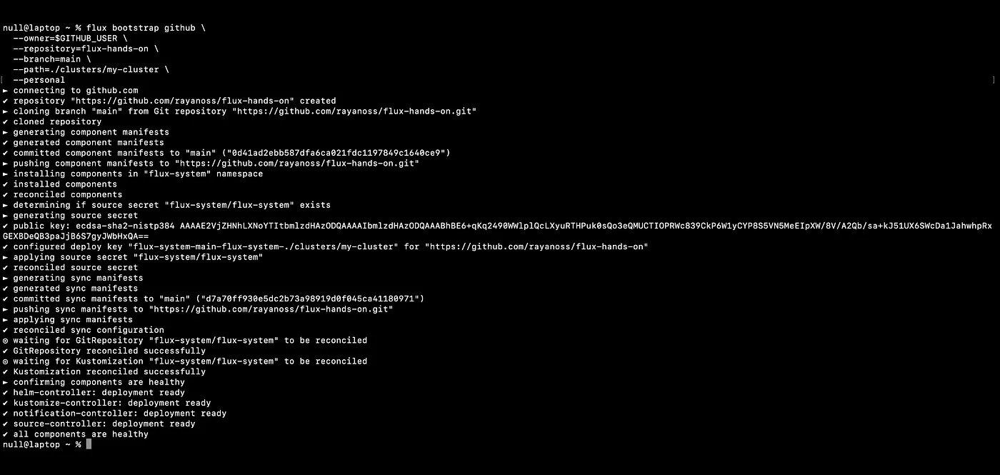
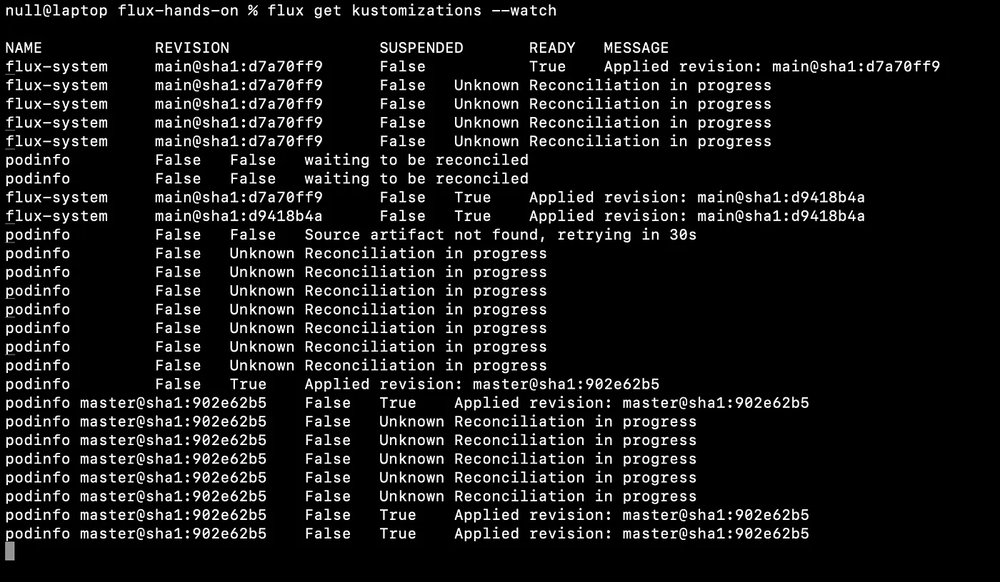
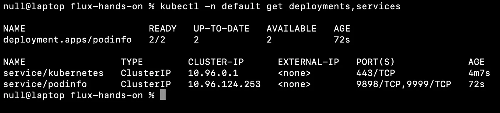
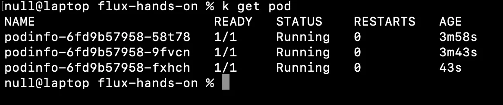

> **Archived project:** The original GitHub repository is no longer available. This article is preserved as a record of the project, including its explanations, code snippets, and illustrations.

GitOps isn’t just a concept — it’s a faster, cleaner way to deploy while maintaining full control over your clusters. By declaring all infrastructure, applications, and policies in Git, you establish a single source of truth that your cluster continuously reconciles with, automatically correcting any drift. Backed by the CNCF, FluxCD turns every commit into a verifiable, consistent, and reversible deployment.

## Table of Contents

- [Set Up FluxCD on a kind Cluster](#set-up-fluxcd-on-a-kind-cluster)
- [Bootstrap Flux into the Cluster](#bootstrap-flux-into-the-cluster)
- [Deploy a Sample Application](#deploy-a-sample-application)
- [Modify and Observe Real-Time Sync](#modify-and-observe-real-time-sync)
- [Conclusion](#conclusion)

## Set Up FluxCD on a kind Cluster

---



<figcaption>Flux bootstrap links your cluster to Git and starts continuous reconciliation.</figcaption>

In this section, we’ll install **FluxCD** on a local Kubernetes cluster with **kind**, connect it to a **GitHub repository**, and deploy a sample app using the GitOps approach. The goal is to see how Flux automates the deployment cycle — from commit to cluster synchronization.

**Prerequisites**

- [Docker](https://docs.docker.com/engine/install/) installed and running
- [kubectl](https://kubernetes.io/docs/tasks/tools/) to interact with the cluster
- [kind](https://kind.sigs.k8s.io/docs/user/quick-start/) to create a local Kubernetes cluster
- [Git](https://git-scm.com/install/) configured locally
- A GitHub account with a [personal access token](https://docs.github.com/en/authentication/keeping-your-account-and-data-secure/managing-your-personal-access-tokens) that has `repo` permissions
- The [Flux CLI](https://fluxcd.io/flux/cmd/) installed on your machine

Make sure to export your GitHub variables **GITHUB_USER** and **GITHUB_TOKEN**, then create a **local cluster** with kind: _kind create cluster — name flux-lab_.

## Bootstrap Flux into the Cluster

---

We’ll now install Flux in the cluster and connect it to a GitHub repository. This step initializes the GitOps workflow — the repository becomes the single source of truth, and the cluster continuously aligns itself with what’s defined in Git.

Run the following command to bootstrap Flux, create the GitHub repository, and configure continuous synchronization between your cluster and Git:

```bash
flux bootstrap github \
  --owner=$GITHUB_USER \
  --repository=flux-hands-on \
  --branch=main \
  --path=./clusters/my-cluster \
  --personal
```

This command creates a repository named flux-hands-on, adds all the manifests required for Flux to operate, and deploys the components to your cluster.

Once installation completes, you should see an output similar to this:



At this point, Flux is fully installed and connected to your GitHub repository. All configurations are versioned under clusters/my-cluster/.

Next, clone the repository locally so you can start adding your first resources:

```bash
git clone https://github.com/$GITHUB_USER/flux-hands-on
cd flux-hands-on
```

## Deploy a Sample Application

---

To see Flux in action, we’ll deploy **Podinfo**, a small open-source web app commonly used in the Flux community for demos and testing.

In Flux, each configuration source — such as a Git repository — is defined as a Kubernetes resource. That’s the role of a **GitRepository**: it tells Flux where to fetch the manifests from. A **Kustomization** then defines how those manifests should be deployed and kept in sync with the cluster.

Run the following command to create the GitRepository that points to the Podinfo repo:

```bash
flux create source git podinfo \
  --url=https://github.com/stefanprodan/podinfo \
  --branch=master \
  --interval=1m \
  --export > ./clusters/my-cluster/podinfo-source.yaml
```

Then create the corresponding Kustomization to tell Flux how to deploy the repository's content:

```bash
flux create kustomization podinfo \
  --target-namespace=default \
  --source=podinfo \
  --path="./kustomize" \
  --prune=true \
  --wait=true \
  --interval=30m \
  --export > ./clusters/my-cluster/podinfo-kustomization.yaml
```

Together, these two files define what to deploy (source) and how to deploy it (Kustomization).

Commit and push your changes to Git:

```bash
git add -A && git commit -m "Add podinfo GitRepository and Kustomization"
git push
```

Flux automatically detects the new files in the repository and applies the corresponding resources to the cluster.

To watch the reconciliation in real time, run:

```bash
flux get kustomizations --watch
```

You’ll see output like this as Flux continuously syncs your configurations:



When the status shows **“Applied revision”**, it means Flux has successfully deployed the manifests from Git to your cluster.

You can verify that the application is running by checking the deployments and services in the _default_ namespace:

```bash
kubectl -n default get deployments,services
```

You should see the podinfo deployment up and running:



From now on, any change committed to the **Podinfo** repository will automatically sync to your Kubernetes cluster — no manual deployment required.

## Modify and Observe Real-Time Sync

---

Let's make a change to see Flux in action — increase the number of replicas for Podinfo. Flux will handle it automatically as soon as the change is committed to Git.

```yaml
patches:
  - patch: |-
      apiVersion: autoscaling/v2
      kind: HorizontalPodAutoscaler
      metadata:
        name: podinfo
      spec:
        minReplicas: 3
    target:
      name: podinfo
      kind: HorizontalPodAutoscaler
```

Commit and push the change:

```bash
git add -A && git commit -m "Increase Podinfo replicas to 3"
git push
```

As soon as you push, Flux detects the change and applies the new configuration to the cluster.

To follow the sync in real time:

```bash
flux get kustomizations --watch
```

Once the sync completes, verify that the new pods have been deployed:

```bash
kubectl get pods -n default
```

You should see three podinfo pods running, confirming that Flux automatically applied your Git changes to the cluster:



That’s the power of GitOps: your infrastructure and applications always reflect the desired state defined in Git. Any drift is corrected automatically, ensuring a stable and consistent environment.

## Conclusion

---

You now have a complete GitOps environment powered by FluxCD — every change committed to Git is automatically applied to your cluster, ensuring consistency, traceability, and reliability.

The related Kubernetes homelab repository is no longer available. This article is retained as an archive of the original work.
