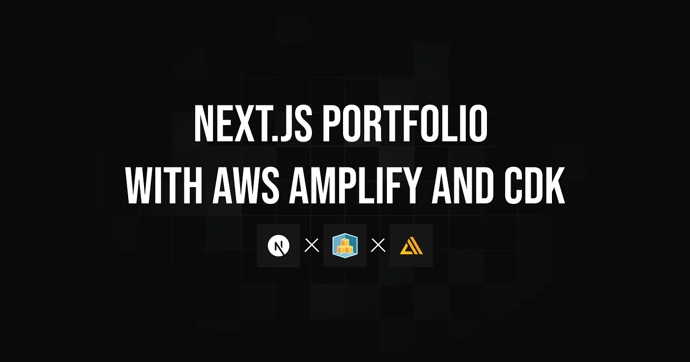
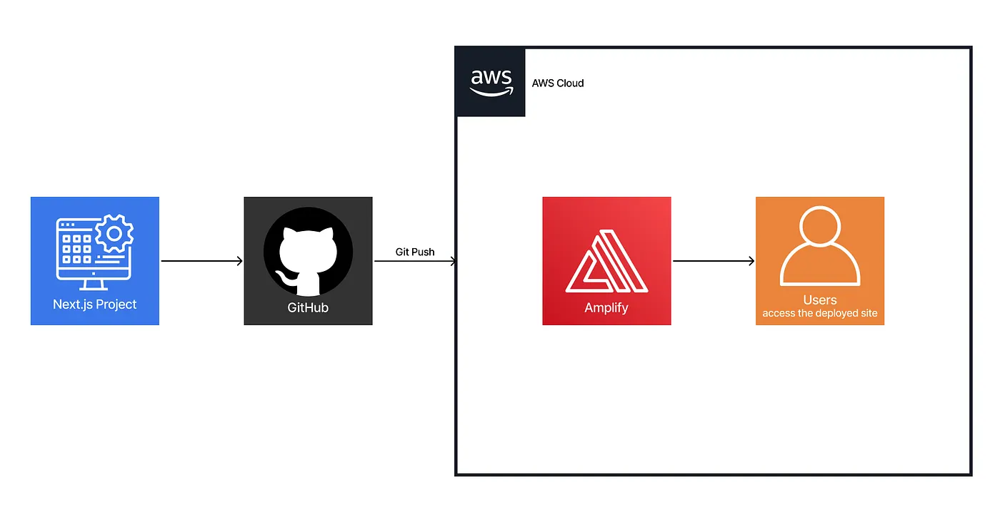
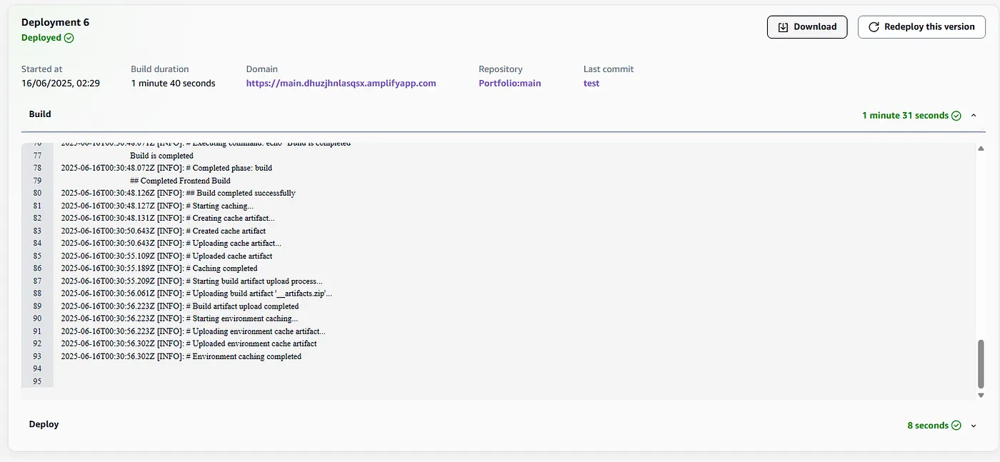
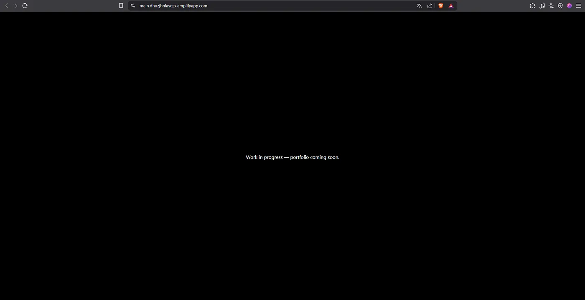

Rather than using a website builder, I wanted to challenge myself by creating and deploying my own portfolio using cloud infrastructure.
This project combines **Next.js**, **AWS Amplify**, and **AWS CDK** to build a modern pipeline that follows best practices of infrastructure as code, CI/CD, and automated deployment.

> This site is currently offline while the frontend is being finalized. Once completed, it will be deployed automatically, through the same pipeline.
> **Archived project:** The original GitHub repository is no longer available. This article is preserved as a record of the project, including its explanations, code snippets, and illustrations.

### Table of Contents

- [Implementation Strategy](#implementation-strategy)
- [Technical Implementation](#technical-implementation)
- [Testing & Validation](#testing--validation)
- [Conclusion](#conclusion)

## Implementation Strategy

---

To keep a clear separation between infrastructure and application logic, the project is organized into two main directories:

- `portfolio/`: contains the **Next.js** frontend application
- `infra/`: contains the **CDK** code responsible for deploying the app with AWS Amplify

The diagram below summarizes the CI/CD workflow from GitHub to AWS Amplify, where each push automatically triggers a new deployment accessible to users.



<figcaption>CI/CD flow from GitHub to Amplify, serving the site to users automatically.</figcaption>

The key technologies and services used include:

- **AWS CDK (TypeScript)** — to provision the Amplify application and connect it to GitHub
- **A custom Amplify** `**buildSpec**` — to build and export the static Next.js site
- **AWS Secrets Manager** — to securely store the GitHub access token

## Technical Implementation

---

### 1. Next.js Project Setup

The frontend is located in the `portfolio/` directory and was initialized with:

```bash
npx create-next-app@latest portfolio --typescript
```

To enable static export, I added the following script in `package.json`:

```json
"scripts": {
  "build-and-export": "next build && next export"
}
```

This outputs the static site to the `out/` directory, which Amplify will serve.

### 2. Amplify Deployment with CDK

The CDK stack provisions an Amplify application connected to a GitHub repository. The GitHub token is securely retrieved from **AWS Secrets Manager**:

```javascript
const amplifyApp = new amplify.App(this, "MyAmplifyApp", {
  appName: 'Portfolio',
  sourceCodeProvider: new amplify.GitHubSourceCodeProvider({
    owner: 'rayanoss',
    repository: 'portfolio_aws_amplify',
    oauthToken: cdk.SecretValue.secretsManager('github-token')
  }),
});
```

The build process is defined using a custom `buildSpec`, which installs dependencies, builds the app, and exports the static site:

```javascript
buildSpec: codebuild.BuildSpec.fromObjectToYaml({
  version: '1.0',
  frontend: {
    phases: {
      preBuild: {
        commands: [          
          'cd portfolio',
          'npm install'
        ]
      },
      build: {
        commands: [          
          'npm run build-and-export'
        ]
      }
    },
    artifacts: {
      baseDirectory: 'portfolio/out',
      files: ['**/*']
    },
    cache: {
      paths: [        'portfolio/node_modules/**/*',
        'portfolio/.next/cache/**/*'
      ]
    }
  }
})
```

Automatic deployment is enabled on the `main` branch:

```javascript
const mainBranch = amplifyApp.addBranch('main', { autoBuild: true });
```

### 3. CI/CD Pipeline

Thanks to the Amplify and GitHub integration, each push to the `main` branch triggers an automatic deployment. The workflow offers:

- Continuous deployment with no manual steps
- Visibility into build logs through the Amplify Console
- No need to manage custom build servers

This setup provides a simple yet effective introduction to CI/CD principles with minimal configuration effort.

## Testing & Validation

---

After pushing the project to GitHub and deploying the CDK stack, I validated the full workflow:

### 1. CI/CD Workflow

After deployment, the portfolio was successfully served through the Amplify-hosted URL, with all static content rendered as expected and no backend configuration required.



<figcaption>Successful deployment in Amplify triggered by a push to the main branch.</figcaption>

### 2. Static Export Verification

Below is an extract from the Amplify build logs, showing the static export workflow in action, from install to artifact upload.

```bash
2025-06-16T00:30:00.095Z [INFO]: Cloning into 'portfolio_aws_amplify'...
2025-06-16T00:30:00.150Z [INFO]: Successfully cleaned up Git credentials
2025-06-16T00:30:14.465Z [INFO]: ## Starting Backend Build
2025-06-16T00:30:14.471Z [INFO]: ## Starting Frontend Build
2025-06-16T00:30:14.471Z [INFO]: # Starting phase: preBuild
2025-06-16T00:30:14.515Z [INFO]: # Executing command: npm install
2025-06-16T00:30:29.805Z [INFO]: up to date, audited 171 packages in 12s
2025-06-16T00:30:29.811Z [INFO]: 95 packages are looking for funding
2025-06-16T00:30:29.812Z [INFO]: # Starting phase: build
2025-06-16T00:30:29.813Z [INFO]: # Executing command: npm run build-and-export
2025-06-16T00:30:48.072Z [INFO]: # Completed phase: build
2025-06-16T00:30:48.126Z [INFO]: ## Build completed successfully
2025-06-16T00:30:56.061Z [INFO]: Uploading build artifact '__artifacts.zip'
2025-06-16T00:30:56.223Z [INFO]: Build artifact upload completed
```

### 3. Amplify Hosting Verification

After deployment, the portfolio was successfully served through the Amplify-hosted URL, with all static content rendered as expected and no backend configuration required.



<figcaption>Amplify-hosted version of the portfolio successfully rendered in the browser</figcaption>

## Conclusion

---

This project demonstrates how to deploy a static portfolio using **Next.js**, **AWS Amplify**, and **CDK**, following modern DevOps practices such as CI/CD, infrastructure as code, and automated deployments.

The result is a reproducible and maintainable architecture, where every update pushed to GitHub is automatically built and deployed through Amplify.
