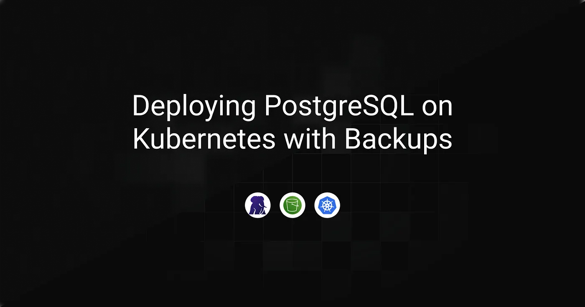
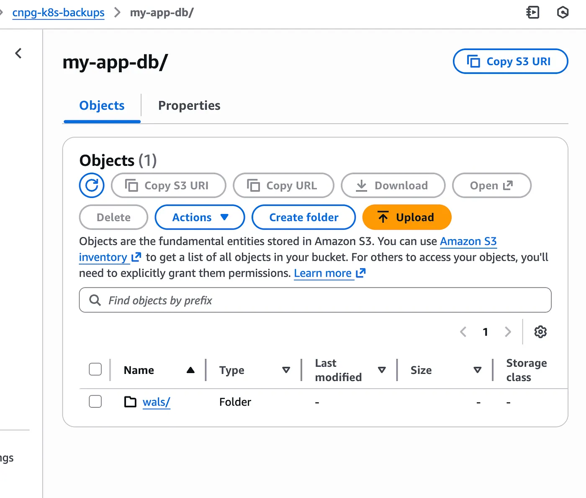
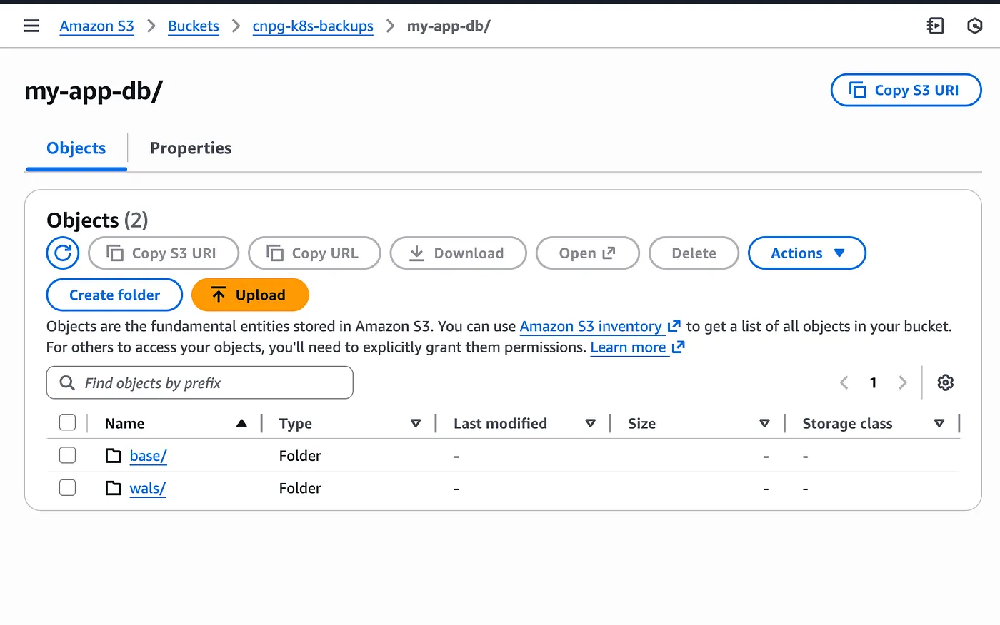
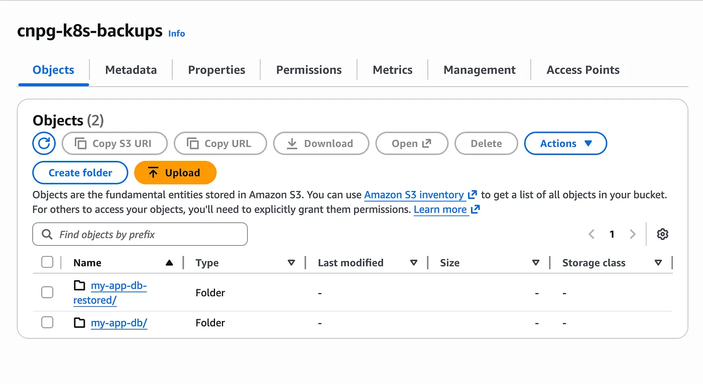
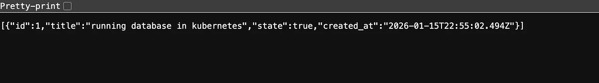

In this guide, we deploy a PostgreSQL database on Kubernetes with backups stored in S3. The goal is simple: database data should not depend on the lifecycle of Pods or volumes. By externalizing backups to object storage, the database can be recreated without losing existing data.

In practice, this avoids situations where a cluster issue turns into data loss, broken applications, or missing historical records. The following sections walk through how to set up this kind of database deployment and backup flow step by step, starting from the infrastructure and ending with data access.

> **Archived project:** The original GitHub repository is no longer available. This article is preserved as a record of the project, including its explanations, code snippets, and illustrations.

---

### Table of Contents

- [PostgreSQL Cluster with Backups on Kubernetes](#postgresql-cluster-with-backups-on-kubernetes)
- [Connecting a Stateless API to the Restored Database](#connecting-a-stateless-api-to-the-restored-database)
- [Conclusion](#conclusion)


## PostgreSQL Cluster with Backups on Kubernetes

We start with the database layer, covering the full flow from connecting PostgreSQL to S3 and enabling backups to inserting real data, deleting the cluster, and restoring it.

### Installing CloudNativePG

CloudNativePG is the operator responsible for running and managing PostgreSQL inside Kubernetes. It handles cluster lifecycle, initialization, services, and exposes the primitives we will rely on later for backups and restore.

We install it using Helm:

```bash
helm repo add cnpg https://cloudnative-pg.github.io/charts
helm upgrade --install cnpg \
  --namespace cnpg-system \
  --create-namespace \
  cnpg/cloudnative-pg
```

Once the operator is running, Kubernetes can manage PostgreSQL clusters as first-class resources.

### Installing Barman Cloud

Barman Cloud is used to connect PostgreSQL to object storage. It is responsible for shipping base backups and WAL files to S3, and later restoring a cluster from those backups.

The plugin relies on `cert-manager` to enable secure TLS communication with the CloudNativePG operator, so it must be installed first:

```bash
kubectl apply -f https://github.com/cert-manager/cert-manager/releases/download/v1.19.2/cert-manager.yaml
```

We then install the Barman Cloud plugin, which adds the CRDs required to define backup stores and recovery sources:

```bash
kubectl apply -f https://github.com/cloudnative-pg/plugin-barman-cloud/releases/download/v0.10.0/manifest.yaml
```

With the operator and backup plugin in place, the next step is defining where PostgreSQL data will be backed up.

### Configuring the Backup Object Store

Backups and WAL archives are stored in S3 using a CloudNativePG `ObjectStore` resource. This resource defines where PostgreSQL backups are stored and which credentials are used to access the bucket.

PostgreSQL relies on two complementary mechanisms for recovery. **Base backups** are full snapshots of the database at a given point in time, while **WAL (Write-Ahead Log) files** record every change made after that snapshot. Base backups provide the starting point, and WAL files allow PostgreSQL to replay changes and reach a consistent state during a restore.

In this setup, base backups will be created periodically, and WAL files will be archived continuously to S3. Both are required to fully restore the database after a cluster deletion.

```yaml
# backups.yaml
apiVersion: barmancloud.cnpg.io/v1
kind: ObjectStore
metadata:
  name: s3-backup-store
  namespace: my-app
spec:
  configuration:
    destinationPath: s3://<your-backup-bucket>/
    s3Credentials:
      accessKeyId:
        name: aws-creds
        key: AWS_ACCESS_KEY_ID
      secretAccessKey:
        name: aws-creds
        key: AWS_SECRET_ACCESS_KEY
    wal:
      compression: gzip
```

We can now deploy the PostgreSQL cluster using this backup configuration.

### Creating the PostgreSQL Cluster

The PostgreSQL cluster is deployed using CloudNativePG. On first startup, PostgreSQL is initialized using `initdb`, which creates the data directory, system catalogs, and initial database and role. WAL archiving is enabled immediately so that every database change is captured and shipped to S3.

The `spec.plugins` section connects the cluster to the `ObjectStore` defined earlier. It tells CloudNativePG to use that S3 backend for archiving WAL files and handling backups. The `serverName` parameter defines the logical name under which backups and WAL archives are stored in S3, allowing multiple clusters to share the same bucket without conflicts.

```yaml
# database.yaml
apiVersion: postgresql.cnpg.io/v1
kind: Cluster
metadata:
  name: my-app-db
  namespace: my-app
spec:
  instances: 1
  imageName: ghcr.io/cloudnative-pg/postgresql:18.1-minimal-trixie
  bootstrap:
    initdb:
      database: app
      owner: app
  plugins:
  - name: barman-cloud.cloudnative-pg.io
    isWALArchiver: true
    parameters:
      barmanObjectName: s3-backup-store
      serverName: my-app-db
  storage:
    size: 1Gi
```

As soon as the cluster starts, WAL files begin to appear in S3, even before any base backup exists.



<figcaption>WAL files visible in S3 right after database startup</figcaption>

To validate the backup workflow, we start by inserting a small amount of real data.

### Preparing Data for Backup Validation

To make the recovery test meaningful, we insert real data directly into the PostgreSQL pod. For simplicity, we connect straight to the primary instance using `kubectl exec`:

```bash
kubectl exec -it my-app-db-1 -n my-app -- psql
```

You are now connected as a superuser to the default `postgres` database. Switch to the application database:

```bash
\c app
```

Create a simple `todos` table:

```sql
CREATE TABLE todos (
  id SERIAL PRIMARY KEY,
  title TEXT NOT NULL,
  state BOOLEAN NOT NULL DEFAULT false,
  created_at TIMESTAMPTZ NOT NULL DEFAULT now()
);
```

Since the table is created as a superuser, ownership is transferred to the `app` user so the application can fully manage it:

```sql
ALTER TABLE todos OWNER TO app;
```

Insert a test row:

```sql
INSERT INTO todos (title, state)
VALUES ('running database in kubernetes', true);
```

Verify the data:

```sql
SELECT * FROM todos;
 id | title                           | state | created_at
----+---------------------------------+-------+------------------------------
  1 | running database in kubernetes  | t     | 2026-01-15 22:55:02+00
(1 row)
```

This data will serve as a reference when validating the restore later on.

### Creating the First Base Backup

Base backups are created using a `ScheduledBackup` resource. This triggers a full snapshot of the PostgreSQL data directory and uploads it to S3.

```yaml
# scheduled-backup.yaml
apiVersion: postgresql.cnpg.io/v1
kind: ScheduledBackup
metadata:
  name: my-app-db-daily
  namespace: my-app
spec:
  schedule: "0 0 0 * * *"
  cluster:
    name: my-app-db
  method: plugin
  pluginConfiguration:
    name: barman-cloud.cloudnative-pg.io
```

The `schedule` field follows a cron format and is evaluated in **UTC**. For testing purposes, you can temporarily set it to run a few minutes in the future to quickly generate a base backup and verify that everything is working as expected.



<figcaption>Base backup visible in S3 after ScheduledBackup execution</figcaption>

With a base backup and WAL archives available, the database can now be safely recreated.

### Deleting the PostgreSQL Cluster

To validate the setup, the PostgreSQL cluster is deliberately deleted. This removes Pods, persistent volumes, and all local database data.

```bash
kubectl delete cluster my-app-db -n my-app
```

The backups stored in S3 remain untouched, which is exactly what we rely on for recovery.

### Restoring the Database from S3

The database is restored by creating a new PostgreSQL cluster that bootstraps from existing backups instead of running `initdb`.

```yaml
# restored-database.yaml
apiVersion: postgresql.cnpg.io/v1
kind: Cluster
metadata:
  name: my-app-db-restored
  namespace: my-app
spec:
  instances: 1
  imageName: ghcr.io/cloudnative-pg/postgresql:18.1-minimal-trixie
  bootstrap:
    recovery:
      source: backup-source
  externalClusters:
  - name: backup-source
    plugin:
      name: barman-cloud.cloudnative-pg.io
      parameters:
        barmanObjectName: s3-backup-store
        serverName: my-app-db
  plugins:
  - name: barman-cloud.cloudnative-pg.io
    isWALArchiver: true
    parameters:
      barmanObjectName: s3-backup-store
      serverName: my-app-db-restored
  storage:
    size: 1Gi
```

CloudNativePG relies on `bootstrap.recovery` to restore the database from a base backup and then replay WAL files until a consistent state is reached.

The `externalClusters` section explicitly references the backup location of the original cluster. In this case, it points to the backups produced by `my-app-db`, allowing the new cluster to restore its data from that history.

At the same time, the `plugins` section is kept enabled. This allows the restored cluster to start archiving WAL files immediately after recovery. The key detail is the use of a different `serverName`. This ensures that the restored cluster writes its WAL files and future backups under a new logical namespace in S3.



As shown above, two separate folders exist in the same S3 bucket: one for the original cluster and one for the restored cluster.

Reconnect to the database and verify the data:

```bash
kubectl exec -it my-app-db-1 -n my-app -- psql
```

Switch to the application database:

```bash
\c app
```

Verify the data:

```sql
SELECT * FROM todos;
 id | title                           | state | created_at
----+---------------------------------+-------+------------------------------
  1 | running database in kubernetes  | t     | 2026-01-15 22:55:02+00
(1 row)
```

Seeing the previously inserted row confirms that the database was restored correctly from backup.

## Connecting a Stateless API to the Restored Database
---

To validate the setup end to end, we deploy a simple stateless API pod that connects to the restored database.

All database connection details are injected through environment variables sourced from Kubernetes Secrets automatically generated by CloudNativePG. The application itself does not embed any database configuration and simply reads connection parameters from its environment.

```yaml
# api-pod.yaml
apiVersion: v1
kind: Pod
metadata:
  name: my-app-api
  namespace: my-app
  labels:
    app: my-app-api
spec:
  containers:
  - name: api
    image: rayanos/my-app-api:0.1.0
    imagePullPolicy: IfNotPresent
    ports:
    - containerPort: 3000
    env:
    - name: PORT
      value: "3000"
    - name: DB_USER
      valueFrom:
        secretKeyRef:
          name: my-app-db-app
          key: username
    - name: DB_PASSWORD
      valueFrom:
        secretKeyRef:
          name: my-app-db-app
          key: password
    - name: DB_HOST
      valueFrom:
        secretKeyRef:
          name: my-app-db-app
          key: host
    - name: DB_NAME
      valueFrom:
        secretKeyRef:
          name: my-app-db-app
          key: dbname
```

Once the pod is running, we expose it internally using a ClusterIP service:

```bash
kubectl expose pod my-app-api \
  --name=my-app-api \
  --namespace=my-app \
  --port=80 \
  --target-port=3000 \
  --type=ClusterIP
```

To access the API locally, we forward the service port to the host:

```bash
kubectl port-forward -n my-app svc/my-app-api 80:80
```

The API can now be queried locally at `http://localhost/api/todos` and returns data directly from the restored PostgreSQL database.



<figcaption>API response showing restored data</figcaption>

## Conclusion
---

CloudNativePG follows PostgreSQL’s native recovery logic rather than treating backups as simple file copies. A restored cluster starts a new history, which is why WAL archives cannot be shared. Using a distinct serverName ensures that recovery and future backups remain clean and predictable.
