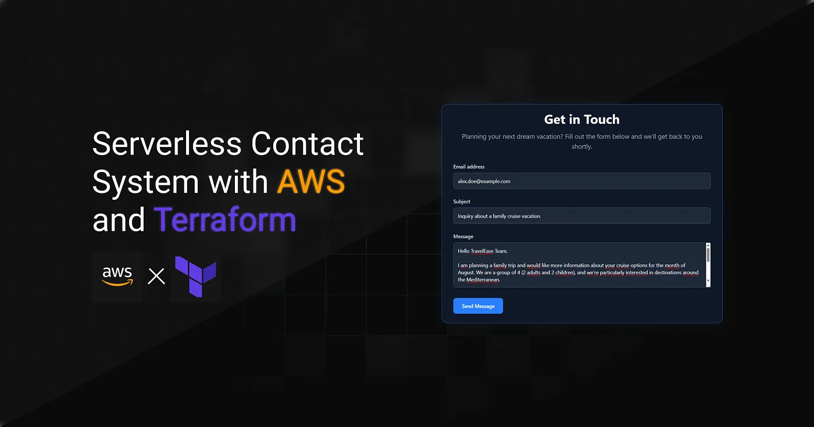
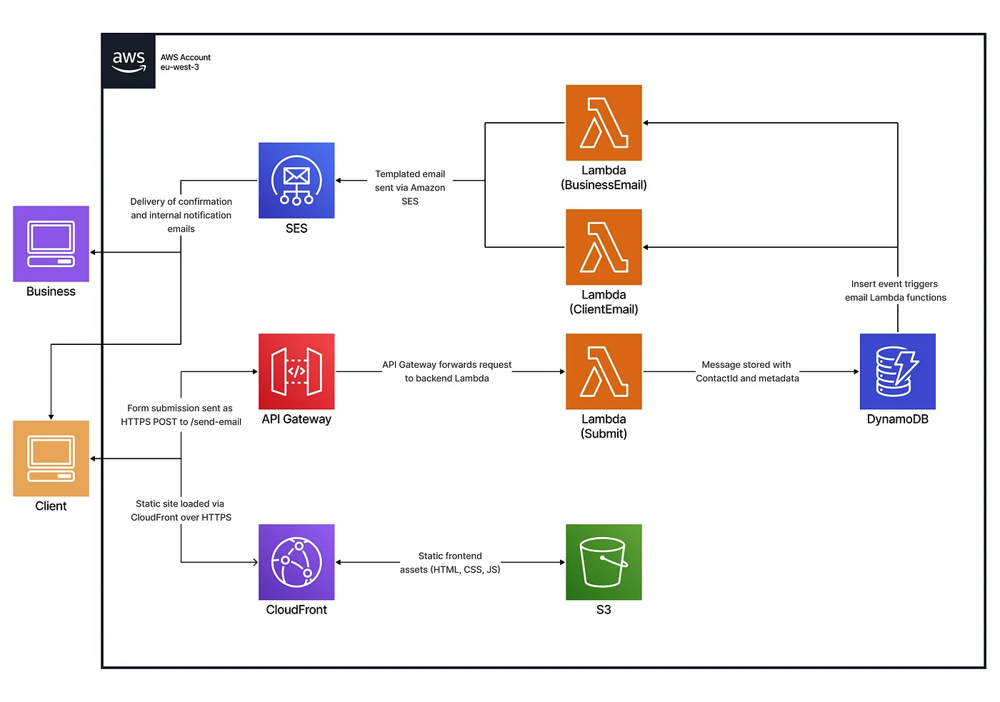
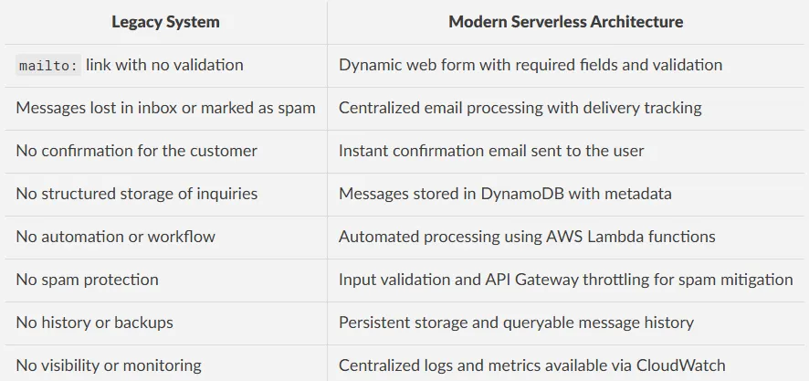
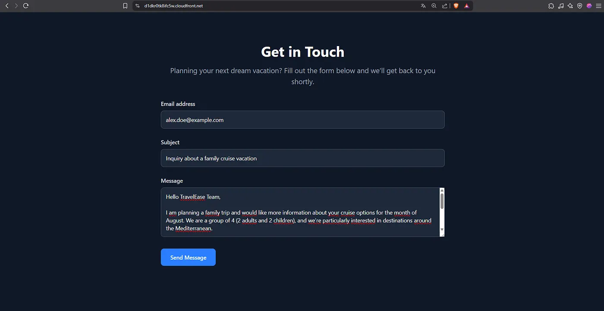
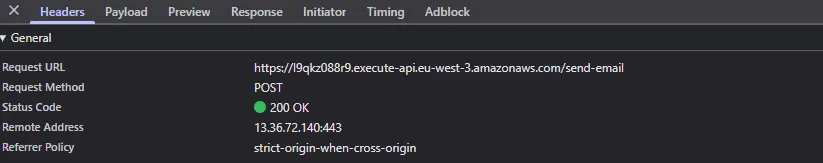
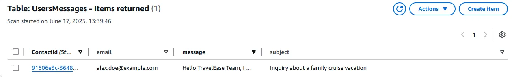
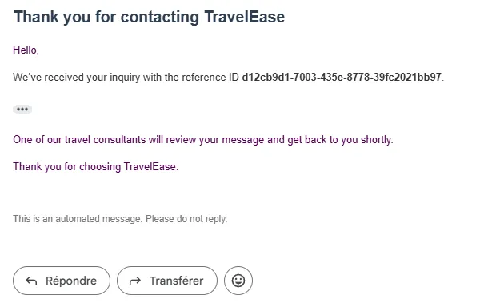
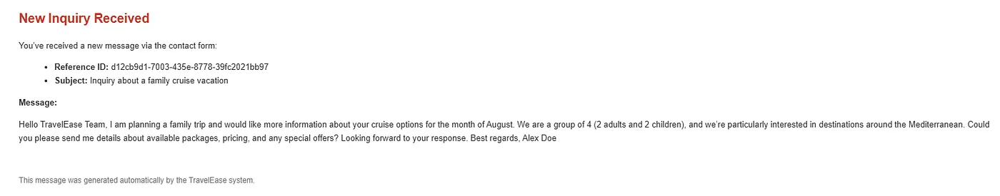

> **Archived project:** The original GitHub repository is no longer available. This article is preserved as a record of the project, including its explanations, code snippets, and illustrations.

**TravelEase Inc.** was a growing travel company facing increasing challenges with how it handled **customer inquiries**. The existing setup relied on a simple `mailto:` link, which often resulted in **missed messages**, **delivery issues**, and a lack of **confirmation** for users. To improve reliability, scalability, and offer a more professional experience, we set out to design a **modern**, **automated**, and **scalable** solution that could evolve with the company’s growth.

## Table of Contents

---

- [Implementation Strategy](#implementation-strategy)
- [System Architecture Overview](#system-architecture-overview)
- [Testing and System Validation](#testing-and-system-validation)
- [Conclusion](#conclusion)

## Implementation Strategy

---

TravelEase’s original system relied on a basic `mailto:` link embedded in the site.
While simple to implement, this approach offered **no validation**, **no feedback**, and **no way to track inquiries**, making it unsuitable for a **growing business**.

We replaced it with a **modular**, **serverless**, and **cloud-native** infrastructure managed entirely with **Terraform**.
The new system was built around **event-driven processing**, a **REST API** for frontend integration, and a backend capable of securely storing and managing customer messages.



<figcaption>Architecture diagram of the serverless contact system using AWS services.</figcaption>

The table below compares the legacy system with the new serverless architecture:



The new system automated the entire workflow, from form submission to storage and notification, using **Lambda functions**, **DynamoDB**, and **SES**.

Each message was **validated**, **processed**, and **logged**, giving TravelEase the **reliability**, **visibility**, and **scalability** it previously lacked.

## System Architecture Overview

---

### API Gateway Integration

An HTTP API was provisioned using **Amazon API Gateway v2** to serve as the secure entry point between the frontend and the backend services.

It receives form submissions and forwards them directly to the appropriate **Lambda** function using **AWS_PROXY** integration mode.

```hcl
resource "aws_apigatewayv2_api" "my_api" {
  name = "travelease-api"
  cors_configuration {
    allow_origins = ["https://${var.cloudfront_domain}"]
    allow_methods = ["POST", "OPTIONS"]
    allow_headers = ["Content-Type", "Authorization"]
    max_age       = 300
  }
  protocol_type = "HTTP"
}
resource "aws_apigatewayv2_integration" "integration" {
  api_id               = aws_apigatewayv2_api.my_api.id
  integration_type     = "AWS_PROXY"
  integration_method   = "POST"
  integration_uri      = var.invoke_arn
  passthrough_behavior = "NEVER"
}
resource "aws_apigatewayv2_route" "route" {
  api_id    = aws_apigatewayv2_api.my_api.id
  route_key = "POST /send-email"
  target    = "integrations/${aws_apigatewayv2_integration.integration.id}"
}
resource "aws_apigatewayv2_deployment" "deployment" {
  api_id = aws_apigatewayv2_api.my_api.id
  lifecycle {
    create_before_destroy = true
  }
}
resource "aws_apigatewayv2_stage" "default" {
  api_id      = aws_apigatewayv2_api.my_api.id
  name        = "$default"
  auto_deploy = true
  default_route_settings {
    throttling_rate_limit  = 100
    throttling_burst_limit = 200
  }
}
resource "aws_lambda_permission" "api_gateway" {
  statement_id  = "AllowExecutionFromAPIGateway"
  action        = "lambda:InvokeFunction"
  function_name = var.function_name
  principal     = "apigateway.amazonaws.com"
  source_arn    = "${aws_apigatewayv2_api.my_api.execution_arn}/$default/POST/send-email"
}
```

### Lambda-Based Message Processing

To automate contact form handling, three specialized **AWS Lambda** functions were deployed. Each responsible for a specific step in the workflow:

`add_message_to_database`

This function validates the incoming form data and stores it in **DynamoDB**.

```ts
await ddbDocClient.send(new PutCommand({
    TableName: tablename,
    Item: itemWithKey
}));
```

`send_email_to_customer`

After a successful submission, this function sends a **confirmation email** to the customer using a predefined **SES template**.

```ts
await sesClient.send(new SendTemplatedEmailCommand({
    Source: process.env.DOMAIN_EMAIL,
    Destination: { ToAddresses: [process.env.SANDBOX_EMAIL] },
    Template: "client-email-template",
    TemplateData: JSON.stringify({
      contactId: newItem.ContactId,
      subject: newItem.subject,
      content: newItem.message,
    }),
}));
```

`send_email_to_business`

Finally, this function notifies the business team by sending an **internal alert** with the customer’s message and contact details.

```ts
await sesClient.send(new SendTemplatedEmailCommand({
    Source: process.env.DOMAIN_EMAIL,
    Destination: { ToAddresses: [process.env.SANDBOX_EMAIL] },
    Template: "business-email-template",
    TemplateData: JSON.stringify({
      contactId: newItem.ContactId,
      subject: newItem.subject,
      content: newItem.message,
    }),
 }));
```

`Modular Lambda Definition and Reuse with for_each`

The `locals` block defines the configuration for each Lambda function. These definitions are then passed to a reusable Terraform module using `for_each`, enabling dynamic provisioning of multiple Lambda functions with their respective configurations.

```hcl
locals {
  lambdas = {
    send_email_to_business = {
      name       = "send_email_to_business",
      source_dir = ".../send_email_to_business",
      output_path = ".../send_email_to_business.zip",
      environment_variables = {
        SANDBOX_EMAIL = var.sandbox_email,
        DOMAIN_EMAIL  = var.domain_email
      },
      policy = jsonencode({
        Statement = [{
          Effect = "Allow",
          Action = ["ses:SendTemplatedEmail", ...], // full list truncated for readability
          Resource = "*"
        }]
      })
    },
    ... // other lambda configs
  }
}
module "lambdas" {
  for_each           = local.lambdas
  source             = "./modules/infra/lambda"
  assume_role_policy = data.aws_iam_policy_document.lambda_assume_role.json
  lambda_config      = each.value
}
```

While the module abstracts all logic, the underlying deployment includes:

```hcl
resource "aws_iam_role" "iam_role_for_lambda" {
  name               = "${var.lambda_config.name}_role"
  assume_role_policy = var.assume_role_policy
}
resource "aws_iam_role_policy" "iam_lambda_policy" {
  name   = "${var.lambda_config.name}_policy"
  role   = aws_iam_role.iam_role_for_lambda.id
  policy = var.lambda_config.policy
}
data  "archive_file"  "my_archive_file" {
  type            =  "zip"
  source_dir      =  var.lambda_config.source_dir
  output_path      =  var.lambda_config.output_path
}
resource "aws_lambda_function" "my_lambda_function" {
  filename         = var.lambda_config.output_path
  function_name    = var.lambda_config.name
  role             = aws_iam_role.iam_role_for_lambda.arn
  handler          = "function.handler"
  runtime          = "nodejs20.x"
  source_code_hash = data.archive_file.my_archive_file.output_base64sha256
  environment {
    variables = var.lambda_config.environment_variables
  }
}
```

### Message Storage with DynamoDB

User messages are stored in a **DynamoDB** table configured with both a **primary key** and a **global secondary index** (GSI) for efficient querying.

```hcl
resource "aws_dynamodb_table" "dynamodb_table" {
  name              = "UsersMessages"
  read_capacity     = 20
  write_capacity    = 20
  hash_key          = "ContactId"
  stream_enabled    = true
  stream_view_type  = "NEW_IMAGE"
  
  attribute {
      name = "ContactId"
      type = "S"
  }
  
  attribute {
    name = "Email"
    type = "S"
  }
  
  global_secondary_index {
    name            = "EmailIndex"
    hash_key        = "Email"
    write_capacity  = 10
    read_capacity   = 10
    projection_type = "ALL"
  }
}
```

To react to new message submissions, an **event source mapping** connects the table’s stream to one or more Lambda functions. This allows processing logic (like sending emails) to be triggered **automatically** on **insert events**.

```hcl
resource "aws_lambda_event_source_mapping" "dynamo_event" {
  count              = length(var.function_names)
  function_name      = var.function_names[count.index]
  event_source_arn   = aws_dynamodb_table.dynamodb_table.stream_arn
  starting_position  = "LATEST"
  filter_criteria {
      filter {
        pattern = jsonencode({
          eventName: ["INSERT"]
        })
      }
    }
}
```

### Email Delivery with Amazon SES

To handle outgoing and incoming emails, **Amazon SES** was integrated into the architecture. This setup includes identity verification, message reception, and templated email responses.

`Domain and Email Identity Verification`

SES requires domain and email ownership validation before sending or receiving messages:

```hcl
resource "aws_ses_domain_identity" "domain_verification" {
  domain = var.domain
}
resource "aws_ses_domain_dkim" "domain_verification_dkim" {
  domain = aws_ses_domain_identity.domain_verification.domain
}
resource "aws_ses_email_identity" "sandbox_email" {
  email = var.sandbox_email
}
```

`Templated Email Responses`

To send structured emails, SES templates were created for both the customer and the business team:

```hcl
resource "aws_ses_template" "client_email_template" {
  name    = "client-email-template"
  subject = "Your message has been sent successfully"
  html    = file("${path.module}/templates/client_template.html")
  text    = file("${path.module}/templates/client_template.txt")
}
resource "aws_ses_template" "business_email_template" {
  name    = "business-email-template"
  subject = "You have received a new form"
  html    = file("${path.module}/templates/business_template.html")
  text    = file("${path.module}/templates/business_template.txt")
}
```

`Inbound Email Rule Set`

Incoming emails are captured using a SES rule set that stores the messages in an S3 bucket and optionally triggers Lambda processing:

```hcl
resource "aws_ses_receipt_rule_set" "main" {
  rule_set_name = "emails-reception-rules"
}
resource "aws_ses_active_receipt_rule_set" "main" {
  rule_set_name = aws_ses_receipt_rule_set.main.rule_set_name
}
resource "aws_ses_receipt_rule" "store" {
  name          = "stockage-s3"
  rule_set_name = aws_ses_receipt_rule_set.main.rule_set_name
  recipients    = [var.domain_email]
  enabled       = true
  scan_enabled  = true
  s3_action {
    bucket_name = var.bucket
    position    = 1
  }
}
```

This setup ensures reliable email delivery and secure message handling without relying on third-party providers.

### Frontend Hosting with CloudFront

Finally, the static website is stored in an S3 bucket and distributed through **CloudFront** with an **SSL certificate**. A bucket policy is required to restrict direct S3 access and ensure that **only CloudFront** can serve the static assets publicly. This improves both **security** and **performance**.

```hcl
locals {
  s3_origin_id = "myS3Origin"
}
resource "aws_cloudfront_origin_access_control" "oac" {
  name                              = "myoac"
  origin_access_control_origin_type = "s3"
  signing_behavior                  = "always"
  signing_protocol                  = "sigv4"
}
resource "aws_cloudfront_distribution" "cloudfront_distribution" {
  origin {
    domain_name              = var.s3_domain_name
    origin_access_control_id = aws_cloudfront_origin_access_control.oac.id
    origin_id                = local.s3_origin_id
  }
  enabled             = true
  is_ipv6_enabled     = true
  default_root_object = "index.html"
  default_cache_behavior {
    allowed_methods  = ["GET", "HEAD", "OPTIONS"]
    cached_methods   = ["GET", "HEAD"]
    target_origin_id = local.s3_origin_id
    cache_policy_id = "658327ea-f89d-4fab-a63d-7e88639e58f6"
    viewer_protocol_policy = "redirect-to-https"
  }
  restrictions {
    geo_restriction {
      restriction_type = "none"
    }
  }
  viewer_certificate {
    cloudfront_default_certificate = true
  }
}
```

To meet this requirement, we define a **bucket policy** that allows access only to requests coming from the CloudFront distribution:

```hcl
resource "aws_s3_bucket_policy" "bucket_policy" {
  bucket = aws_s3_bucket.this.id
  policy = jsonencode({
    Version = "2012-10-17",
    Statement = [      merge({
        Effect = "Allow",
        Principal = {
          "${var.policy_principal.type}" = var.policy_principal.identifiers
        },
        Action   = var.policy_action,
        Resource = "${aws_s3_bucket.this.arn}/*"
      }, var.policy_condition != null ? { Condition = var.policy_condition } : {})
    ]
  })
}
```

## Testing and System Validation

---

### Frontend and CloudFront Validation

The CloudFront distribution correctly delivers the static frontend over HTTPS. The contact form is fully accessible.



<figcaption>User filling out the contact form hosted on the static website served by CloudFront.</figcaption>

### API Integration Verification

Submitting a `POST /send-email` request from the frontend correctly triggers the designated Lambda function.
The request payload is processed and successfully stored in the DynamoDB table.



<figcaption>Successful POST request to the /send-email endpoint through API Gateway (200 OK).</figcaption>



<figcaption>User message successfully stored in the DynamoDB table with metadata and ContactId.</figcaption>

### Email Processing via Amazon SES

Test emails sent to the configured domain were successfully received by Amazon SES.
Messages were stored in the specified S3 bucket and processed according to the active receipt rule set.
Templated responses were also dispatched as expected to both the customer and the business team.



<figcaption>Automated confirmation email sent to the customer after successful form submission.</figcaption>



<figcaption>Internal notification email sent to the business team containing the message details.</figcaption>

## Conclusion

---

This project shows that it is possible to design a secure and modular serverless system using Terraform. The infrastructure is automated, consistent, and built with long term maintenance in mind.

Each step of the contact workflow, from submission to storage and notification, is handled through event driven AWS services. The use of individual Lambda functions with scoped permissions helped maintain clear boundaries and follow best practices without adding unnecessary complexity.
