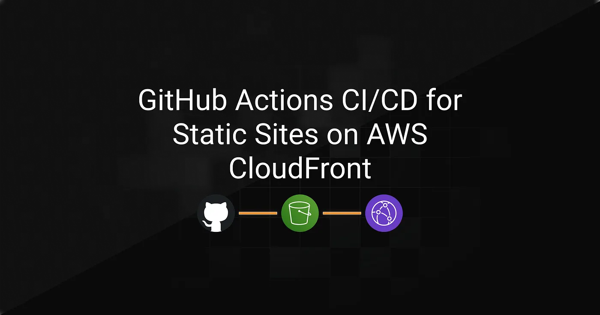
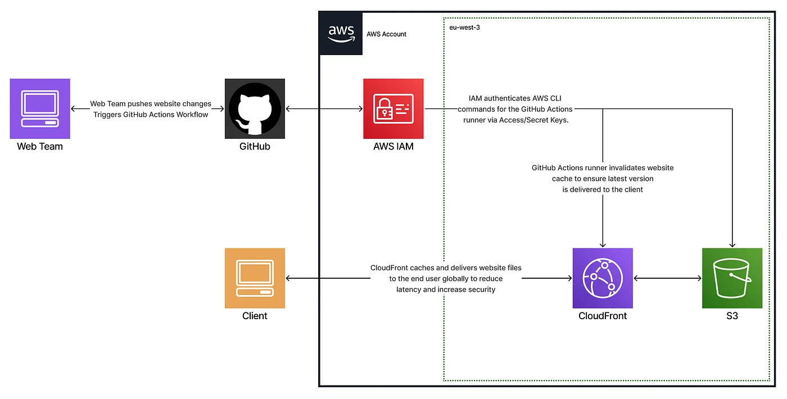
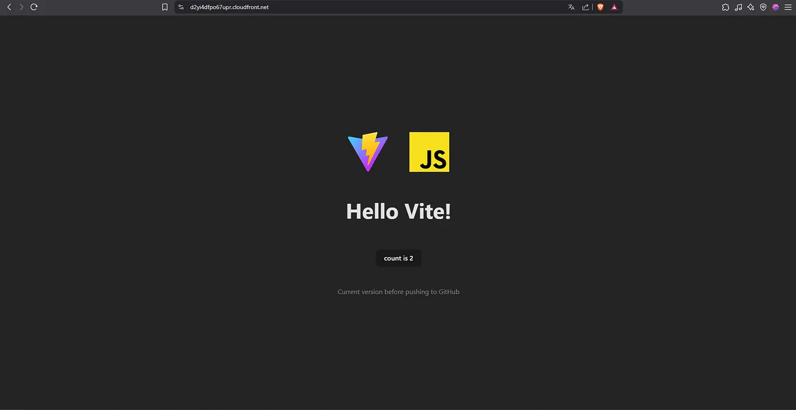
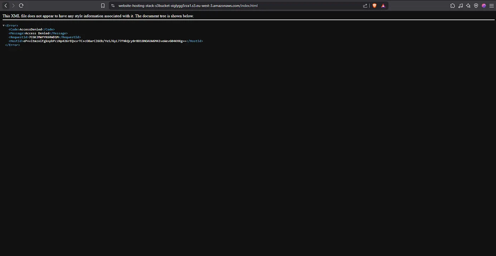
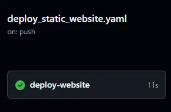
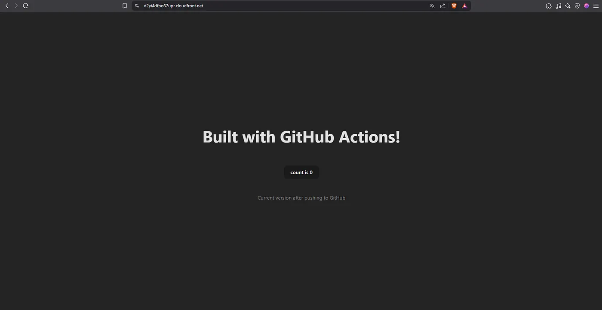
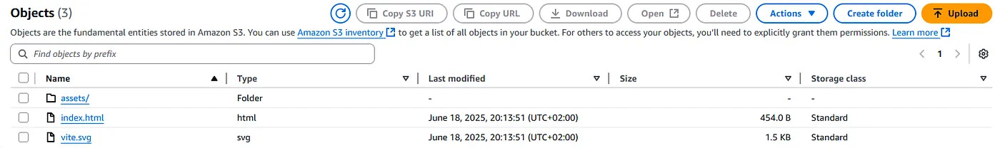

> **Archived project:** The original GitHub repository is no longer available. This article is preserved as a record of the project, including its explanations, code snippets, and illustrations.

CloudPipe is a small web agency that creates websites for local companies. Until recently, developers manually downloaded files from GitHub and uploaded them to the production server. This time-consuming process often led to errors, such as missing files or deploying the wrong version.

To address these challenges, I built a reliable and automated infrastructure where each website update is deployed through a GitHub Actions pipeline, eliminating the risks of manual uploads, and improving speed, consistency, and visibility.

## Table of Contents

---

- [Implementation Strategy](#implementation-strategy)
- [Technical Breakdown](#technical-breakdown)
- [Tests & Validation](#tests--validation)
- [Conclusion](#conclusion)

## Implementation Strategy

---



To enhance and modernize the agency’s outdated deployment process, I implemented a **CI/CD pipeline** that ensures a **reliable**, **scalable**, and **secure** distribution of the website using **GitHub Actions**, **AWS S3**, and **CloudFront**.

This new infrastructure delivers a complete solution by:

- Eliminating manual uploads to reduce human error
- Automating website deployment
- Hosting static content securely
- Delivering assets globally with access control
- Providing immediate feedback to developers on deployment status

To keep things simple while meeting key security and scalability requirements, I designed the system around three core layers:

- **Version control & trigger**: a GitHub repository that automatically initiates deployment on each push
- **Build & deploy pipeline**: builds the frontend, syncs files to S3, and invalidates CloudFront cache
- **Static hosting & distribution**: ensures fast, HTTPS-based delivery via CloudFront with access control

All resources were provisioned through **AWS CloudFormation**, allowing for reproducible and transparent infrastructure.

## Technical Breakdown

---

### GitHub Repository Configuration

The source files include `index.html`, JavaScript files, CSS stylesheets, and assets, all stored in the repository. The build output goes to `frontend/dist`, which is **synced** to the **S3 bucket** during deployment. Each push to `main` **automatically triggers the workflow**.

### GitHub Actions Workflow

The CI/CD pipeline is defined in `.github/workflows/deploy_static_website.yaml`.
It **automates** the entire **delivery process** by **building** the frontend, **uploading** it to S3, and **invalidating** the CloudFront cache to ensure users always receive the latest version of the site. **AWS credentials** and configuration values (such as access keys and bucket name) are **securely stored** in **GitHub Secrets**, preventing hardcoded credentials in the codebase.

```yaml
- name: Install Dependencies & build
  run: |
    cd frontend
    npm i
    npm run build- name: Configure AWS Credentials
  uses: aws-actions/configure-aws-credentials@v1
  with:
    aws-access-key-id: ${{ secrets.AWS_ACCESS_KEY_ID }}
    aws-secret-access-key: ${{ secrets.AWS_SECRET_ACCESS_KEY }}
    aws-region: eu-west-3
- name: Sync new files with S3 Bucket
  run: |
    aws s3 sync ./frontend/dist s3://${{ secrets.S3_BUCKET_NAME }} --delete
- name: Invalidate CloudFront cache
  run: |
    aws cloudfront create-invalidation --distribution-id ${{ secrets.CLOUDFRONT_DIST_ID }} --paths "/*"

```

### S3 Bucket and CloudFront

The CloudFormation template (`website-hosting-stack.yaml`) provisions the entire static hosting infrastructure, including:

- An **S3 bucket** to store static frontend assets (private, not exposed directly to the web)
- A **bucket policy** that restricts read access exclusively to CloudFront
- A **CloudFront distribution** that delivers the site securely over HTTPS with caching and access control
- A generated domain that serves as the public entry point to the website

Below is the CloudFormation template:

```yaml
AWSTemplateFormatVersion: "2010-09-09"
Description: Static website hosting using S3 and CloudFront
Resources:
  S3Bucket:
    Type: "AWS::S3::Bucket"
  CloudFrontOAC:
    Type: "AWS::CloudFront::OriginAccessControl"
    Properties:
      OriginAccessControlConfig:
        Name: "oac-for-s3"
        OriginAccessControlOriginType: s3
        SigningBehavior: always
        SigningProtocol: sigv4
  CloudFrontDistribution:
    Type: "AWS::CloudFront::Distribution"
    Properties:
      DistributionConfig:
        Origins:
          - DomainName: !GetAtt S3Bucket.RegionalDomainName
            Id: "static-hosting"
            S3OriginConfig: {}
            OriginAccessControlId: !GetAtt CloudFrontOAC.Id
        Enabled: true
        DefaultRootObject: "index.html"
        HttpVersion: http2and3
        IPV6Enabled: true
        ViewerCertificate:
          CloudFrontDefaultCertificate: true
        DefaultCacheBehavior:
          AllowedMethods: [GET, HEAD, OPTIONS]
          ViewerProtocolPolicy: redirect-to-https
          CachePolicyId: "658327ea-f89d-4fab-a63d-7e88639e58f6"
          Compress: true
          TargetOriginId: "static-hosting"
  BucketPolicy:
    Type: 'AWS::S3::BucketPolicy'
    Properties:
      Bucket: !Ref S3Bucket
      PolicyDocument:
        Version: '2012-10-17'
        Statement:
          - Effect: Allow
            Action: 's3:GetObject'
            Resource: !Sub 'arn:aws:s3:::${S3Bucket}/*'
            Principal:
              Service: 'cloudfront.amazonaws.com'
            Condition:
              StringEquals:
                AWS:SourceArn: !Sub 'arn:aws:cloudfront::${AWS::AccountId}:distribution/${CloudFrontDistribution}'
```

## Tests & Validation

---

### CloudFront delivery

Accessing the CloudFront domain successfully loads the updated site, served securely over HTTPS.



<figcaption>Website rendered via CloudFront</figcaption>

### S3 access restriction

Any direct attempt to access an object via an S3 URL returns an “Access Denied” message, confirming that only CloudFront can serve the content.



<figcaption>Access Denied error displayed when trying to reach the S3 object directly</figcaption>

### Deployment triggered by push

A push to the `main` branch automatically triggers the pipeline.
This was verified by inspecting the GitHub Actions logs.



<figcaption>GitHub Actions interface showing successful deployment pipeline run</figcaption>


<figcaption>Website rendered via CloudFront after deployment (Built with GitHub Actions!)</figcaption>

### Build artifacts

The Vite build output is generated in `frontend/dist` and successfully synced to the S3 bucket.



<figcaption>S3 console view showing index.html, vite.svg, and the /assets folder</figcaption>

## Conclusion

---

We moved from a **time-consuming** manual workflow to a **scalable**, **secure**, and **reliable** deployment process.
Websites are now hosted in a **private S3 bucket**, delivered securely through **CloudFront**, and every push to the `main` branch automatically triggers an updated deployment **within seconds**.
This transformation provides CloudPipe with a **modern infrastructure** that enables **faster**, **safer**, and **fully automated** website delivery, while significantly **reducing the risk of human error**.
