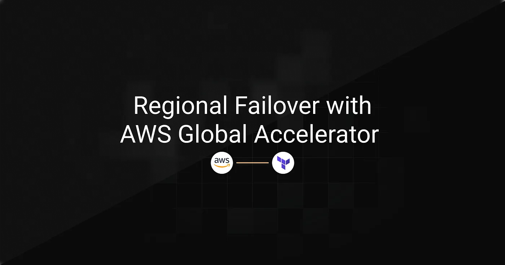
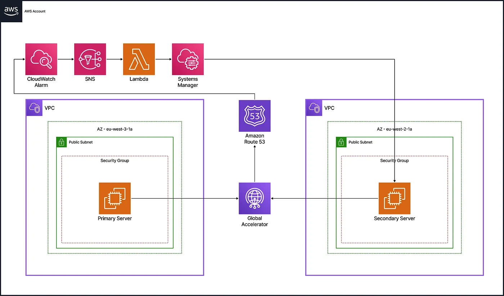
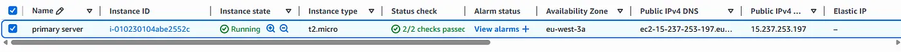
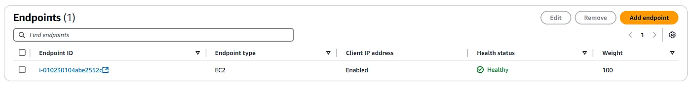
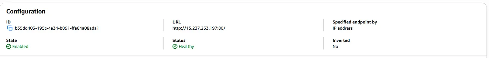
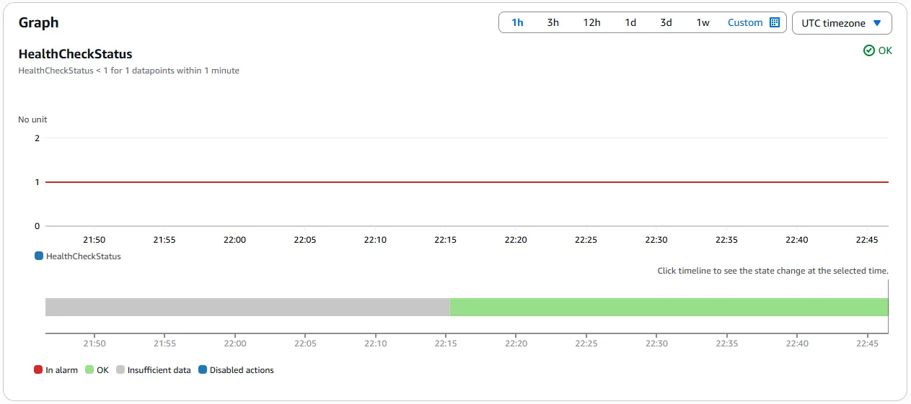
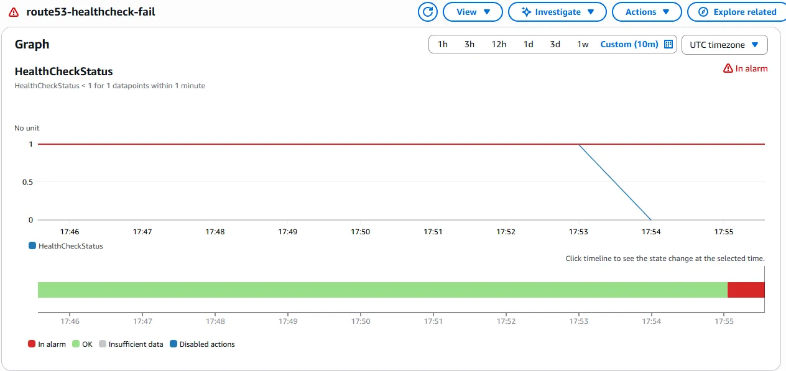
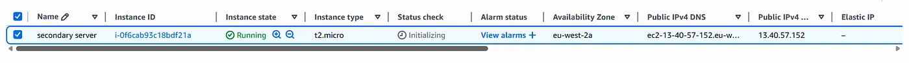
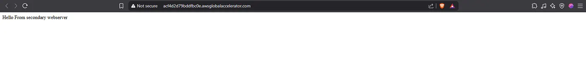

> **Archived project:** The original GitHub repository is no longer available. This article is preserved as a record of the project, including its explanations, code snippets, and illustrations.
> 
CloudSleuth requires its web application to remain **accessible** during regional **failures** or **disasters**. The challenge is to deliver a consistent user experience without **manual server management**, even when the primary region is unavailable. This architecture is designed to be scalable, reliable, and secure using AWS Global Accelerator, Route 53, CloudWatch, SSM, and Lambda. The entire infrastructure is automatically provisioned with Terraform.

## Table of Contents

---

- [Implementation Strategy](#implementation-strategy)
- [Technical Implementation](#technical-implementation)
- [Tests & Validation](#tests--validation)
- [Conclusion](#conclusion)

## Implementation Strategy

---



To ensure **high availability** and maintain access during regional outages, the architecture uses a **multi-region**, highly available web architecture managed entirely with Terraform. The solution uses **AWS Global Accelerator** to provide static IP addresses that remain consistent even during failover events. **Route 53** continuously monitors the **health** of the primary server through HTTP checks, while **CloudWatch** triggers **alarms** when **failures** occur and routes notifications via SNS. **Lambda functions automate** the failover process by starting backup instances through **Systems Manager (SSM)** and updating Global Accelerator routing to **redirect traffic** to the secondary region. When the primary server recovers, routing is restored to the original region without user impact.

## Technical Implementation

---

### Multi-Region Infrastructure

The infrastructure includes **two VPCs** in Paris and London, each with a public subnet and EC2 instance. The primary server runs by default in Paris, while the secondary in London stays in **pilot light mode** and starts only during **failover**.

`VPC Module`

```hcl
resource "aws_vpc" "main" {
  cidr_block           = "10.0.0.0/16"
  enable_dns_support   = true
  enable_dns_hostnames = true
}
resource "aws_subnet" "public" {
  vpc_id                  = aws_vpc.main.id
  cidr_block              = "10.0.1.0/24"
  map_public_ip_on_launch = true
}
resource "aws_security_group" "web_sg" {
  vpc_id = aws_vpc.main.id
  ingress {
    from_port   = 80
    to_port     = 80
    protocol    = "tcp"
    cidr_blocks = ["0.0.0.0/0"]
  }
}
```

`EC2 Module`

```hcl
data "aws_ami" "amazon_linux" {
  most_recent = true
  owners      = ["137112412989"]
  filter {
    name   = "name"
    values = ["al2023-ami-*-x86_64"]
  }
}
resource "aws_instance" "web" {
  ami           = data.aws_ami.amazon_linux.id
  instance_type = "t2.micro"
  subnet_id     = var.subnet_id
  vpc_security_group_ids = [var.security_groups]
  user_data = <<-EOF
    #!/bin/bash
    yum install -y httpd
    systemctl start httpd
    echo "Hello from ${var.server_message}" > /var/www/html/index.html
    %{ if !var.start_on_boot }
    shutdown -h now
    %{ endif }
  EOF
}
```

`Regional Module Usage`

```hcl
module "primary_vpc" {
  source = "./modules/infra/vpc"
  providers = {
    aws = aws.paris
  }
}
module "primary_webserver" {
  providers = {
    aws = aws.paris
  }
  source          = "./modules/infra/ec2"
  security_groups = module.primary_vpc.security_groups_id
  subnet_id       = module.primary_vpc.subnet_id
  server_message  = "primary webserver"
  start_on_boot   = true
}
# For the secondary region (London), we use the same modules
# with the aws.london provider and start_on_boot = false
```

### Global Accelerator Configuration

AWS Global Accelerator offers **two static IP** addresses for consistent access during failover. It uses a **TCP listener** on port 80 with two endpoint groups: the primary region **handles all traffic** by default, while the secondary stays on **standby**.

```hcl
resource "aws_globalaccelerator_accelerator" "global_accelerator" {
  name            = "Website"
  ip_address_type = "IPV4"
  enabled         = true
}
resource "aws_globalaccelerator_listener" "http_listener" {
  accelerator_arn = aws_globalaccelerator_accelerator.global_accelerator.id
  protocol        = "TCP"
  port_range {
    from_port = 80
    to_port   = 80
  }
}
resource "aws_globalaccelerator_endpoint_group" "primary_endpoint" {
  listener_arn          = aws_globalaccelerator_listener.http_listener.arn
  endpoint_group_region = "eu-west-3"
  endpoint_configuration {
    endpoint_id                    = module.primary_webserver.ec2_id
    weight                         = 100
    client_ip_preservation_enabled = true
  }
  depends_on = [module.primary_webserver]
}
resource "aws_globalaccelerator_endpoint_group" "secondary_endpoint" {
  listener_arn          = aws_globalaccelerator_listener.http_listener.arn
  endpoint_group_region = "eu-west-2"
  endpoint_configuration {
    endpoint_id                    = module.secondary_webserver.ec2_id
    weight                         = 0
    client_ip_preservation_enabled = true
  }
  depends_on = [module.secondary_webserver]
}
```

### Monitoring & Alerts

Monitoring and alerting detect primary server **failures** and manage **recovery**. Route 53 health checks probe the primary server’s public IP. When a health check fails, a CloudWatch alarm **sends a notification** to an **SNS topic** to trigger the **failover process**. A separate alarm detects when the server is healthy again, supporting the failback workflow.

`Failover Alert (Primary Failure)`

```hcl
resource "aws_route53_health_check" "primary_server_check" {
  type              = "HTTP"
  resource_path     = "/"
  port              = 80
  ip_address        = module.primary_webserver.public_ip
  failure_threshold = 3
  request_interval  = 30
}
resource "aws_cloudwatch_metric_alarm" "health_alarm" {
  alarm_name          = "route53-healthcheck-fail"
  metric_name         = "HealthCheckStatus"
  namespace           = "AWS/Route53"
  statistic           = "Minimum"
  period              = 60
  evaluation_periods  = 1
  threshold           = 1
  comparison_operator = "LessThanThreshold"
  dimensions = {
    HealthCheckId = aws_route53_health_check.primary_server_check.id
  }
  alarm_actions = [aws_sns_topic.failover_topic.arn]
}
resource "aws_sns_topic" "failover_topic" {
  name = "failover-topic"
}
```

`Failback Alert (Primary Recovery)`

```hcl
resource "aws_cloudwatch_metric_alarm" "failback_alarm" {
  alarm_name          = "route53-healthcheck-recovered"
  metric_name         = "HealthCheckStatus"
  namespace           = "AWS/Route53"
  statistic           = "Minimum"
  period              = 60
  evaluation_periods  = 1
  threshold           = 1
  comparison_operator = "GreaterThanOrEqualToThreshold"
  actions_enabled     = false
dimensions = {
    HealthCheckId = aws_route53_health_check.primary_server_check.id
  }
  alarm_actions = [aws_sns_topic.failback_topic.arn]
}
resource "aws_sns_topic" "failback_topic" {
  name = "failback-topic"
}
```

### SSM Automation Documents

AWS Systems Manager (SSM) Automation documents define the **failover and failback processes**. They specify steps to start or stop the secondary instance, shift traffic with Global Accelerator, and manage CloudWatch alarms for **seamless transitions** without manual intervention.

`IAM Role for SSM Automation`

```hcl
resource "aws_iam_role" "ssm_execution_role" {
  name = "FailoverSSMExecutionRole"
assume_role_policy = jsonencode({
    Version = "2012-10-17",
    Statement = [      {
        Effect = "Allow"
        Principal = {
          Service = "ssm.amazonaws.com"
        }
        Action = "sts:AssumeRole"
      }
    ]
  })
}
resource "aws_iam_role_policy" "ssm_execution_policy" {
  name = "ssm-execution-permissions"
  role = aws_iam_role.ssm_execution_role.id
  policy = jsonencode({
    Version = "2012-10-17",
    Statement = [      {
        Effect = "Allow"
        Action = [          "ec2:StartInstances",
          "ec2:DescribeInstances",
          "globalaccelerator:UpdateEndpointGroup"
        ]
        Resource = [module.secondary_webserver.instance_arn, aws_globalaccelerator_endpoint_group.primary_endpoint.arn, aws_globalaccelerator_endpoint_group.secondary_endpoint.arn]
      },
      {
        Effect = "Allow",
        Action = [          "cloudwatch:DisableAlarmActions",
          "cloudwatch:EnableAlarmActions"
        ],
        Resource = "*"
      }
    ]
  })
}
```

`run-second-instance.yaml` _(Starts and waits for the secondary instance)_

```yaml
schemaVersion: '0.3'
description: "Start and wait for the secondary instance to become healthy"
assumeRole: "{{ AutomationAssumeRole }}"
parameters:
  AutomationAssumeRole:
    type: String
    description: "Role to assume for executing the automation"
  SecondaryInstanceId:
    type: String
    description: "ID of the secondary EC2 instance"
mainSteps:
  - name: StartSecondaryInstance
    action: aws:changeInstanceState
    inputs:
      InstanceIds:
        - "{{ SecondaryInstanceId }}"
      DesiredState: running
  - name: WaitForInstanceToBeHealthy
    action: aws:waitForAwsResourceProperty
    inputs:
      Service: ec2
      Api: DescribeInstanceStatus
      InstanceIds:
        - "{{ SecondaryInstanceId }}"
      PropertySelector: "$.InstanceStatuses[0].InstanceStatus.Status"
      DesiredValues:
        - "ok"
      MaxAttempts: 10
      Interval: 15
```

`failover-doc.yaml` _(Shifts traffic to secondary and manages alarms)_

```yaml
schemaVersion: '0.3'
description: "Failover to the secondary instance and fully redirect Global Accelerator traffic"
assumeRole: "{{ AutomationAssumeRole }}"
parameters:
  AutomationAssumeRole:
    type: String
    description: "Role to assume for executing the automation"
  PrimaryInstanceId:
    type: String
    description: "ID of the primary EC2 instance"
  PrimaryEndpointGroupArn:
    type: String
    description: "ARN of the Global Accelerator primary endpoint group"
  SecondaryInstanceId:
    type: String
    description: "ID of the secondary EC2 instance"
  SecondaryEndpointGroupArn:
    type: String
    description: "ARN of the Global Accelerator secondary endpoint group"
mainSteps:
  - name: DisableFailoverAlarm
    action: aws:executeAwsApi
    inputs:
      Service: cloudwatch
      Api: DisableAlarmActions
      AlarmNames:
        - "route53-healthcheck-fail"
  - name: EnableFailbackAlarm
    action: aws:executeAwsApi
    inputs:
      Service: cloudwatch
      Api: EnableAlarmActions
      AlarmNames:
        - "route53-healthcheck-recovered"
  - name: ShiftTrafficToSecondary
    action: aws:executeAwsApi
    inputs:
      Service: GlobalAccelerator
      Api: UpdateEndpointGroup
      EndpointGroupArn: "{{ SecondaryEndpointGroupArn }}"
      EndpointConfigurations:
        - EndpointId: "{{ SecondaryInstanceId }}"
          Weight: 100
  - name: RemoveTrafficFromPrimary
    action: aws:executeAwsApi
    inputs:
      Service: GlobalAccelerator
      Api: UpdateEndpointGroup
      EndpointGroupArn: "{{ PrimaryEndpointGroupArn }}"
      EndpointConfigurations:
        - EndpointId: "{{ PrimaryInstanceId }}"
          Weight: 0
```

`shut-second-instance.yaml` _(Stops the secondary instance)_

```yaml
schemaVersion: "0.3"
description: "Shutdown the secondary EC2 instance"
assumeRole: "{{ AutomationAssumeRole }}"
parameters:
  AutomationAssumeRole:
    type: String
    description: "Role to assume for executing the automation"
  SecondaryInstanceId:
    type: String
    description: "ID of the secondary EC2 instance"
mainSteps:
  - name: StopSecondaryInstance
    action: aws:changeInstanceState
    inputs:
      InstanceIds:
        - "{{ SecondaryInstanceId }}"
      DesiredState: stopped
```

### Lambda Functions

Two Lambda functions handle **automated failover and failback**. Triggered by **SNS notifications** from **CloudWatch alarms**, they invoke **SSM Automation documents** to start or stop EC2 instances and update Global Accelerator routing.

`IAM Role and Policy`

```hcl
resource "aws_iam_role" "iam_for_lambda" {
  name               = "lambda_iam_for_ssm_2"
  assume_role_policy = data.aws_iam_policy_document.lambda_assume_role.json
}
resource "aws_iam_role_policy" "iam_lambda_policy" {
  name = "failover_policy"
  role = aws_iam_role.iam_for_lambda.id
  policy = jsonencode({
    Version = "2012-10-17",
    Statement = [      {
        Effect = "Allow",
        Action = ["ssm:StartAutomationExecution","ssm:GetAutomationExecution"],
        Resource = [          "${aws_ssm_document.failover_doc.arn}:$LATEST",
          "${aws_ssm_document.failback_doc.arn}:$LATEST",
          "${aws_ssm_document.shutdown_second_instance.arn}:$LATEST",
          "${aws_ssm_document.run_second_instance.arn}:$LATEST"
        ]
      },
      {
        Effect = "Allow",
        Action = "iam:PassRole",
        Resource = aws_iam_role.ssm_execution_role.arn
      },
      {
        Effect = "Allow",
        Action = ["logs:CreateLogGroup","logs:CreateLogStream","logs:PutLogEvents"],
        Resource = "*"
      }
    ]
  })
}
```

`Failover Lambda Function`

```hcl
resource "aws_lambda_function" "failover_handler" {
  filename         = data.archive_file.failover_archive.output_path
  function_name    = "failover-lambda"
  handler          = "function.handler"
  runtime          = "nodejs20.x"
  role             = aws_iam_role.iam_for_lambda.arn
  source_code_hash = data.archive_file.failover_archive.output_base64sha256
environment {
    variables = {
      AUTOMATION_DOCUMENT_NAME          = aws_ssm_document.failover_doc.name
      RUN_SECOND_INSTANCE_DOCUMENT_NAME = aws_ssm_document.run_second_instance.name
      AUTOMATION_ASSUME_ROLE_ARN        = aws_iam_role.ssm_execution_role.arn
      PRIMARY_INSTANCE_ID               = module.primary_webserver.ec2_id
      PRIMARY_ENDPOINT_GROUP_ARN        = aws_globalaccelerator_endpoint_group.primary_endpoint.arn
      SECONDARY_INSTANCE_ID             = module.secondary_webserver.ec2_id
      SECONDARY_ENDPOINT_GROUP_ARN      = aws_globalaccelerator_endpoint_group.secondary_endpoint.arn
    }
  }
}
resource "aws_sns_topic_subscription" "failover_sub" {
  topic_arn = aws_sns_topic.failover_topic.arn
  protocol  = "lambda"
  endpoint  = aws_lambda_function.failover_handler.arn
}
resource "aws_lambda_permission" "allow_sns_failover" {
  statement_id  = "AllowExecutionFromSNS"
  action        = "lambda:InvokeFunction"
  function_name = aws_lambda_function.failover_handler.function_name
  principal     = "sns.amazonaws.com"
  source_arn    = aws_sns_topic.failover_topic.arn
}
```

`Failback Lambda Function`

```hcl
resource "aws_lambda_function" "failback_handler" {
  filename         = data.archive_file.failback_archive.output_path
  function_name    = "failback-lambda"
  handler          = "function.handler"
  runtime          = "nodejs20.x"
  role             = aws_iam_role.iam_for_lambda.arn
  source_code_hash = data.archive_file.failback_archive.output_base64sha256
environment {
    variables = {
      AUTOMATION_DOCUMENT_NAME               = aws_ssm_document.failback_doc.name
      SHUTDOWN_SECOND_INSTANCE_DOCUMENT_NAME = aws_ssm_document.shutdown_second_instance.name
      AUTOMATION_ASSUME_ROLE_ARN             = aws_iam_role.ssm_execution_role.arn
      PRIMARY_INSTANCE_ID                    = module.primary_webserver.ec2_id
      PRIMARY_ENDPOINT_GROUP_ARN             = aws_globalaccelerator_endpoint_group.primary_endpoint.arn
      SECONDARY_INSTANCE_ID                  = module.secondary_webserver.ec2_id
      SECONDARY_ENDPOINT_GROUP_ARN           = aws_globalaccelerator_endpoint_group.secondary_endpoint.arn
    }
  }
}
resource "aws_sns_topic_subscription" "failback_sub" {
  topic_arn = aws_sns_topic.failback_topic.arn
  protocol  = "lambda"
  endpoint  = aws_lambda_function.failback_handler.arn
}
resource "aws_lambda_permission" "allow_sns_failback" {
  statement_id  = "AllowExecutionFromSNSFailback"
  action        = "lambda:InvokeFunction"
  function_name = aws_lambda_function.failback_handler.function_name
  principal     = "sns.amazonaws.com"
  source_arn    = aws_sns_topic.failback_topic.arn
}
```

## Tests & Validation

---

### Normal Operating State

The system runs in its default, steady state with traffic served from the **primary region** in Paris. The primary EC2 instance is powered on and **healthy**. Route 53 health checks confirm **availability**, CloudWatch alarms remain in the **OK state**, and Global Accelerator routes all traffic to the **primary endpoint** with static IP continuity.

`EC2 Instance Running (Paris Region)`



<figcaption>Shows the primary EC2 instance in running state with passed health checks. Confirms the server is ready to serve traffic.</figcaption>

`Global Accelerator Endpoint Configuration`



<figcaption>Displays the endpoint group with the Paris instance enabled and healthy, weighted at 100. Confirms Global Accelerator is routing all traffic to the primary server.</figcaption>

`Browser Rendering Through Accelerator IP`


<figcaption>Demonstrates accessing the static IP of the Global Accelerator, receiving the “Hello from primary webserver” response. Confirms end-user access works as expected.</figcaption>

`Route 53 Health Check Status`



<figcaption>Shows the Route 53 health check returning healthy status for the primary server’s public IP. Confirms AWS is monitoring and validating availability.</figcaption>

`CloudWatch Alarm in OK State`



<figcaption>Displays the CloudWatch alarm state timeline showing OK, indicating no detected failures during normal operation.</figcaption>

### Failover State (Secondary Region Active)

When the primary server in Paris is **unavailable**, traffic is automatically **redirected** to the **secondary server** in London. The Route 53 health check detects the **failure** and triggers a **CloudWatch alarm**, which **invokes** a **Lambda function** to start the standby instance and **update Global Accelerator routing**. The transition is **seamless** for users, maintaining access via the same static IP.

`CloudWatch Alarm`



<figcaption>Shows the alarm triggered by the failed health check, confirming that failover was detected and initiated.</figcaption>

`EC2 Instance in London`



<figcaption>Displays the secondary instance in “running” state after automated startup.</figcaption>

`User-Facing Result via Global Accelerator IP`



<figcaption>Confirms successful routing to the secondary server, with the application remaining accessible through the static IP.</figcaption>

The same workflow also handles the reverse scenario automatically. When the primary server becomes healthy again, routing is restored to Paris without manual intervention.

## Conclusion

---

By integrating Terraform with AWS Global Accelerator, Route 53, CloudWatch, Lambda, and Systems Manager, this architecture delivers a fully automated regional disaster recovery solution. It ensures sustained service availability without operator involvement, while maintaining a secure, modular, and compliant infrastructure aligned with best practices in fault tolerance.
