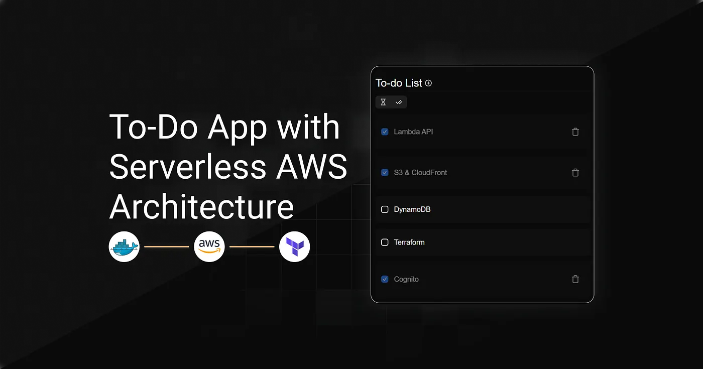
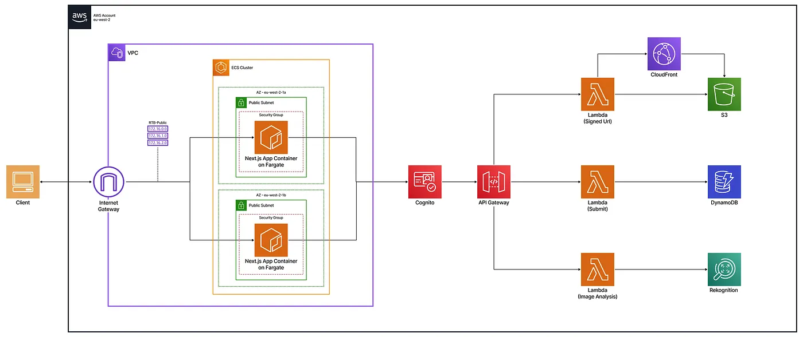
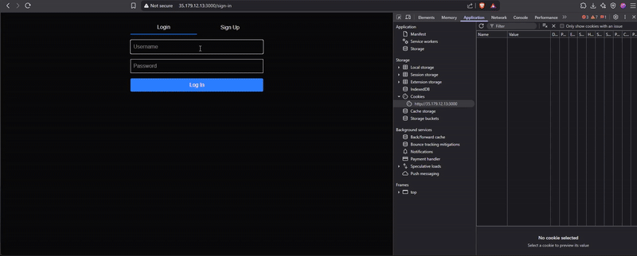
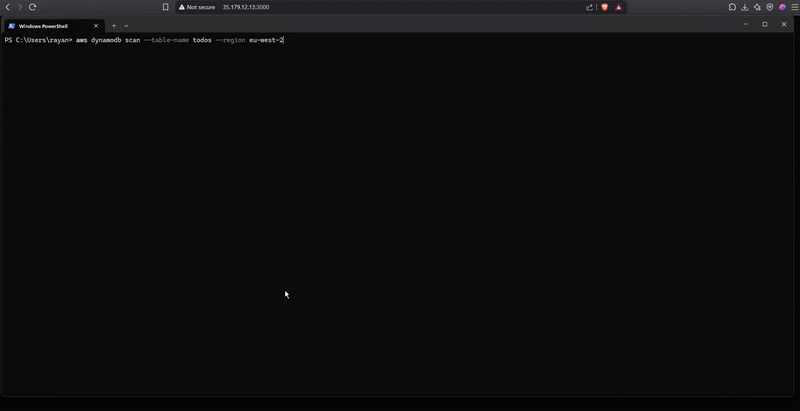
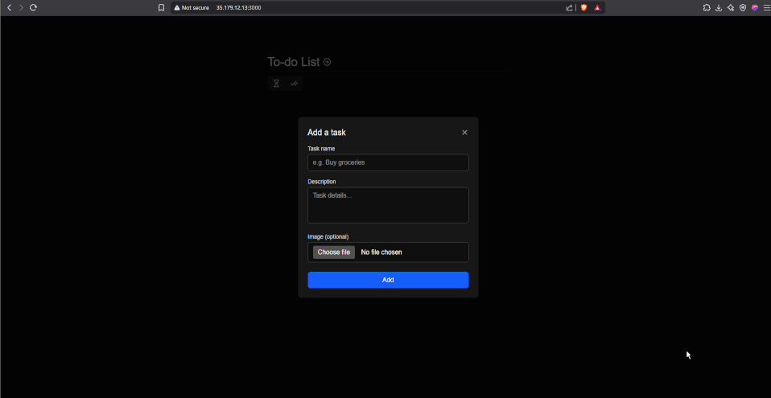

> **Archived project:** The original GitHub repository is no longer available. This article is preserved as a record of the project, including its explanations, code snippets, and illustrations.

ServerTask is a company that offers a to-do list application originally built with local storage in the browser. While simple to implement, this setup came with major limitations, including data loss across devices, lack of user authentication, and poor scalability.

The mission was to solve these issues by designing a modern, cloud-native architecture.

## Table of Contents

---

- [Implementation Strategy](#implementation-strategy)
- [Technical Breakdown](#technical-breakdown)
- [Tests & Validation](#tests--validation)
- [Conclusion](#conclusion)

## Implementation Strategy

---

The goal was to build a modern, secure to-do app supporting image attachments, with a smooth browser experience. The architecture had to be scalable, maintainable, and secure.



<figcaption>AWS serverless architecture for the to-do app.</figcaption>

Each user action, like creating tasks or uploading images, follows a secure, automated flow from the ECS-hosted frontend. Cognito handles authentication with short-lived JWT tokens. The serverless design ensures scalability with minimal maintenance.

All resources are deployed via Terraform with strict IAM controls, without manual AWS console setup.

## Technical Breakdown

---

To support the ServerTask application, a modular AWS architecture was implemented, focusing on performance, security, and scalability.

> Some properties are omitted in these Terraform snippets (marked with …). The original repository is no longer available; this archived article does not include the complete implementation.

### VPC and Networking

The web app is deployed in a secure, isolated VPC with public subnets across two availability zones. It is publicly exposed on port 3000 through an internet gateway and a public route table.

```hcl
# Create a VPC with DNS support
resource "aws_vpc" "fargate_vpc" {
  cidr_block           = "10.0.0.0/16"
  enable_dns_support   = true
  enable_dns_hostnames = true
}
# Attach an internet gateway to allow outbound traffic
resource "aws_internet_gateway" "fargate_igw" {
  vpc_id = aws_vpc.fargate_vpc.id
}
# Define a public subnet in AZ eu-west-2a
resource "aws_subnet" "fargate_subnet_1" {
  vpc_id                  = aws_vpc.fargate_vpc.id
  cidr_block              = "10.0.1.0/24"
  availability_zone       = "eu-west-2a"
  map_public_ip_on_launch = true
}
# Create a second public subnet in another AZ
# (same config as above, different CIDR/AZ)
# resource "aws_subnet" "fargate_subnet_2" { ... }
# Create a public route table and default route
resource "aws_route_table" "fargate_public_rt" {
  vpc_id = aws_vpc.fargate_vpc.id
}
resource "aws_route" "fargate_public_route" {
  route_table_id         = aws_route_table.fargate_public_rt.id
  destination_cidr_block = "0.0.0.0/0"
  gateway_id             = aws_internet_gateway.fargate_igw.id
}
# Associate subnets with the route table
# (Repeat for each public subnet)
resource "aws_route_table_association" "subnet_1_assoc" {
  subnet_id      = aws_subnet.fargate_subnet_1.id
  route_table_id = aws_route_table.fargate_public_rt.id
}
# resource "aws_route_table_association" "subnet_2_assoc" { ... }
# Create a security group to allow inbound HTTP traffic
resource "aws_security_group" "fargate_sg" {
  name        = "fargate-sg"
  description = "Allow HTTP"
  vpc_id      = aws_vpc.fargate_vpc.id
   ingress {
    # Allow incoming traffic on port 3000
    ...
  }
  egress {
    # Allow all outbound traffic
    ...
  }
}
```

### Frontend Deployment

A containerized Next.js app, built using a multi-stage Dockerfile, is deployed to ECS Fargate and stored in an Amazon ECR repository.

`Dockerfile`

A multi-stage Docker build is used to optimize the Next.js app for standalone production. It separates dependencies, build, and runtime layers to minimize image size and boost performance.

```dockerfile
FROM node:18-alpine AS base
RUN apk add --no-cache libc6-compat
# Dependencies
FROM base AS deps
WORKDIR /app
COPY package.json package-lock.json* ./
RUN npm ci
# Builder
FROM base AS builder
WORKDIR /app
COPY --from=deps /app/node_modules ./node_modules
COPY . .
RUN npm run build
# Production
FROM base AS runner
WORKDIR /app
ENV NODE_ENV=production
RUN addgroup --system --gid 1001 nodejs
RUN adduser --system --uid 1001 nextjs
COPY --from=builder /app/public ./public
COPY --from=builder --chown=nextjs:nodejs /app/.next/standalone ./
COPY --from=builder --chown=nextjs:nodejs /app/.next/static ./.next/static
USER nextjs
EXPOSE 3000
ENV PORT=3000
ENV HOSTNAME="0.0.0.0"
CMD ["node", "server.js"]
```

`Container Registry (Amazon ECR)`
A dedicated ECR repository stores the Docker image, which ECS retrieves automatically during deployment.

```hcl
resource "aws_ecs_cluster" "frontend_cluster" {
  name = "todo-frontend-cluster"
}
```

`ECS Fargate Deployment`

Deployment is handled via ECS Fargate with a public IP making the service accessible through the browser.

```hcl
resource "aws_iam_role" "ecs_task_exec_role" {
  name = "ecsTaskExecutionRole"
  # Define a policy that allows ECS to assume this role
  assume_role_policy = ...
}
resource "aws_iam_role_policy_attachment" "ecs_exec_policy" {
  role       = aws_iam_role.ecs_task_exec_role.name
  policy_arn = "arn:aws:iam::aws:policy/service-role/AmazonECSTaskExecutionRolePolicy"
}
resource "aws_ecs_task_definition" "task_definition" {
  family                   = var.family
  network_mode             = "awsvpc"
  requires_compatibilities = ["FARGATE"]
  cpu                      = "256"
  memory                   = "512"
  execution_role_arn       = aws_iam_role.ecs_task_exec_role.arn
  container_definitions = var.container_definitions
}
resource "aws_ecs_service" "task_service" {
  name            = "todo-frontend-service"
  cluster         = var.cluster_id
  launch_type     = "FARGATE"
  desired_count   = 1
  task_definition = aws_ecs_task_definition.task_definition.arn
  network_configuration {
    # Define your network configuration (subnets, security groups, public IP)
    ...
  }
  deployment_minimum_healthy_percent = 50
  deployment_maximum_percent         = 200
  depends_on = [aws_iam_role_policy_attachment.ecs_exec_policy]
}
```

### Authentication with Cognito

Amazon Cognito handles user sign-up, login, and session management. It issues JWT tokens that authorize access to protected backend routes.

```hcl
resource "aws_cognito_user_pool" "users" {
  name = "server-task-user-pool"
  auto_verified_attributes = ["email"]
  password_policy {
    minimum_length    = 8
    require_uppercase = true
    require_lowercase = true
    require_numbers   = true
    require_symbols   = false
  }
}
resource "aws_cognito_user_pool_client" "client" {
  name         = "server-task-client"
  user_pool_id = aws_cognito_user_pool.users.id
  generate_secret = false 
  explicit_auth_flows = [    "ALLOW_USER_PASSWORD_AUTH",
    "ALLOW_REFRESH_TOKEN_AUTH"
  ]
}
```

### AWS Lambda Functions

Each one focuses on a specific task, like managing to-dos, generating pre-signed S3 URLs for image uploads, or analyzing images with Rekognition. This modular setup keeps the code organized and easy to maintain.

`Function Configuration (locals.tf)`

Every Lambda function is defined with its name, source path, environment variables, and required IAM policy.

```hcl
# locals.tf – Lambda function configuration (simplified)
locals {
  lambdas = {
    todos_operations = {
      name        = "todos_operations"
      source_dir  = "${path.root}/functions/todos"
      output_path = "${path.root}/functions/todos.zip"
      environment_variables = {
        REGION        = "eu-west-2"
        DB_TABLE_NAME = "todos"
        # Other variables...
      }
      # Define IAM policy required by the Lambda (e.g., access to DynamoDB)
      policy = ... 
    }
    # Other functions (upload, rekognition, etc.) omitted
  }
}
```

`Lambda Module Usage`

A dynamic `for_each` loop ensures each function from `locals.tf` is provisioned with its specific parameters and IAM role.

```hcl
module "lambdas" {
  for_each           = local.lambdas
  source             = "../modules/infra/lambda"
  assume_role_policy = data.aws_iam_policy_document.lambda_assume_role.json
  lambda_config      = each.value
}
```

`Lambda Module Content`

This reusable module provisions the IAM role, zip archive, and AWS Lambda resource using the input values.

```hcl

resource "aws_iam_role" "iam_for_lambda" {
  name               = "${var.lambda_config.name}_role"
  assume_role_policy = var.assume_role_policy
}
resource "aws_iam_role_policy" "iam_lambda_policy" {
  name   = "${var.lambda_config.name}_policy"
  role   = aws_iam_role.iam_for_lambda.name
  policy = var.lambda_config.policy
}
data "archive_file" "my_archive_file" {
  type        = "zip"
  source_dir  = var.lambda_config.source_dir
  output_path = var.lambda_config.output_path
}
resource "aws_lambda_function" "my_lambda_function" {
  filename         = var.lambda_config.output_path
  function_name    = var.lambda_config.name
  role             = aws_iam_role.iam_for_lambda.arn
  handler          = "function.handler"
  runtime          = "nodejs20.x"
  source_code_hash = data.archive_file.my_archive_file.output_base64sha256
  environment {
    variables = var.lambda_config.environment_variables
  }
}
```

### API Gateway

API Gateway is the main backend entry point. It uses Cognito JWT tokens for secure access, validates requests, and routes them to the correct Lambda function.

`API Module Usage`

A custom module handles the configuration of the API Gateway by consuming route definitions, Cognito credentials, and the CloudFront domain.

```hcl
module "my_api" {
  source = "../modules/application/api"
  cloudfront_domain = module.cloudfront.cloudfront_domain
  client_id         = aws_cognito_user_pool_client.client.id
  user_pool_id      = aws_cognito_user_pool.users.id
  routes = {
    todos = {
      integration_uri = module.lambdas["todos_operations"].invoke_arn
      function_name   = module.lambdas["todos_operations"].function_name
      route_keys      = ["ANY /todos", "ANY /todos/{id}"]
    }
    # Other routes (upload, rekognition, etc.) defined similarly
  }
}
```

`API Module Resources`

The module sets up the API structure, configures CORS and authentication, defines route integrations, and manages permissions and deployment lifecycle.

```hcl
data "aws_region" "current" {}
resource "aws_apigatewayv2_api" "my_api" {
  name = "todos-api"
  cors_configuration {
    # Define CORS settings to allow browser-based API access
    ...
  }
  protocol_type = "HTTP"
}
resource "aws_apigatewayv2_authorizer" "jwt_authorizer" {
  name             = "cognito-jwt"
  api_id           = aws_apigatewayv2_api.my_api.id
  authorizer_type  = "JWT"
  identity_sources = ["$request.header.Authorization"]
  jwt_configuration {
    audience = [var.client_id]
    issuer   = "https://cognito-idp.${data.aws_region.current.name}.amazonaws.com/${var.user_pool_id}"
  }
}
resource "aws_apigatewayv2_integration" "integrations" {
  for_each               = var.routes
  api_id                 = aws_apigatewayv2_api.my_api.id
  integration_type       = "AWS_PROXY"
  integration_method     = "POST"
  integration_uri        = each.value.integration_uri
  payload_format_version = "2.0"
}
locals {
  flat_routes = merge([    for key, route in var.routes : {
      for rk in route.route_keys :
      "${key}-${rk}" => {
        route_key        = rk
        integration_name = key
      }
    }
  ]...)
}
resource "aws_apigatewayv2_route" "routes" {
  for_each = local.flat_routes
  api_id    = aws_apigatewayv2_api.my_api.id
  route_key = each.value.route_key
  target    = "integrations/${aws_apigatewayv2_integration.integrations[each.value.integration_name].id}"
  authorizer_id      = aws_apigatewayv2_authorizer.jwt_authorizer.id
  authorization_type = "JWT"
}
resource "aws_lambda_permission" "lambda_perms" {
  # Allow API Gateway to invoke Lambda functions
  ...
}
resource "aws_apigatewayv2_deployment" "my_api_deployment" {
  # Deploy API routes
  ...
}
resource "aws_apigatewayv2_stage" "default" {
  # Auto-deploy to default stage
  ...
}
```

### Storage with DynamoDB & S3

Data persistence is handled with DynamoDB for tasks and S3 for image uploads. To-do items are user-specific and timestamped for efficient sorting, while access to uploaded files is secured using short-lived signed URLs generated by the backend.

`DynamoDB Table`

This table stores all to-do tasks. A combination of user ID and task ID uniquely identifies each item, while a global secondary index enables sorting tasks by creation date per user.

```hcl
resource "aws_dynamodb_table" "dynamodb_table" {
  name           = "todos"
  read_capacity  = 20
  write_capacity = 20
  hash_key       = "user_id"  
  range_key      = "todo_id"    
  attribute {
    name = "user_id"
    type = "S"
  }
  attribute {
    name = "todo_id"
    type = "S"
  }
  attribute {
    name = "createdAt"
    type = "S"
  }
  global_secondary_index {
    name            = "CreatedAtIndex"
    hash_key        = "user_id"
    range_key       = "createdAt"
    write_capacity  = 10
    read_capacity   = 10
    projection_type = "ALL"
  }
}
```

`S3 Bucket with CORS Configuration`

Uploaded images are stored in S3. The bucket is configured with CORS rules to allow secure uploads and downloads directly from the frontend, ensuring compatibility across browsers.

```hcl
resource "aws_s3_bucket" "s3-bucket" {}
resource "aws_s3_bucket_cors_configuration" "s3_cors" {
  bucket = aws_s3_bucket.s3-bucket.id
  cors_rule {
    # Define CORS settings to allow uploads and downloads from the frontend
    ...
  }
}
```

### `Secure Content Delivery with Amazon CloudFront`

CloudFront serves S3 images securely using signed URLs with Origin Access Control. Lambda generates these time-limited URLs. The setup enforces HTTPS and uses caching for better performance.

```hcl
locals {
  s3_origin_id = "todoS3Origin"
}
resource "aws_cloudfront_origin_access_control" "todooac" {
  name                              = "todooac"
  origin_access_control_origin_type = "s3"
  signing_behavior                  = "always"
  signing_protocol                  = "sigv4"
}
resource "aws_cloudfront_public_key" "my_public_key" {
  name        = "cloudfront-key"
  encoded_key = file("public_key.pem")
  comment     = "Key for signed URL verification"
}
resource "aws_cloudfront_key_group" "my_key_group" {
  name  = "my-key-group"
  items = [aws_cloudfront_public_key.my_public_key.id]
}
resource "aws_cloudfront_distribution" "s3-distribution" {
  origin {
    domain_name              = var.domaine_name
    origin_access_control_id = aws_cloudfront_origin_access_control.todooac.id
    origin_id                = local.s3_origin_id
  }
  enabled         = true
  is_ipv6_enabled = true
  default_cache_behavior {
  # Define allowed methods and cache behavior
  ...
  # Use signed URLs with a trusted key group and enforce HTTPS
  ...
  }
  restrictions {
    geo_restriction {
      restriction_type = "none"
    }
  }
  viewer_certificate {
    cloudfront_default_certificate = true
  }
}
```

### Serverless Business Logic with AWS Lambda

Three dedicated Lambda functions power the backend, each responsible for a distinct task in the application’s workflow. This modular approach improves maintainability and aligns with event-driven best practices. Each function is triggered by API Gateway and interacts with other AWS services like DynamoDB, S3, CloudFront, and Rekognition.

`Task Management Logic`

To-do operations are handled by a Lambda function that verifies the user identity with JWT tokens and interacts with DynamoDB. Data is isolated per user, and sorting is done using the `createdAt` index.

```ts
exports.handler = async (event) => {
  const { pathParameters, body, requestContext } = event;
  const userId = requestContext?.authorizer?.jwt?.claims?.sub;
  const httpMethod = requestContext.http.method;
  try {
    switch (httpMethod) {
      case "GET":
        // list or get single todo
      case "POST":
        // create new todo
      case "PUT":
        // update existing todo
      case "DELETE":
        // delete todo
      default:
        return { statusCode: 405, body: "Method not allowed" };
    }
  } catch (err) {
    return { statusCode: 500, body: "Internal Server Error" };
  }
};
```

`Secure Upload & Download URLs`

Short-lived signed URLs are generated to enable secure image upload to S3 and private access through CloudFront.

```ts
exports.handler = async (event) => {
  const { queryStringParameters } = event;
  const action = queryStringParameters?.action;
  if (!action) return buildResponse(400, { error: "Action parameter is required" });
  if (action === "create") {
    // Generate presigned S3 POST URL
  }
  if (action === "get") {
    // Generate signed CloudFront GET URL
  }
  return buildResponse(400, { error: "Unsupported action" });
};
```

`Image Label Detection`

Triggered after an image upload, this function analyzes the file using Amazon Rekognition. It returns detected labels and confidence scores, which are attached to the related task in DynamoDB.

```ts
exports.handler = async (event) => {
  const imageKey = event.queryStringParameters?.imagekey;
  try {
    // Call Rekognition with image key
    // Return detected labels with confidence scores
  } catch (err) {
    return buildResponse(500, { error: "Label detection failed" });
  }
};
```

### **Deployment Automation**

This script handles multi-step deployment with dynamic dependency resolution, ensuring CloudFront, S3, API Gateway, and ECS are correctly configured with the necessary CORS origins and environment variables.

```bash
#!/bin/bash
set -e # stop the script if any command fails
AWS_REGION="eu-west-2"
# 1. Deploy the infrastructure stack
cd infrastructure/stack_infra
terraform init
terraform apply -auto-approve
# 2. Get the CloudFront hostname from Terraform outputs
CLOUDFRONT_HOSTNAME=$(terraform output -raw cloudfront_hostname)
echo "CloudFront hostname: $CLOUDFRONT_HOSTNAME"
cd ../stack_app
terraform init
# 3. Deploy only the ECR module for the frontend
terraform apply -target=module.todo_frontend -auto-approve
# 4. Get ECR repository details from Terraform outputs
REPOSITORY_URL=$(terraform output -raw repository_url)
REPOSITORY_NAME=$(terraform output -raw repository_name)
echo "ECR repository URL: $REPOSITORY_URL"
echo "ECR repository name: $REPOSITORY_NAME"
cd ../../frontend
# 5. Create the .env file with the actual CloudFront hostname
echo "NEXT_PUBLIC_CLOUDFRONT_HOSTNAME=$CLOUDFRONT_HOSTNAME" > .env
# 6. Build, tag, and push the Docker image to ECR
aws ecr get-login-password --region $AWS_REGION | docker login --username AWS --password-stdin $REPOSITORY_URL
docker build -t $REPOSITORY_NAME:latest .
docker tag $REPOSITORY_NAME:latest $REPOSITORY_URL:latest
docker push $REPOSITORY_URL:latest
# 7. Deploy the application stack (ECS service, etc.)
cd ../infrastructure/stack_app
terraform apply -auto-approve
# 8. Get the public IP address of the running ECS task (assumes only one running task)
TASK_ARN=$(aws ecs list-tasks --cluster todo-frontend-cluster --service-name todo-frontend-service --desired-status RUNNING --region $AWS_REGION --query 'taskArns[0]' --output text)
ENI_ID=$(aws ecs describe-tasks --cluster todo-frontend-cluster --tasks $TASK_ARN --region $AWS_REGION --query 'tasks[0].attachments[0].details[?name==`networkInterfaceId`].value' --output text)
PUBLIC_IP=$(aws ec2 describe-network-interfaces --network-interface-ids $ENI_ID --region $AWS_REGION --query 'NetworkInterfaces[0].Association.PublicIp' --output text)
echo "Public ECS IP: $PUBLIC_IP"
# 9. Re-deploy the infrastructure stack to update API/S3 CORS settings with the new frontend origin (e.g., http://IP:3000)
cd ../stack_infra
terraform apply \
  -var="api_allowed_origin=http://$PUBLIC_IP:3000" \
  -var="s3_allowed_origins=[\"http://$PUBLIC_IP:3000\"]" \
  -auto-approve
echo "Automated deployment complete."
```

## Tests & Validation

---

### Authentication with Cognito



<figcaption>UI example demonstrating secure sign-up, login, and token-based authentication with Amazon Cognito.</figcaption>

User sign-up, login, and token-based access were validated. Authenticated requests succeed, while invalid or missing tokens are rejected as expected.

### End-to-End Application Functionality



<figcaption>UI example showing real-time task creation, updating, and deletion through the serverless API.</figcaption>

Creating, updating, and deleting tasks works smoothly via the UI and API. Each new task is sent through API Gateway, processed by Lambda, saved in DynamoDB, and instantly reflected in the UI. Updates and deletions follow the same flow.

### Image Upload and Analysis



<figcaption>UI example of secure image upload with automatic label detection powered by Amazon Rekognition.</figcaption>

Users upload images via pre-signed S3 URLs. On upload, images are analyzed automatically using Rekognition, with detected labels saved in DynamoDB and shown in the UI below the image.

## Conclusion

---

This project shows how a serverless and scalable architecture on AWS can support a full-featured, modern web application without the overhead of managing servers. By combining ECS Fargate, API Gateway, Lambda, DynamoDB, S3, Cognito, and Rekognition, the system delivers secure authentication, real-time task management, image upload, and automated content analysis.

All infrastructure was deployed through Terraform, ensuring automation, reproducibility, and a clear separation of concerns. The final architecture is easy to maintain, optimized for cost, and ready for real-world use.
