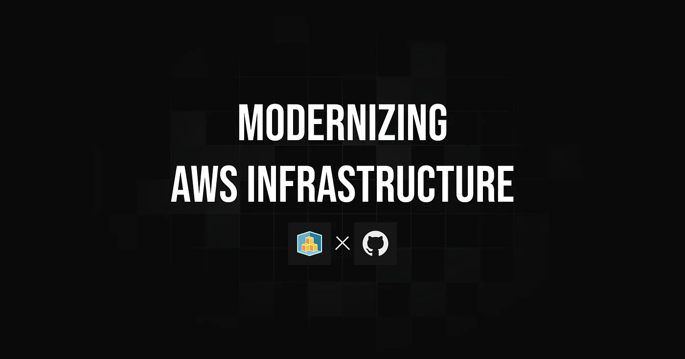
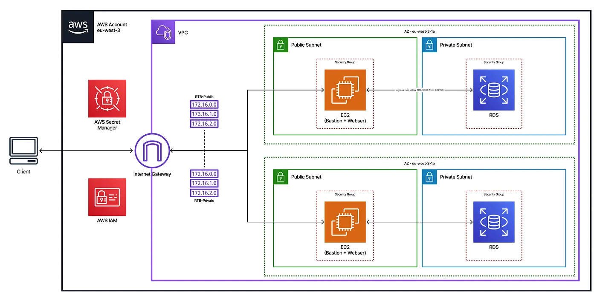
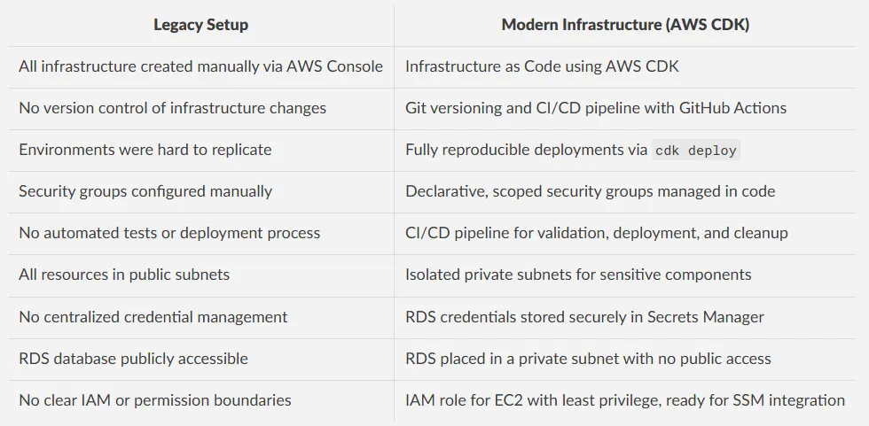
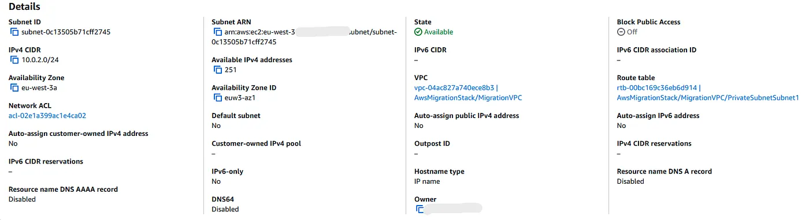
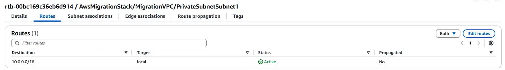
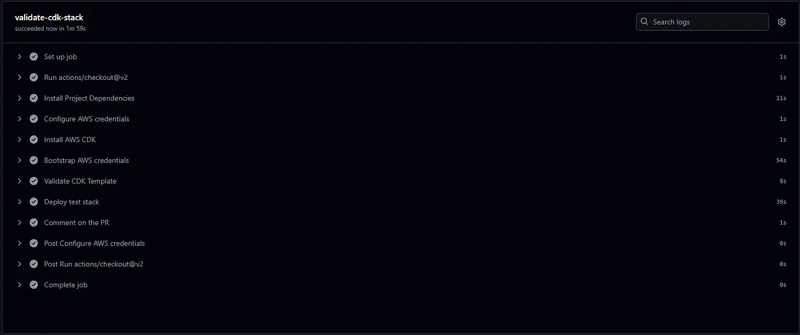
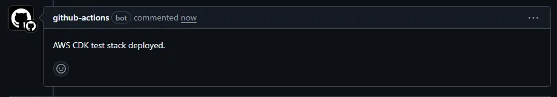
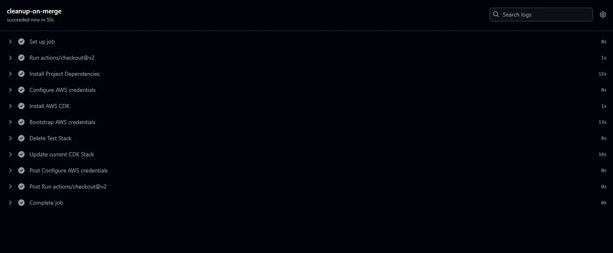

> **Archived project:** The original GitHub repository is no longer available. This article is preserved as a record of the project, including its explanations, code snippets, and illustrations.

TechHealth Inc. is a healthcare technology company whose AWS infrastructure was initially built manually through the AWS Console five years ago. Over time, this approach led to growing challenges in terms of **maintainability**, **security**, and **scalability**, including the lack of **version control**, inconsistent configurations, and limited environment reproducibility.

This project focused on modernizing that legacy setup to deliver a cloud environment that was **scalable**, **reliable**, and **secure**, aligned with current infrastructure **best practices**.

### Table of Contents

- [Restructuring Plan](#restructuring-plan)
- [CDK Infrastructure Breakdown](#cdk-infrastructure-breakdown)
- [Testing & Validation](#testing--validation)
- [CI/CD Workflow](#cicd-workflow)
- [Conclusion](#conclusion)

## Restructuring Plan

---



The legacy AWS infrastructure at TechHealth was restructured using **Infrastructure as Code** with **AWS CDK**, enabling full **reproducibility**, **version control**, and consistent provisioning.
The new architecture improves both **security** and **cost-efficiency**, with infrastructure changes automatically validated and deployed through a **CI/CD pipeline powered by GitHub Actions**.

To achieve this, we addressed the following pain points:



Each infrastructure component was defined declaratively, making the system both **auditable** and **maintainable**. The new VPC design introduced **network isolation** by placing the RDS database in private subnets, while the EC2 instance resides in a public subnet with restricted SSH access.

IAM roles followed the **principle of least privilege**, and **Secrets Manager** securely managed database credentials.

With this setup, TechHealth was able to deploy its environment using a single `cdk deploy` command, while ensuring **security standards** and **operational efficiency**.

## CDK Infrastructure Breakdown

---

The entire infrastructure was implemented in a single TypeScript CDK stack, ensuring modularity, reproducibility, and security.

### VPC and Subnets

A Virtual Private Cloud (VPC) was created with **two Availability Zones**, each containing **one public and one private isolated subnet**. This structure provides clear network segmentation and prepares the environment for scalable multi-AZ setups.

```javascript
const vpc = new ec2.Vpc(this, 'MigrationVPC', {
  maxAzs: 2,
  subnetConfiguration: [    {
      cidrMask: 24,
      name: 'PublicSubnet',
      subnetType: ec2.SubnetType.PUBLIC,
    },
    {
      cidrMask: 24,
      name: 'PrivateSubnet',
      subnetType: ec2.SubnetType.PRIVATE_ISOLATED,
    },
  ],
});
```

### Security Groups

Two security groups were defined:

- One for the **EC2 instance**, allowing SSH (port 22) and HTTP (port 80) access.
- One for the **RDS instance**, allowing MySQL traffic (port 3306) **only from the EC2 security group**, ensuring least privilege network access.

```javascript
const ec2SecurityGroup = new ec2.SecurityGroup(this, 'EC2SecurityGroup', {
  vpc,
  allowAllOutbound: true,
  description: 'Security group for EC2 instance',
});
// Replace with your actual IP address and use CIDR notation (e.g., "203.0.113.10/32")
const myIp = ec2.Peer.ipv4('YOUR_IP_ADDRESS_HERE/32');
ec2SecurityGroup.addIngressRule(myIp, ec2.Port.tcp(22), 'Allow SSH from my IP');
ec2SecurityGroup.addIngressRule(ec2.Peer.anyIpv4(), ec2.Port.tcp(80), 'Allow HTTP');
const rdsSecurityGroup = new ec2.SecurityGroup(this, 'RDSSecurityGroup', {
  vpc,
  allowAllOutbound: true,
  description: 'Security group for RDS instance',
});
rdsSecurityGroup.addIngressRule(ec2SecurityGroup, ec2.Port.tcp(3306), 'Allow MySQL from EC2');
```

### IAM Role for EC2

An IAM role is attached to the EC2 instance to allow basic secure operations. It includes the `AmazonSSMManagedInstanceCore` managed policy, which enables future support for **AWS Systems Manager (SSM)** if needed.

```javascript
const ec2Role = new iam.Role(this, 'EC2IAMRole', {
  assumedBy: new iam.ServicePrincipal('ec2.amazonaws.com'),
});
ec2Role.addManagedPolicy(iam.ManagedPolicy.fromAwsManagedPolicyName('AmazonSSMManagedInstanceCore'));
```

### EC2 Instance

A t3.micro EC2 instance was deployed into the public subnet, associated with its security group and IAM role. It is accessible via SSH and acts as a gateway to the private RDS instance.

```javascript
const ec2Instance = new ec2.Instance(this, 'MigrationEC2', {
  vpc,
  vpcSubnets: { subnetType: ec2.SubnetType.PUBLIC },
  instanceType: ec2.InstanceType.of(ec2.InstanceClass.T3, ec2.InstanceSize.MICRO),
  machineImage: new ec2.AmazonLinuxImage({
    generation: ec2.AmazonLinuxGeneration.AMAZON_LINUX_2,
  }),
  securityGroup: ec2SecurityGroup,
  role: ec2Role,
});
```

### RDS MySQL Database

A MySQL RDS instance was provisioned in the private subnet to ensure it is not publicly accessible. It allows incoming connections **only from the EC2 instance**, following the least privilege principle. The instance uses the **Free Tier–eligible** `db.t3.micro` class.

```javascript
new rds.DatabaseInstance(this, 'MigrationRDS', {
  engine: rds.DatabaseInstanceEngine.mysql({ version: rds.MysqlEngineVersion.VER_8_0 }),
  vpc,
  vpcSubnets: { subnetType: ec2.SubnetType.PRIVATE_ISOLATED },
  securityGroups: [rdsSecurityGroup],
  instanceType: ec2.InstanceType.of(ec2.InstanceClass.BURSTABLE3, ec2.InstanceSize.MICRO),
  allocatedStorage: 20,
  removalPolicy: cdk.RemovalPolicy.DESTROY,
});
```

## Testing & Validation

---
To ensure the infrastructure was functioning correctly and securely, I manually validated the key components after deployment.

### **SSH Access**
I verified that the EC2 instance could be accessed securely from my IP address using an SSH key.

```bash
$ ssh -i mykeypair.pem ec2-user@15.237.248.31
   ,     #_
   ~\_  ####_        Amazon Linux 2
  ~~  \_#####\
  ~~     \###|       AL2 End of Life is 2026-06-30.
  ~~       \#/ ___
   ~~       V~' '->        A newer version of Amazon Linux is available!
    ~~~         /
      ~~._.   _/
         _/ _/       Amazon Linux 2023 available: https://aws.amazon.com/linux/
       _/m/'
[ec2-user@ip-10-0-0-114 ~]$
```

### **Database Connectivity**
I successfully connected to the RDS MySQL database from the EC2 instance using credentials securely stored in Secrets Manager.

```bash
$ mysql -h awsmigrationstack-migrationrds7e06c147-zgayq0i7ssug.cvsec4ggy3fw.eu-west-3.rds.amazonaws.com -u admin -p
Enter password:
Welcome to the MariaDB monitor.  Commands end with ; or \g.
Your MySQL connection id is 28
Server version: 8.0.41 Source distribution
Copyright (c) 2000, 2018, Oracle, MariaDB Corporation Ab and others.
Type 'help;' or '\h' for help. Type '\c' to clear the current input statement.
MySQL [(none)]>
```

### **Security Validation**

I attempted to connect to the RDS instance from outside the VPC to confirm that it was not publicly accessible.

```bash
$ mysql -h awsmigrationstack-migrationrds7e06c147-zgayq0i7ssug.cvsec4ggy3fw.eu-west-3.rds.amazonaws.com -u admin -p
Enter password:
ERROR 2003 (HY000): Can't connect to MySQL server on 'awsmigrationstack-migrationrds7e06c147-zgayq0i7ssug.cvsec4ggy3fw.eu-west-3.rds.amazonaws.com:3306' (110)
```

### **Network Isolation**

The RDS instance is deployed in a private subnet. This is verified by both metadata and the absence of an Internet Gateway route.


Auto-assignment is disabled, meaning instances in this subnet do not receive a public IP address.


The route table does not include a route to an Internet Gateway, which confirms that this subnet is isolated from the public internet.

## CI/CD Workflow

---

Every pull request triggers a CI/CD pipeline using **GitHub Actions**. This workflow installs CDK, synthesizes the infrastructure templates, deploys a temporary **test stack**, and posts a comment directly in the pull request to confirm the deployment status.

If the PR is merged, the pipeline **automatically destroys** the test stack and redeploys the **latest stable version** of the infrastructure, ensuring the AWS environment stays **clean** and **up to date**.

Below is a breakdown of the main jobs within the CI/CD pipeline:

`validate-cdk-stack`
This job runs on every pull request. After installing CDK and synthesizing the templates, it deploys a temporary test stack without requiring manual approval, then comments the result directly in the PR.

```yaml
- name: Deploy test stack
  run: |
    cdk deploy --all --require-approval never --context prNumber=${{ github.event.pull_request.number }}
- name: Comment on the PR
  uses: actions/github-script@v6
  with:
    github-token: ${{ secrets.GITHUB_TOKEN }}
    script: |
      github.rest.issues.createComment({
        issue_number: context.issue.number,
        owner: context.repo.owner,
        repo: context.repo.repo,
        body: '✅ AWS CDK test stack deployed successfully.'
      })
```





<figcaption>The screenshot below shows a successful deployment triggered by a pull request, along with the confirmation comment automatically posted in the PR.</figcaption>

`cleanup-on-merge`
This job runs only when a pull request is merged. It ensures the AWS account remains clean by destroying the temporary test stack and then deploying the latest stable version of the infrastructure.

```yaml
- name: Delete Test Stack
  run: |
    cdk destroy --all --require-approval never --context prNumber=${{ github.event.pull_request.number }}
- name: Update current CDK Stack
  run: |
    cdk deploy --all --require-approval never
```


<figcaption>The screenshot shows that, after the PR was merged, the test stack was successfully destroyed and the latest version of the infrastructure was deployed to the production environment.</figcaption>

By using this pipeline, every infrastructure change is tested in isolation, automatically cleaned up after merging, and safely deployed to production. This ensures fast feedback, safer collaboration, and a clean AWS environment.

## Conclusion

---
This project led to a complete transformation of TechHealth’s AWS infrastructure into a **modern, secure, and automated environment** using **AWS CDK**.

The new architecture introduces **clear network segmentation** through public and private subnets, along with **strict access control** enforced by scoped IAM roles and security groups. Deployments are now **fully reproducible** and integrated into a GitHub Actions **CI/CD pipeline**, ensuring continuous validation and clean infrastructure management.

By using **Free Tier–eligible** instances, removing unnecessary resources, and **automating cleanup** on merge, the system achieves effective **cost optimization**.

Overall, this migration greatly improves the **reliability**, **security**, and **scalability** of TechHealth’s cloud environment and demonstrates the power of Infrastructure as Code and DevOps automation.
