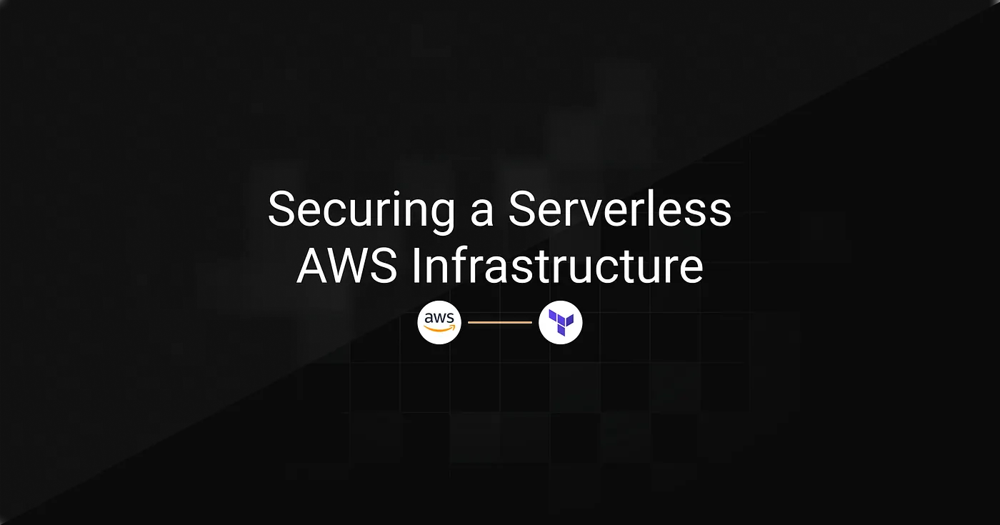
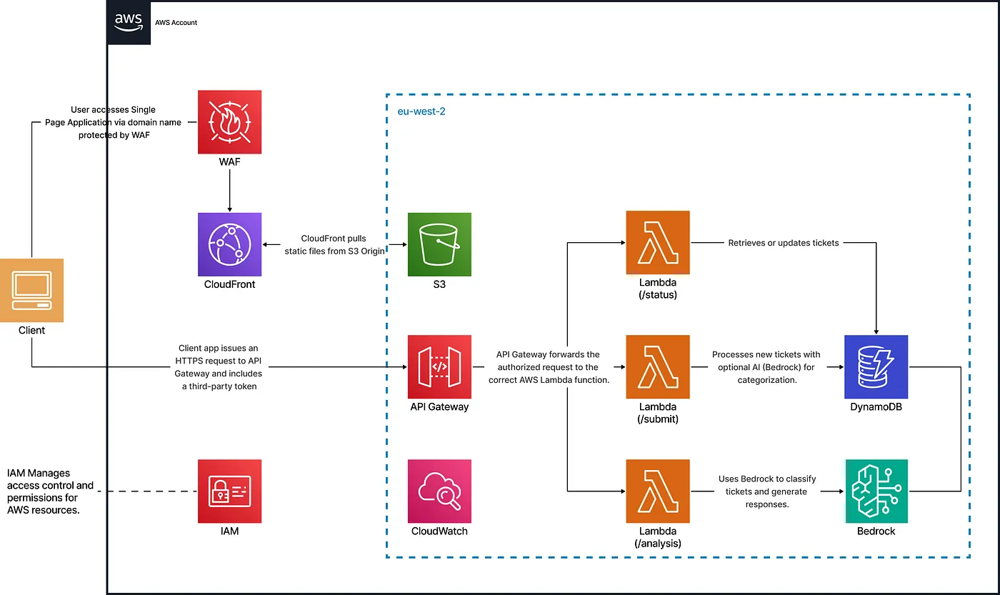

> **Archived project:** The original GitHub repository is no longer available. This article is preserved as a record of the project, including its explanations, code snippets, and illustrations.

SwiftSupport is an AI-powered support ticket platform that recently transitioned to a modern serverless architecture on AWS. While the initial deployment focused on rapid functionality, security best practices were not prioritized. With the platform now servicing multiple clients and sensitive customer interactions, it became crucial to overhaul access control, implement fine-grained IAM policies, and enforce a secure infrastructure as code approach. The goal was to strengthen the AWS environment, redesign identity and access structures, and enforce the principle of least privilege, all while maintaining automation and scalability with Terraform.

## Table of Contents

---

- [Implementation Strategy](#implementation-strategy)
- [Technical Implementation](#technical-implementation)
- [Conclusion](#conclusion)

## Implementation Strategy

---



This solution replaces shared AWS credentials with IAM Identity Center for single sign-on, enforces role-based access control with IAM groups and policies, and applies the principle of least privilege through scoped permissions and permission boundaries. It uses a modular, secure-by-default Terraform setup to harden key AWS services, including Lambda, API Gateway, and CloudFront, while automating infrastructure provisioning and managing SSO-based access to monitoring and cost tools.

## Technical Implementation

---

### IAM Identity Center & Groups

To eliminate shared credentials and enforce role-based access control, IAM Identity Center was configured with five dedicated groups for Developers, DevOps, Security, Data Science, and Product Management. Each group maps to specific roles and inline policies defining least-privilege access.

```hcl
module "iam_identity_center" {
  source = "./modules/security/iam-identity-center"
  groups = local.groups
}
```

Each group is defined in the `locals` block with custom users and permissions:

```hcl
locals {
  groups = {
    Developers = {
      description = "Developer team"
      users = [        {
          user_name  = "dev01"
          given_name = "Dev"
          family_name = "One"
          email      = "dev01@example.com"
        }
        # ... other developers here
      ]
      permissions = [        {
          actions = [            "lambda:InvokeFunction",
            "lambda:UpdateFunctionCode",
            "lambda:GetFunction",
            "lambda:ListFunctions",
            "lambda:GetFunctionConfiguration"
          ]
          resources = [for name, mod in module.lambda : mod.arn]
        }
        # ... more permissions here
      ]
    }
    # other groups...
  }
}
```

### IAM Permission Boundaries

By enforcing permission boundaries, all role permissions remain tightly scoped, reducing the risk of misconfiguration and ensuring consistent security governance. A customer-managed boundary policy was created and applied to high-privilege roles such as DevOps to prevent potential privilege escalation.

```hcl
resource "aws_iam_policy" "permission_boundary" {
  name   = "devops-boundary"
  policy = file("${path.module}/boundary.json")
}
```

Then attached it to DevOps roles:

```hcl
resource "aws_ssoadmin_permissions_boundary_attachment" "devops_boundary" {
  for_each = {
    for group_name, group in var.groups :
    group_name => group.permission_boundaries
    if contains(keys(group), "permission_boundaries") && group.permission_boundaries != null
  }
  instance_arn       = tolist(data.aws_ssoadmin_instances.main.arns)[0]
  permission_set_arn = aws_ssoadmin_permission_set.this[each.key].arn
  permissions_boundary {
    customer_managed_policy_reference {
      name = each.value
      path = "/"
    }
  }
}
```

### Lambda Security and Modularization

Each Lambda function is provisioned with a dedicated IAM role and scoped permissions defined in the `locals` block. This modular approach reduces policy duplication, ensures consistent security, and simplifies ongoing maintenance.

`Locals block defining Lambda configurations`

```hcl
locals {
  lambdas = {
    status = {
      name        = "status"
      source_dir  = "./lambdas/status"
      output_path = "./lambdas/status.zip"
      env_vars    = {}
      policy = jsonencode({
        Version = "2012-10-17",
        Statement = [          {
            Effect = "Allow",
            Action = [              "dynamodb:GetItem",
              "dynamodb:PutItem",
              "dynamodb:UpdateItem",
              "dynamodb:Query"
            ],
            Resource = module.dynamodb.arn
          },
          {
            Effect = "Allow",
            Action = [              "logs:CreateLogGroup",
              "logs:CreateLogStream",
              "logs:PutLogEvents"
            ],
            Resource = "arn:aws:logs:*:*:*"
          }
        ]
      })
    }
    # ... other Lambda configurations (submit, analysis, etc.)
  }
}
```

`Lambda Module Definition` This module provisions the IAM role, policy, and Lambda function for each defined configuration.

```hcl
resource "aws_iam_role" "iam_for_lambda" {
  name               = "${var.lambda_config.name}_role"
  assume_role_policy = var.assume_role_policy
}
resource "aws_iam_role_policy" "iam_lambda_policy" {
  name   = "${var.lambda_config.name}_policy"
  role   = aws_iam_role.iam_for_lambda.name
  policy = var.lambda_config.policy
}
data "archive_file" "lambda_zip" {
  type        = "zip"
  source_dir  = var.lambda_config.source_dir
  output_path = var.lambda_config.output_path
}
resource "aws_lambda_function" "lambda_function" {
  filename         = var.lambda_config.output_path
  function_name    = var.lambda_config.name
  role             = aws_iam_role.iam_for_lambda.arn
  handler          = "function.handler"
  runtime          = "nodejs20.x"
  source_code_hash = data.archive_file.lambda_zip.output_base64sha256
  environment {
    variables = var.lambda_config.env_vars
  }
}
```

`Usage of the Lambda Module` The module is invoked in the root configuration to provision all defined Lambda functions dynamically:

```hcl
module "lambda" {
  for_each      = local.lambdas
  source        = "./modules/infra/lambda"
  lambda_config = each.value
}
```

### API Gateway with JWT Authorization

JWT-based authorization was implemented to ensure that only authenticated users can access the Lambda-powered API endpoints. This approach improves security by validating user identity before any request is processed.

```hcl
resource "aws_apigatewayv2_authorizer" "jwt" {
  api_id           = aws_apigatewayv2_api.api.id
  name             = "JWTAuthorizer"
  authorizer_type  = "JWT"
  identity_sources = ["$request.header.Authorization"]
  jwt_configuration {
    issuer   = "https://dev-abc123.us.auth0.com/"
    audience = ["https://api.swift-support.com"]
  }
}
```

### CloudFront + S3 Hardening

To prevent public access to sensitive static content, S3 buckets were secured with encryption, public access was blocked, and access was limited exclusively to CloudFront for secure CDN delivery.

```hcl
resource "aws_s3_bucket" "s3_bucket" {}
resource "aws_s3_bucket_server_side_encryption_configuration" "s3_encryption" {
  bucket = aws_s3_bucket.s3_bucket.id
  rule {
    apply_server_side_encryption_by_default {
      sse_algorithm = "AES256"
    }
  }
}
resource "aws_s3_bucket_public_access_block" "website_public_access" {
  bucket                  = aws_s3_bucket.s3_bucket.id
  block_public_acls       = true
  block_public_policy     = true
  ignore_public_acls      = true
  restrict_public_buckets = true
}
resource "aws_s3_bucket_policy" "cloudfront_access" {
  bucket = aws_s3_bucket.s3_bucket.id
  policy = jsonencode({
    Version = "2012-10-17",
    Statement = [      {
        Sid    = "AllowCloudFrontService"
        Effect = "Allow"
        Principal = {
          Service = "cloudfront.amazonaws.com"
        }
        Action   = ["s3:GetObject"]
        Resource = "${aws_s3_bucket.s3_bucket.arn}/*"
        Condition = {
          StringEquals = {
            "AWS:SourceArn" = var.cloudfront_distribution_arn
          }
        }
      }
    ]
  })
}
```

### WAF & CloudTrail

AWS WAF was configured with managed rule groups to protect the CloudFront distribution from common web threats such as SQL injection and malicious inputs. CloudWatch metrics were enabled for visibility into blocked requests.

```hcl
resource "aws_wafv2_web_acl" "cloudfront_waf" {
  name  = "cloudfront-waf"
  scope = "CLOUDFRONT"
  rule {
    name     = "AWSManagedRulesSQLiRuleSet"
    priority = 2
    override_action { none {} }
    statement {
      managed_rule_group_statement {
        name        = "AWSManagedRulesSQLiRuleSet"
        vendor_name = "AWS"
      }
    }
    visibility_config {
      cloudwatch_metrics_enabled = true
      metric_name                = "SQLiRuleSet"
      sampled_requests_enabled   = true
    }
  }
}
```

CloudTrail was enabled to capture all API activity across the account for auditing and compliance.

```hcl

resource "aws_s3_bucket" "cloudtrail_bucket" {}
resource "aws_s3_bucket_ownership_controls" "cloudtrail_controls" {
  bucket = aws_s3_bucket.cloudtrail_bucket.id
  rule {
    object_ownership = "BucketOwnerPreferred"
  }
}
resource "aws_s3_bucket_acl" "cloudtrail_acl" {
  depends_on = [aws_s3_bucket_ownership_controls.cloudtrail_controls]
  bucket     = aws_s3_bucket.cloudtrail_bucket.id
  acl        = "private"
}
resource "aws_s3_bucket_policy" "cloudtrail_policy" {
  bucket = aws_s3_bucket.cloudtrail_bucket.id
  policy = jsonencode({
    Version = "2012-10-17",
    Statement = [      {
        Sid : "AWSCloudTrailAclCheck",
        Effect : "Allow",
        Principal = {
          Service = "cloudtrail.amazonaws.com"
        },
        Action   = "s3:GetBucketAcl",
        Resource = aws_s3_bucket.cloudtrail_bucket.arn
      },
      {
        Sid       = "AWSCloudTrailWrite"
        Effect    = "Allow"
        Principal = { Service = "cloudtrail.amazonaws.com" }
        Action    = "s3:PutObject"
        Resource  = "${aws_s3_bucket.cloudtrail_bucket.arn}/AWSLogs/${data.aws_caller_identity.current.account_id}/*"
        Condition = {
          StringEquals = {
            "s3:x-amz-acl" : "bucket-owner-full-control"
          }
        }
      }
    ]
  })
}
resource "aws_cloudtrail" "main" {
  name                          = "main-trail"
  s3_bucket_name                = aws_s3_bucket.cloudtrail_bucket.bucket
  include_global_service_events = true
  is_multi_region_trail         = true
  enable_log_file_validation    = true
}
```

## Conclusion

---

This project transforms the infrastructure from a functionality-focused model to a secure, scalable, and governed environment. Using Terraform, the implementation delivers fine-grained IAM with Identity Center, secure Lambda and API Gateway integrations, and hardened S3, WAF, and CloudFront configurations. Access is now auditable and role-based, supporting best practices in cloud governance while enabling confident scaling.
