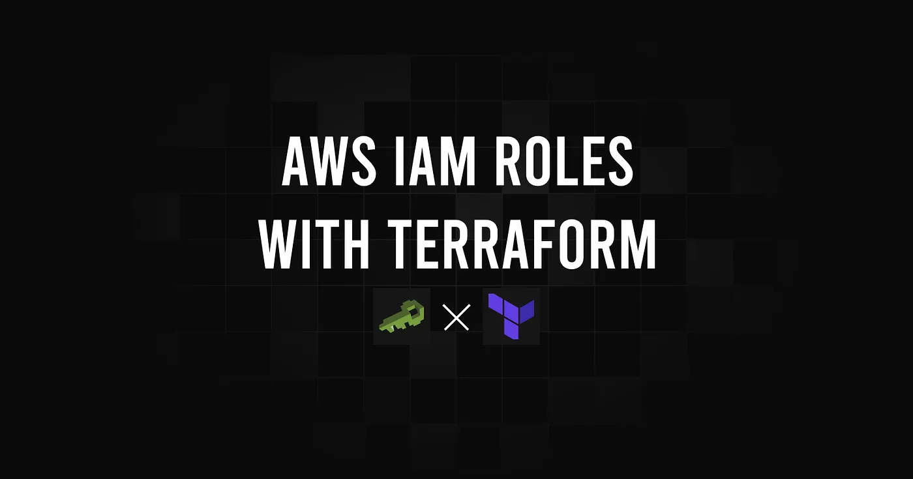
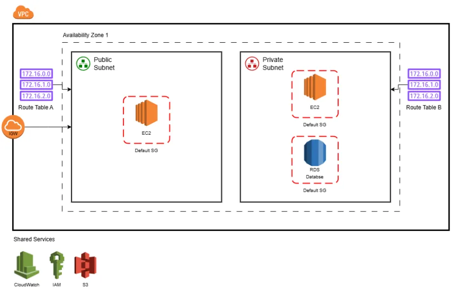
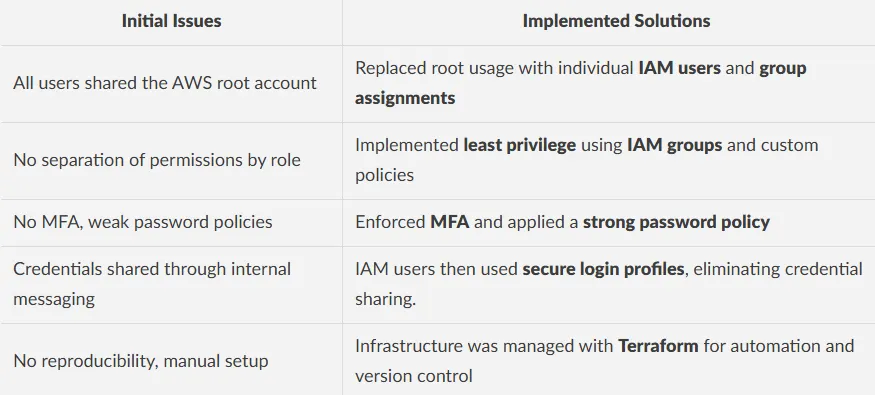
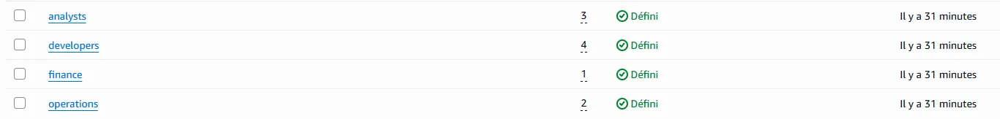
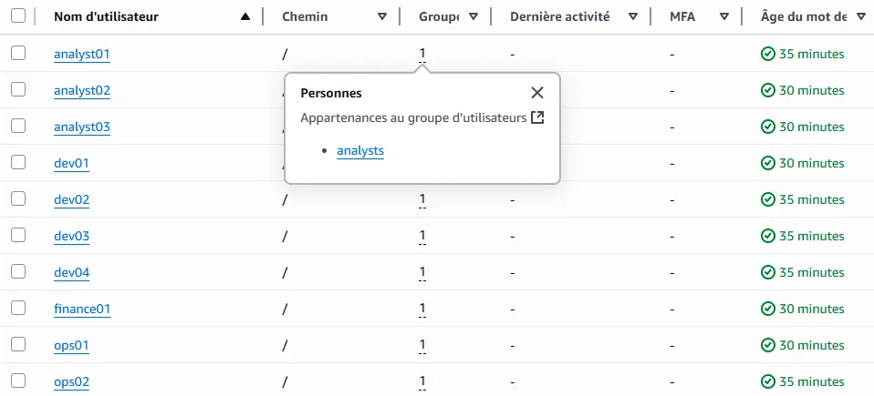
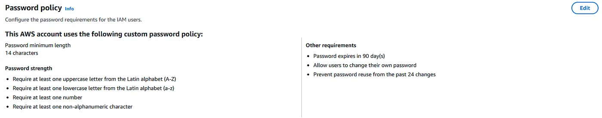
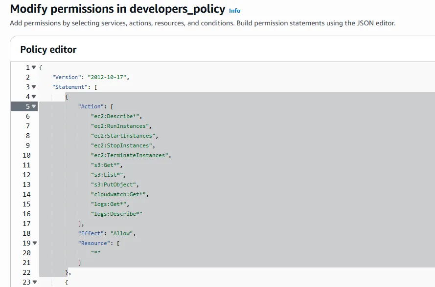

> **Archived project:** The original GitHub repository is no longer available. This article is preserved as a record of the project, including its explanations, code snippets, and illustrations.

StartupCo is a fast-growing tech startup that **recently launched** its first product. Due to tight deadlines, the team quickly set up their AWS infrastructure using only the root account, without following AWS security best practices. This approach introduced significant risks, as root access provides full, unrestricted control over all AWS services.

## Table of Contents

---

- [Restructuring Plan](#restructuring-plan)
- [IAM System Implementation](#iam-system-implementation)
- [Tests & Validation](#tests--validation)
- [IAM Users & Groups](#iam-users--groups)
- [MFA Enforcement](#mfa-enforcement)
- [Password Policy](#password-policy)
- [Permissions Review](#permissions-review)
- [Conclusion](#conclusion)

## Restructuring Plan

---



<figcaption>This diagram represents a simplified version of StartupCo’s initial AWS setup. The focus of this project was IAM restructuring so the architecture shown here is not production-ready, and is provided for illustration purposes only.</figcaption>

The mission was to migrate StartupCo’s cloud infrastructure to a secure, scalable, and automated model using **Terraform**. The goal was not only to apply **AWS IAM best practices**, but to design a setup that could **evolve** with the company’s growth while remaining **reproducible** and **auditable**.

To achieve this, we addressed the following pain points:



The IAM system was implemented using **reusable Terraform modules** that grouped related logic together, including users with their **login profiles** and **group memberships**, or **IAM groups** alongside their **inline policies**. Users were mapped to roles using `locals`, group permissions were defined declaratively, and **MFA enforcement** was implemented through a conditional `Deny` block. A **strong global password policy** was also enforced to ensure consistent security across the environment.

This modular design allowed the company to onboard new users in seconds, maintain strict access control, and scale securely as the team grew.

## IAM System Implementation

---

## 1. Team Mapping

---

We modeled the team structure around four main roles, each of which was mapped to a specific group with tailored access permissions:

- **Developers** — EC2, S3, CloudWatch (read-only)
- **Operations** — Full infrastructure access + SSM + RDS
- **Finance** — Billing, Budgets, Cost Explorer
- **Analysts** — Read-only access to S3 and RDS

We defined both users and their group permissions using Terraform `locals`. This centralized approach enabled clear **role mapping** and **reusable access policies** across the environment.

The following is a simplified extract from the `locals` configuration used to define IAM users and groups:

```hcl
locals {
  # Map users to their corresponding IAM groups
  users = {
    dev01     = ["developers"]
    ops01     = ["operations"]
    finance01 = ["finance"]
    ...
  }
  # Define permissions for each IAM group
    groups = {
      developers = {
        permissions = [{
          # Limited access to EC2, S3 and CloudWatch
          actions = [            "ec2:Describe*",
            "s3:Get*",
            "cloudwatch:Get*"
          ]
          resources = ["*"]
        }]
      }
      finance = {
        permissions = [{
          # Cost and budget visibility only
          actions = [            "ce:*",
            "budgets:*"
          ]
          resources = ["*"]
        }]
      }
      ...
    }
  }
```

## 2. IAM Policies with MFA Enforcement

---

We dynamically generated one **IAM group policy** per role, combining allowed actions with an explicit deny rule when **MFA** was not enabled. This approach ensured that all users were required to authenticate using **multi-factor authentication** before gaining access even if they had valid IAM credentials.

The following Terraform block defines these policies:

```hcl
# Define one inline policy per group with least-privilege permissions and MFA enforcement
resource "aws_iam_group_policy" "this" {
  for_each = var.groups
  group    = aws_iam_group.this[each.key].name
  name     = "${each.key}_policy"
  policy = jsonencode({
    Version = "2012-10-17",
    Statement = concat(
      [        // Business-specific permissions
        for perm in each.value.permissions : {
          Effect   = "Allow",
          Action   = perm.actions,
          Resource = perm.resources
        }
      ],
      [        // Allow user to manage their own MFA setup
        {
          Sid    = "AllowUserSelfManageMFA",
          Effect = "Allow",
          Action = [            "iam:CreateVirtualMFADevice",
            "iam:EnableMFADevice",
            "iam:ListMFADevices",
            "iam:ResyncMFADevice",
            "iam:GetUser"
          ],
          Resource = "*"
        },
        // Allow user to deactivate their own MFA only when MFA is already active
        {
          Sid    = "AllowDeactivateMFAOnlyIfUsingMFA",
          Effect = "Allow",
          Action = [            "iam:DeactivateMFADevice"
          ],
          Resource = "arn:aws:iam::*:user/$${aws:username}",
          Condition = {
            Bool = {
              "aws:MultiFactorAuthPresent" = "true"
            }
          }
        },
        // Allow user to change their own password
        {
          Sid    = "AllowUserChangeOwnPassword",
          Effect = "Allow",
          Action = [            "iam:ChangePassword"
          ],
          Resource = "arn:aws:iam::*:user/$${aws:username}"
        },
        // Deny all other actions unless MFA is used
        {
          Sid    = "BlockAllUnlessUsingMFA",
          Effect = "Deny",
          NotAction = [            "iam:CreateVirtualMFADevice",
            "iam:EnableMFADevice",
            "iam:ListMFADevices",
            "iam:ResyncMFADevice",
            "iam:DeactivateMFADevice",
            "iam:ChangePassword",
            "iam:GetUser"
          ],
          Resource = "*",
          Condition = {
            BoolIfExists = {
              "aws:MultiFactorAuthPresent" = "false"
            }
          }
        }
      ]
    )
  })
}
```

## 3. IAM Users Configuration

---

Each user was assigned to one or more **IAM Groups** and given a **login profile** to enable **console access**.

The following Terraform module was used to manage user creation, group membership, and login configuration:

```hcl
resource "aws_iam_user" "this" {
  for_each = var.users
  name     = each.key
}
resource "aws_iam_user_login_profile" "this" {
  for_each = var.users
  user     = each.key
  password_reset_required = true
}
resource "aws_iam_user_group_membership" "this" {
  for_each = var.users
  user     = each.key
  groups   = each.value
}
```

## 4. Global Password Policy

---

To enforce **strong password security** standards across the AWS account, we implemented a strict global password policy. This ensured that all IAM users followed consistent and secure password requirements.

The following Terraform resource was used to configure this policy:

```hcl
resource "aws_iam_account_password_policy" "strict" {
  minimum_password_length        = 14
  require_lowercase_characters   = true
  require_uppercase_characters   = true
  require_numbers                = true
  require_symbols                = true
  allow_users_to_change_password = true
  password_reuse_prevention      = 24
  max_password_age               = 90
}
```

## Tests & Validation

---

After implementing the IAM system, we validated each security control through the AWS Console and CLI to ensure correct behavior across all user roles and policies.

## IAM Users & Groups

---

Each user was successfully created and assigned to the correct group. AWS Console confirms group membership and permission inheritance.



<figcaption>Each group (developers, analysts, finance, operations) shows the correct number of users assigned.</figcaption>



<figcaption>All IAM users were created with the correct names and are visible in the console.</figcaption>

## MFA Enforcement

---

Attempting to use AWS CLI without MFA results in access denied, proving the deny condition is working.

```bash
$ aws s3 ls --profile dev01
An error occurred (AccessDenied) when calling the ListBuckets operation:
User: arn:aws:iam::123456789:user/dev01 is not authorized to perform:
s3:ListAllMyBuckets with an explicit deny in an identity-based policy
```

After authenticating with MFA and using a temporary session, the same operation **succeeds**:

```bash
$ aws s3 ls --profile dev01-with-mfa
2025-06-11 22:38:55 testbucketforproject12345
```

## Password Policy

---

AWS Console shows the enforced password policy settings.



## Permissions Review

---

Example group policy below, demonstrating the principle of least privilege in practice.



## Conclusion

---

By moving away from shared root credentials and implementing a modular, Terraform-based IAM system, **StartupCo strengthened the foundations of its AWS infrastructure**.

The project introduced core security practices such as **role-based access**, **MFA enforcement**, and **a centralized password policy**, all managed as code for consistency and traceability.

The implemented structure remains scalable, maintainable, and aligned with AWS IAM best practices. It allows new users to be onboarded quickly and securely while ensuring strict access control and auditability.
