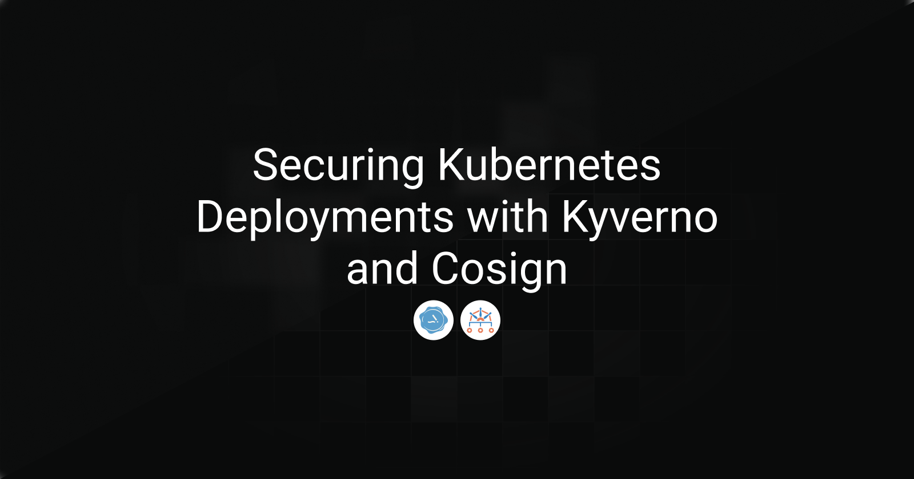
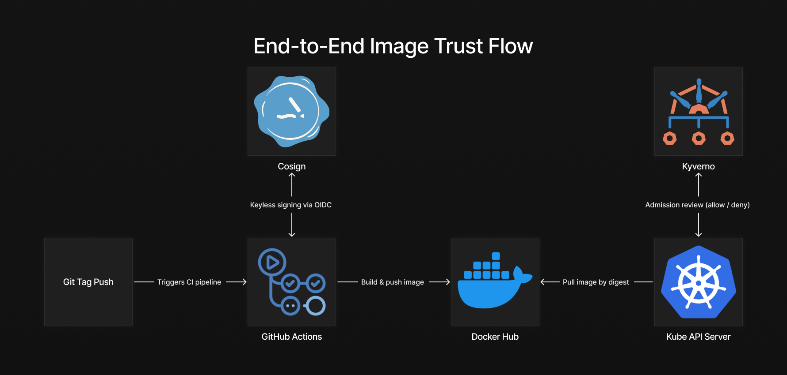

> **Archived project:** The original GitHub repository is no longer available. This article is preserved as a record of the project, including its explanations, code snippets, and illustrations.

Building a container image today usually involves much more than a simple `docker build`. Modern pipelines commonly include vulnerability scanning, dependency analysis, metadata generation, and various checks aimed at reducing the risk of shipping compromised software. 

Among all these steps, this article deliberately focuses on **the CI pipeline itself and the guarantees it can provide**. More precisely, we look at one critical question at the boundary between the CI pipeline and the Kubernetes cluster:

**How can a Kubernetes cluster be sure that the image it is about to run was actually built by our CI pipeline and has not been modified afterwards?**

Without a cryptographic guarantee, the container registry becomes a weak link in the supply chain. Images can be altered or introduced outside the expected pipeline while still appearing valid to Kubernetes, allowing issues to propagate quietly across environments before the root cause is understood.

This article presents a concise, end-to-end approach to address that risk using **Cosign** for image signing and **Kyverno** for enforcement at cluster level. It focuses on a single critical moment: the handoff between the CI pipeline and the cluster, and how to make that transition verifiable and enforceable: build → sign → verify → enforce.

---
## Table of Contents

- [Architecture Overview](#architecture-overview)
- [Signing Container Images with Cosign](#signing-container-images-with-cosign)
- [Enforcing Trust in Kubernetes with Kyverno](#enforcing-trust-in-kubernetes-with-kyverno)
- [Conclusion](#conclusion)

---
## Architecture Overview



The diagram above illustrates the trust boundary between the CI pipeline and the Kubernetes cluster. Images are built and signed in CI, then independently verified and enforced at admission time, ensuring that only artifacts produced by the trusted pipeline are allowed to run.

---
## Signing Container Images with Cosign

Cosign supports two main signing models: **key-based signing** and **keyless signing**. Both provide cryptographic guarantees, but they differ significantly in how trust is established and operated.

### Keyless signing vs key-based signing

**Key-based signing** relies on a long-lived private key owned and managed by the organization. This key is used to sign container images, and the corresponding public key is distributed to verifiers.

While effective, this approach introduces operational challenges: private keys must be securely stored, rotated, backed up, and protected against leakage. In CI/CD environments, this often means handling sensitive secrets and building additional controls around key management.

**Keyless signing**, which is the model used in this article, removes the need to manage private keys altogether. Instead, Cosign leverages the **Sigstore** ecosystem and OpenID Connect (OIDC). In a GitHub Actions workflow, Cosign uses the job’s OIDC identity to obtain a short-lived certificate issued by Fulcio. No private key is stored, and the certificate is only valid for a few minutes.

This model shifts trust from key ownership to identity verification and provides several practical benefits:

-   No secrets to manage in CI
-   Strong identity binding to the CI workflow
-   Short-lived credentials that reduce blast radius
-   Public, immutable audit trail via Rekor
    
Because of these properties, keyless signing is particularly well suited for modern CI/CD pipelines and cloud-native environments, where identity-based trust is often easier to reason about and enforce than long-lived cryptographic keys.

### GitHub Actions workflow: build, push and sign
```yaml
name: Build and Sign
on:
  push:
    tags: ['v*']
permissions:
  contents: read
jobs:
  build-sign:
    runs-on: ubuntu-24.04
    permissions:
      contents: read
      id-token: write      
      attestations: write
    steps:
      - name: Checkout code
        uses: actions/checkout@v4

      - name: Set up Docker Buildx
        uses: docker/setup-buildx-action@v3

      - name: Log in to Docker Hub
        uses: docker/login-action@v3
        with:
          username: ${{ secrets.DOCKERHUB_USERNAME }}
          password: ${{ secrets.DOCKERHUB_TOKEN }}

      - name: Extract metadata
        id: meta
        uses: docker/metadata-action@v5
        with:
          images: rayanos/kyverno-cosign-demo
          tags: |
            type=semver,pattern=v{{version}}

      - name: Build and push
        id: build
        uses: docker/build-push-action@v6
        with:
          push: true
          platforms: linux/amd64,linux/arm64
          tags: ${{ steps.meta.outputs.tags }}
          labels: ${{ steps.meta.outputs.labels }}
          cache-from: type=gha
          cache-to: type=gha,mode=max

      - name: Install Cosign
        uses: sigstore/cosign-installer@v3.7.0

      - name: Sign image with Cosign
        run: |
          IMAGE="rayanos/kyverno-cosign-demo@${{ steps.build.outputs.digest }}"
          echo "Signing: ${IMAGE}"
          cosign sign --yes "${IMAGE}"
          echo "Verifying signature..."
          cosign verify \
            --certificate-identity-regexp="https://github.com/${{ github.repository }}" \
            --certificate-oidc-issuer="https://token.actions.githubusercontent.com" \
            "${IMAGE}"
```

The workflow below demonstrates a minimal setup. A Git tag triggers the pipeline, the image is built and pushed to the registry, and then signed using Cosign in keyless mode. The pipeline also verifies the signature immediately after signing. This early verification step acts as a safety net, ensuring the signature is valid before the workflow completes.


### Why signing by digest matters

Although Cosign can sign images referenced by a tag or a digest, this workflow deliberately signs the image by its manifest digest, which is immutable.

Unlike digests, **tags are mutable**. The same tag can be reassigned to a different image, either accidentally or deliberately, without any change being visible from the tag name alone. Signing a tag would therefore provide no guarantee that the image being pulled later is the one that was originally built and approved.

By signing the digest, the signature is cryptographically bound to the image content itself. Any change to the image results in a different digest, immediately invalidating the signature.

In practice, the signature includes metadata that makes this verification possible:

-   The image digest    
-   The OIDC issuer
-   The CI identity (repository, workflow, ref)
-   A timestamp recorded in Rekor

This allows anyone to verify not only that the image was signed, but **who signed it and under which identity**.

---

## Enforcing Trust in Kubernetes with Kyverno

Signing images is only half of the solution. If the cluster does not verify those signatures, a malicious image can still be deployed manually or introduced through another pipeline.

Kyverno addresses this gap by acting as a Kubernetes admission controller. Using declarative YAML policies, it validates Cosign signatures before a Pod is created. This ensures that security checks happen at the point where workloads enter the cluster, not after they are already running.

If an image does not meet the policy requirements, the request is rejected immediately, providing deterministic and enforceable protection at admission time.


### Verifying Cosign signatures

The following policy enforces that any Pod deployed in the `test-app` namespace must use an image signed by a trusted GitHub Actions identity.

```yaml
apiVersion: kyverno.io/v1
kind: ClusterPolicy
metadata:
  name: require-signed-images
spec:
  validationFailureAction: Enforce
  background: false
  rules:
    - name: check-image-signature
      match:
        any:
          - resources:
              kinds:
                - Pod
              namespaces:
                - test-app
      verifyImages:
        - imageReferences:
            - "*"
          attestors:
            - entries:
              - keyless:
                  issuer: "https://token.actions.githubusercontent.com"
                  subjectRegExp: "^https://github.com/rayanoss/"
                  rekor:
                    url: "https://rekor.sigstore.dev"

```


This policy defines a clear trust contract at admission time. Any image deployed in the target namespace must be cryptographically signed, and that signature must originate from a GitHub Actions workflow. Kyverno verifies that the signing identity matches the expected repository and ensures the signature is recorded in Rekor, providing both authenticity and traceability before the Pod is allowed to run.
    
### How Kyverno evaluates a Pod request

Once the `ClusterPolicy` is applied, the enforcement happens automatically at admission time. To validate the behavior, we deploy two Pods in the target namespace:

- one using an image **signed by our CI/CD pipeline**
- one using an **unsigned image**

No additional configuration is required. The policy is evaluated transparently by Kyverno when the Pod is created.

#### Signed image from trusted CI/CD

```yaml
apiVersion: v1
kind: Pod
metadata:
  creationTimestamp: null
  labels:
    run: signed
  name: signed
  namespace: test-app
spec:
  containers:
  - image: rayanos/kyverno-cosign-demo:v1.0.0
    name: signed
    resources: {}
  dnsPolicy: ClusterFirst
  restartPolicy: Always
status: {}
```
```bash
null@laptop kyverno % k apply -f signed-pod.yaml  
pod/signed created
null@laptop kyverno % k get pod -n test-app
NAME     READY   STATUS    RESTARTS   AGE
signed   1/1     Running   0          15s
null@laptop kyverno % 
```
This Pod is successfully admitted. The image signature is present, cryptographically valid, and the signing identity matches the expected GitHub Actions OIDC subject defined in the policy. Since all admission requirements are satisfied, Kyverno allows the Pod to be created.

#### Unsigned image
```yaml
apiVersion: v1
kind: Pod
metadata:
  creationTimestamp: null
  labels:
    run: unsigned
  name: unsigned
  namespace: test-app
spec:
  containers:
  - image: rayanos/kyverno-cosign-demo:v1.0.1
    name: unsigned
    resources: {}
  dnsPolicy: ClusterFirst
  restartPolicy: Always
status: {}
```
```bash
null@laptop kyverno % k apply -f unsigned-pod.yaml 
Error from server: error when creating "unsigned-pod.yaml": admission webhook "mutate.kyverno.svc-fail" denied the request: 

resource Pod/test-app/unsigned was blocked due to the following policies 

require-signed-images:
  check-image-signature: 'failed to verify image docker.io/rayanos/kyverno-cosign:v1.0.1:
    .attestors[0].entries[0].keyless: no signatures found'
```
This Pod is rejected at admission time. Because the image has no associated Cosign signature, Kyverno cannot establish a trusted signing identity. The policy requirements are not met, and the request is denied before the Pod ever reaches the scheduler.


----------


## Hardening the Supply Chain in Kubernetes

Image signature enforcement is a strong baseline, but it should be treated as one layer in a broader supply-chain security model. For higher assurance environments, image signatures should be complemented with additional guarantees. 

SLSA provenance allows the cluster to verify how an image was built, while SBOMs provide visibility into its contents. Together, they extend trust from *who produced the image* to *how it was produced* and *what it contains*.

Kyverno integrates naturally with these additional controls, enabling policies that block mutable tags, restrict allowed registries, or enforce provenance and dependency requirements at admission time.

----------

## Conclusion

By combining Cosign and Kyverno, image trust becomes an enforceable property rather than an implicit convention. CI pipelines are responsible for producing and signing artifacts, while Kubernetes clusters independently verify what they run at admission time.

This model reduces operational risk, improves auditability, and provides a clear path toward SLSA-aligned supply-chain security. In practice, the cluster runs only what was actually built and signed by the trusted CI pipeline.
